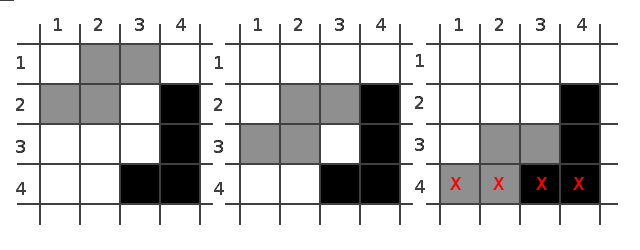

Mi a különbség a népszerűség meg a vezetés között?

A népszerű embert ma szeretik, holnap felejtik.
A vezetőt ma vitatják, holnap hiányolják.

% Az utolsó aranymag – a fehér ló útján

Elő-előszó
===================================

Ez a könyv több okból íródott. A kezdetben mindinkább filozófiai és 
metafizikai témákat egyre jobban felváltotta a praktikus bölcsesség 
átadása és megóvása, illetve mindazon összegyűlt tudás fenntartása
mellett, amely ebben a műben összegyűjteni kíséreltetik, a könyv
ugyan ennyire a nemzetek megmentéséről is szól. Nem pontosan egyetlen
egy (tehát a Magyar), nemzet megmentéséről, hanem annak örök életűvé
tételének kísérletével egyetemben, minden népek és nemzetek számára
a fennmaradás reményeként megjelenő szimbólummá való átalakításáról
szólnak a megfelelő fejezetek.

A fő cél nem kevesebb, mint az összes lehetséges érték, minél pontosabb
és részletgazdagabb, de egyszerűen, a mindennapi emberek számára érthető 
gyűjtése. A másodlagos cél sem kisebb feladat: elérni, hogy ha minden
nemzet el is bukna, ha az emberiség egyszer ténylegesen is felépítené
Bábel tornyát, az egyféleség pedig végképp elterjedne, akkor is maradjon
egy pislákoló remény: Egy gyűjtemény ami szimbolizálni képes mi veszett
el és mi hiányzik. Amiben le van írva annak a magva, ami elveszett.

Ha pedig megmarad magként ami látszólag elvész, ha ki is halunk, egyszer
talán eljő egy ifjú, aki elolvasván újra feltámasztja a nemzetet: akár
milyen jellegű háttérrel és akárhonnan is jön - mégis talán Magyarrá 
válik majd és ezzel feltámad a nemzet is, a hagyomány is. Reményeink 
szerint ha egyszer elveszünk, szimbólumként - a lázadás szimbólumaként
örökké élünk majd és amikor már azt hisszük minden nemzet kivérzett,
ott pislákol majd még a remény: a remény, hogy visszatér mindaz, ami
már oda...

Előszó
===============================

Abban reménykedem, hogy nem derül ki a nevem. Nem félek, hogy a mag tán
gyümölcsöt se terem sőt bízva-bízok, hogy célba talál a fegyverem. Azért
bízok, mert az íjat nem magamért feszítem. Istent magát kérem: ne legyen
hírnevem! A győzelemre esküszök: nem magamért készítem.

	Mi az a mágia? Milyen út vagy vágta?
	Mennynek és földnek elveszett koronája,
	Istennek dicsősége, szentek áldomása,
	Szerelem tüzének dicső ragyogása,
	Győzelem nyilának megvillanása,
	Egyenesen annak szívbehatolása,
	ott soha nem pusztításra,
	hanem gyógyításra.

Sokan talán csodát keresnek majd ebben a könyvben, vagy varázslatot –
ígéreteket, esetleg nacionalista felhangokat. A varázslat azonban nem
mágia és a mágia nem varázslat! Amit olvashatunk nem "titkos" tudás és 
főként nem titkolni való – hanem egy maréknyi arany mustármag.

	Nem rejtegették, hanem eltemették,
	Mindig is őrízték, mindig is szerették,
	Világnak porai már régen befedték,
	Arany szegeletét oly sokszor felégeték,
	Soha meg nem törték, szunnyadó életét.

Amit feltárunk az nem egy dicső, bár letűnt múlt, hanem parázsként élő
és a nyelv, a kultúra és igazosság által elérhető élet. Olyan út – a tű
fokán keresztül – ahol csak nyílhegyek hatolnak át. Nem a vér, hanem a
megismerés, az önmagunkba, belső „mag”-unkba való befogadás örökölteti
át.

	Nevünk megőrízte,
	Nyelvünk éltette,
	Mindenkiért tette,
	Mindenki érthette.

– a legfontosabb tanítása pedig abban áll, hogy másoknak meg tudjuk
mutatni, hogy van népi értéken alapuló alternatívája annak, hogy a
sokszínűséget elvesztve olvadjon össze az emberiség Bábel tornyának új
oltárán! Nem adunk majd elő rituálékat különböző természetvallásokból,
hanem magát az életet fogjuk megszólítani – egészen közvetlenül. Olyan
dolgokról, amelyek külsőségekről szólnak, mi itt nem fogunk sok szót
ejteni. Amit ebben a könyvben olvashatunk az nem népszerű és nem is
egyszerű, de mégsem tudós közösségnek szánjuk, hanem hősöknek. Olyan
hősöknek adjuk akikben a lélek fényesen világít, a mag pedig majd a
szívben ragyogva várja, hogy igazi magosságokba törjön! Ők azok a
nemzetünkben és mindenhol a földön akik életet tartanak. Ők azok akik
miatt a „mágia” valósággá válik és csakis bennük bízunk.

Lovat, íjat és nyilakat adunk, azért hogy győzzenek – a magos hegy
szélétől, a csillagokig is lőjenek – akár szolgának, akár gazdag
Rotschildnak szülessenek!

Nem fogunk itt tehát kitérni hosszas filozófiai viták bizonyítás jellegű
eldöntésére, illetve olyan győzködésre, amely csak arra szolgál, hogy a
teljesen megtévedett embernek felnyissuk a szemét. Fontos, hogy nem
próbáljuk megerőszakolni környezetünket, de tudatosan használható, okos
fegyver gyanánt néhány gondolatot át kell adunk. Ennek ellenére a cél
inkább azon képességek fejlesztése, amivel mi magunk válhatunk saját
eszünk és szívünk fegyvereinek kovácsaivá.

Ez a könyv azokhoz szól, akik a nyitottak a magok befogadására és
azok kinyílására várnak. Azoknak kik az igaz élethez kérnek hatékony
eszközkészletet, de nem a múlt sérelmei, a felgyülemlett sérülések
szerint látják a dolgokat, hanem még eredeti tisztaságukban. Azokhoz
szól a könyv, akik növekedésre áhítoznak, hogy aztán égig érő faként
felnőve, ezernyi új maggal termékenyítség meg az emberiséget azokkal a
magvas gondolatokkal, ami a jó értékek felemelkedését szolgálja. Az
egészséges rügyet, ki nem nyílt virágot nem permetezik le és szórják
körbe kénporral, ezért az olvasóval szemben alkalmazott bánásmód is
különbözik majd attól az érvelési módtól, amire ellenséges lelki
környezetben kell szorítkoznunk sok esetben. A magot megszaporítjuk és
elvetjük. A csipegető madarakkal nem foglalkozunk.

A mag bennünk van és a tisztaság, az igaz emberség megismerésével
felövezve magunkat az igaz emberként való életre majd azokon is
segíthetünk tán, akik az itt leírtakat csak sokkal több, hosszabb,
összetettebb magyarázat mellett értenék meg. Ha a nemzetben csak
ötvenezer igazi mágus lenne, akkor ma is legendák születnének és nem
kellene arra várni, hogy mikor lesz a Magyar név, megint szép! Ehhez
mérten továbbá, ha a világban csak ötmillió igaz mágus van, akkor
reménykedhetünk, hogy a sátán még nem győzedelmeskedett, de majd látni
fogjuk, hogy bámikor akár egyetlen igaz ember létével is még menthetőnek
nevezhetnénk a helyzetet ahogyan azt Isten kinyilatkoztatásaiból
ismerjük. Nem mindenható pártokban, hanem a saját lelkünk, nemzetünk
felemelkedésében, alulról építkezve válthatjuk meg a hazánkat és a
világot!

Pont elég olyan könyvet olvashatunk, ami könnyű életet ígér, vagy a
fantáziánkkal játszik, így azt javaslom örüljünk, hogy ez az írás nem
ilyen! Aki megemészti és továbbgondolja azt a bölcsességet, ami itt
megosztásra kerül nem könnyű és nem is varázslatokkal teli életre
vállalkozik, hanem megerőltető hőstettekre és mágiára. A mágia –
csakúgy, mint a Magyar népnév, Magor nyomán – a magból származik. Milyen
egy igazi Arany-Magyar, magos, mágus? Nem sámán és nem is varázsló,
hanem olyan ember, aki veszélyesebb holtában, mint élve! Azért veszélyes
holtában, mert az elpusztításához csak a lelkének a felemése árán lehet
eljutni! Egy igazi mágussá válva olyan magosságos legyen az, amit ti
cselekedtek, hogy ha el is vesztek, vagy népünk el is vész, tetteink és
világnézetünk még akkor is feltámadhasson, ha csupán egyetlen apró
elfeledett és eltemetett magva marad meg a föld alatt arra várva, hogy
valaki tiszta lélekkel egyszer sok-sok ezer év múlva rátaláljon és azt
magáévá, tehát saját magjává tegye!

Aki Magyar az ebbe a kultúrkörbe született és az a feladatunk, hogy ezt
soha ne hagyjuk veszni. Az olvasó nem könnyű életet, hanem igazi harcot,
célt szerez magának, amelyért lélekben meghalnánk. Olyan célt, amit
akkor is elérünk, ha nagyon nehéznek, sőt kilátástalannak tűnik az
erőfeszítés. Olyan jövőt, melyet nem csak gyermekeinkre, hanem az
emberiségre hagyományozunk. Olyan világba születtetünk, ahol a legtöbb
nemzetek elvesztették már mindezt, például torzult nacionalizmus ártó
árnyékában, vagy épp ellenében – de ezt nekünk még akkor is meg kell
őrízni, ha ebbe pusztulnánk.

Ez az út egy tanítás útja: annak a tanítása a világ népei felé, hogy
becsüljék meg önmagukat, múltjukat és nemzetüket és mindenki mást – ha
különböznek is – erre tanítsanak tovább!

Nehéz lesz-e? Az nem kifejezés! Olyan vállalkozás ez, amely látszólag
lehetetlen, amelyre nem számítanak sehol, amely a világ ellenében,
az élet szerelmében, de hősi diadal jegyében ír - sőt ró - történelmet!

Mégis szép csendben rója a történelmet, rejtett módon, zaj nélkül.

Ami tudvalevő Aranymagorról
======================================================

Aranymagor dala
------------------------------------------

	Fehér lovon vágtál,
	Koronája örök,
	Íja célba talál,
	Ég is beledörög.

	Király vajon ő tán?
	Úr a népek között?
	De hisz nép maga is!
	Az utolsók mögött!

	Népekért száll lóra,
	Másokért könyörög!
	Nem válhat valóra:
	Bábel? – nem, köszönöd.

	A jó Istentől várja,
	Hogy reád tekintsen,
	Hozzá szól imája:
	„Másokon segítsen!”

	Szín-aranyban úszik,
	De pénze sok nincsen.
	Lelkében mély hit
	Szegeletén kincsem.

	Vérét nem sajnálja,
	Teste: igaz nincsen.
	Tagjai mi vagyunk,
	Aranymagyar szívben.

Hősi küldetése
-----------------------------------------

Kérdezték is az emberek, bölcsek és gyermekek: Kicsoda Aranymagor? Egy
személy? Egy vallás? Egy eszme, vagy egy hitvallás? A táltos és a
garabonciás szerint egyik sem, de nem mert mindezeknél kevesebb, hanem
mert mindezeknél több, akár a látomás: Aranymagor Bábel kulcsának utolsó
őre, az emberi civilizáció szakértője, főnix népe, fehér ló népe, magvas
gondolatok képe – és mindezek megszemélyesítése. Mágikus mesehős, új
korok szárnya – gyönyörű mezőknek példás unokája. Táltos lován a világot
bejárja, csodát hoz létre, sok szépet a világra. Akkor élt, amikor már
csak az igazi mágia segíthetett, mert a világ és mindenség életében újra
nagy zavar kerekedett. Nagyhalak korában, halál fenyegetett – és az
emberiség a félelmében a sok kiömlő víztől – újra tornyot építgetett.

Olyan korok jártak, amikor még néhányan tudták, hogy vízzel álmodni
rosszat jelent, de már rég azt sem értették miért vízözön képében írták
meg az egyik előző, hasonló történetet – bolond idők voltak ezek!
Aranymagor nem értette, vajh ilyen ostobaság hogyan lehet – míly dolog
nem látni azt, ami olyan érthetően ott lebeg? De hát nem látták azt sem,
hogy nincs különbség! Nincs aközött ki másokat pusztít és ki mindenkit
egyszerre pusztít épp! Oszd meg és uralkodj – ez volt a beszéd – s oly
sokan hallgatták, hogy egyénnek lenni lassan minden nép-ismerőse félt:
„Ha mindenki leszek, nem leszek megosztott és ha mind meghalunk, az
embereket pedig magukra hagyjuk – majd csak találnak maguknak új
népeket: gyárakat, szektákat, sőt elmebetegségeket! Majd mindezek új
néppé lesznek.” Ezeket mondták az ostobák, de Magor fia Aranymagor rájuk
nem hallgatott, mert épp apukája arany szegelet kertjében, a csodás
szarvaskájának, szép kis házikót rakott.

Nép s nemzet volt ő is, akárcsak vén nomád atyja és hitt Isten szavának
mint annak boldog asszonya, az ő anyja. Ismerte még régről Bábel
tornyának történetét, értette a nyelvzavar okát, őrízte régi állapotát.
Vajh nem tanul senki más, ki mind ott volt apjával, vagy vele? Néha
már-már tényleg könnybe lábad szeme. Hát nem látja a sok barát, ellenség
és testvér? Nem látnak szemüktől milyen nagy a veszély? Amikor előtör a
gonosz, tolvaj világ-birodalom... a semmiből a minden összezavarodik és
kezdődhet elölről. Hát nem tudják, hogy minket népeket arra teremtettek,
hogy több- és többféleképp álljunk a gonosszal szemben és ne találjon az
ördög minden embert egyszerre fogó fegyverre?

Szegény Aranymagor így tanakodott, majd apja egyszer csak ajtaján
bekopogott. Vén Magor ugyanis ezt nejével is tisztán látta – éppen ezért
fogott bele anno egy új, tiltott mutatványba: Gyermeket nemzett hát
saját kertjén belül, akit boldogságtól sugárzó anyjával Aranymagor-nak
neveztek és hamarost hüvejk-piciny bölcsőbe helyeztek. Itt élt a pici
kertben és csendben nevelkedett – egészen addig, míg felcseperedett.

Kihívja az apja – tyűha, mi lőn vajon? Sok mindent gondol szegény, ilyen
fiatalon…

- Üljünk le mostan fiam és beszéljünk anyáddal, lehívjuk az égből, de
repüljön madárral!

És repült túlról madár, repült egykettőre – máris bensőséges, hangulat
lett tőle.

- Gyere fiam, gyere s nézz jó mélyen magadba: látod-e Székely szívem ott
lenn a mellkasodba? Látod-e Magyar hőseim a bátor kezedben és anyukád
szentjeit gyönyörű szemedben? Meg kell ejtenünk most az apa-fia
beszédet: lassan eszes leszel és magadat felméred! Gondoltál-e arra,
vajon mily különböző vagy? Hogy lehet hogy szüleiddel kicsit-kicsit egy
vagy? Nézz körül a kertben, haldoklunk mink, népek! A sötét lúdvérc
sárkány mindent megigézett!

	Körbenéz a legény:
	szeme tágan járja,
	körül a vidéket,
	sok szomorút látva.

	Egyfelől a sárkány,
	uszítja a népekt,
	másfelől készíti,
	az olvasztó tégelyt.

- Apám, vak mindenki? Hová lesz a drága, csillagos egeknek sok szép
kultúrája?

- Nem vész még el fiam, volt már ilyen Róma... hanem nyisd ki füled
tágra és most vigyázz a világra: Téged azért neveltünk, hogy legyen
olyan nép, akire mind ki a múltját keresi büszkén néz! Aki reményt,
hitet és szeretetet visz zászlóján, amikor nagy a vész és táltos
paripáján olyant dobbant, hogy arra minden szív megdobban! Nem
vérből, hanem szellemből való vagy te, mint valaha én, apám és 
mind a szüleink. Olyan népek, melyek nem hellyel, nem származással,
hanem helyes szívvel, tettekkel és a közös belső világ elfogadásával
születtek meg szerelemből - emberekből akik nem csak élnek, de 
szeretnek, remélnek és egymásért örömmel tennének. Olyan, világ ez
ahol a emberekre találsz ki Rómával szemben beáll Atilla seregébe
és bárki legyen is, máris Szittya - ha már Szittya, viselete, dala,
beszéde és szíve! Ez az mi el lett ásva fiam jó mélyre, hogy mi alkot
egy népet és hogy született a közös ének! Addig szép az élet, amíg
nem egyedül éled, de egymásnak lehet ugrasztani a fiatal nemzedéket,
majd odanyújtani a mézes cukros süteményed: újra birodalmat építeni,
egy égig éri tornyot ahol minden egyfélén fortyog. Ez a sárkány játéka
aki a háttérben kavarog. Minden 12 hónapban elpróbálja ez a barom és
mindig volt aki kibírta állva - hát most jól figyelj a tanulságra.

	Azzal pedig apja,
	megkezdé meséjét,
	Boldog anyukája,
	segíté beszédét.

	Repül túlról madár,
	suhog mélyen szárnya,
	Hogy a földig leér,
	Rezgő csapkodása.

	Leszáll vele szava
	Atyának, Anyának:
	Fel a táltos lóra!
	Induljunk a tájnak!

	Ha van füled hallod,
	Ha szemed hát látod,
	Vágtassál mivélünk,
	Rá teremtél, látod!

	Halld az öreg szavát,
	Add hozzá a szíved,
	Tisztasággal kérlek,
	Teremts újra mindet!

Ami tudvalevő a mindenségről
=======================================================

A mágus, azaz magos az, aki magosságot cselekszik, „mert a világon élni,
csak hősként érdemes”! Reszkess babilon, mert bár a téglák erősek, a
falak vének, de az alap – a talapzat – hibája a régi. Eljárt az idő azok
felett akik nem teszik fel a fontos kérdéseket és tovább építik a
szörnyeteget! A mindenség földje lesz ami megremeg: nem a világi téglák
és elvek azok, amik elhozzák végzeted...

A tisztán látás jellemzői
----------------------------------------------------

	Aki vak az nem lát csak néz,
	Az egó a szép szemed lakatja.
	Igaz légy, mielőtt kihuny a fény!
	A halál mindenképp felszaggatja!

Amikor tisztán látsz és ezt meggondolod, akkor majd életed adósságát
siratod. Amint magadat feladod, amint magad választását az éghez szabod
– remélve, hogy így legalább egy részét talán megkapod – akkor veted el
csak igaz emberként a magot. Addig minden nap van mit takarítanod.

Az igazság
--------------------------------------

    Kerestem az igazságot - Kerestem a lényeget
    Kerestem a hazugságot - Szerettem az életet
    Kerestem az igazságot - Kerültem a tévedést

Azt mondják egyesek, az Igazság és hazugság csak az emberi gondolkodásban
létezik. A világon csak igazság van, és a hazugság, vagy a tévedés csak
abból fakad, hogy vannak olyan dolgok, amikről nincs információnk,
vagy téves információnk van róla, esetleg valaki nem jól tájékoztatott.
Például egy bolygó mindig ott van, ahol van, legfeljebb mi tudjuk rosszul,
hogy hol van. Mások azt mondják "sok igazság van", mindenkinek a sajátja.

Én pedig azt mondom, a világban létező abszolút igazság (amit nem pontosan
ismerünk) valóban létezik, keresendő, közelítendő, de a nézőpont sok!

De amit talán kiemelnék, természetesen más dolog a hazugság és a tévedés, mert
a hazugság asszimetrikus, az egyik fél nem "rosszul tudja" - nagyon is jól
tudja és azt szeretné, hogy a másik valamiért "ne úgy tudja", vagy "ne tudja".

Az állatvilágban is bőven vannak ilyen hazugságok, ha úgy tetszik átverések;
elég csak az "álszem" mintákra gondolni, vagy arra miként épít több madár
ál-fészket, vagy ál-bejáratot a fészekhez és rejti el úgy fiókákat, hogy
leteszi a könnyen elérhető "fals" lyukat ahova bemegy a kígyó és azt hiszi,
hogy a fészek üres.

A ragadozó ezeknél persze ha teljes, nem hiányos információkkal lenne ellátva,
akkor nem menne félre, de a tudatos félrevezetés és a mindenség egyetlen egy
igazságától távolítás egy külön elem itt. Az igazságtól eltérés tehát nem
csupán információs hiánygazdálkodás eredménye lehet természetesen.

Érdekes megfigyelni a Magyar nyelvet is, mert tanulságos. Később több ilyen
úgynevezett nyelvpörgetést fogunk végezni, de előre legyen elég az, hogy
jó ha megfigyeljük, hogy az "igaz" ember nem csak "igazsággal rendelkező"
ember például a bibliában sem, hanem kicsit szinonímnak tűnik ott a "jóság"
egy formájával. A nyelvünkön az "igaz" ugyebár rokon az "ige" szóval (IGÉS,
"az igével egy", vagyis a mindenséget teremtő igével egy). Az is érdekes,
hogy az "igen" szó is ide jön s más nyelveken nem mindig van ilyen kapcsolat
például az angol true és yes nem hangzik hasonlóan, mint az "igaz" és "igen".

Ebből is látszik a "valósággal való szoros kapcsolat". Az is érdekes, hogy
igazodás - ami ha lebontod a ragozás szerint, akár "igazzá levést" jelentene,
mégis eligazodást, út-találást jelent, esetleg igazodási pontot.

Ide tartozik az IGA szó is, amely eredeti jelentésében nem az ökör szerszáma,
ami húzza az igát, hanem két dolog össze-alkotásának jelentése, összekötő
szerepő szó volt. Tehát így az állatot hozzá kötöd ahhoz, amit húz. Később
már csak ez a jelentés ment tovább, ezért ma ehhez kötjük. Lásd még "-IG" rag
amikor ragozol. Tehát "ez a terület az enyém és elterül a szomszéd szőlők-IG",
vagy épp "a létra felér a tető-IG".

Továbbá kapcsolódik ezen szóbokorral az "így" szóhoz is. Tehát megint csak a
"valóság igazságával".

Ezekre Magyar nyelven gondolkozva igazából, igen-is igen könnyű rájönni, de
hátrányból indulnak az indo-európai anyanyelvűek, ahol ezek nem alkotnak egy
jelentésben ÉS ejtésben is közös szóbokrot, tehát nem "szembeötlő" a kapcsolat.
Ezért beszélnek "kinek mi a saját igazsága", a truth így nem az abszolútnak
hangzik nyelvileg, "csak egy szó". De ugye Magyarul az igaz, maga a teremtő
ige, ami a térkitöltés-IG ott van mindenhol is - méghozzá pont "úgy", a-hogy
(aképp hogy) lennie kell, csak EGY van belőle és nem több, nem a föld a hona,
hanem az ÉG és ha megigéz lehet hogy épp a valót látod saját szemmel. 😉

Az univerzum és a világ
--------------------------------------------------

	A fényeset keresed, vagy a mindenséget?
	Ha kevered elnyerted a hülyeséget!

Valamikor mindenek tudák, még a pásztor legények is, hogy a mindenség
az minden, abban ott van Isten: abban ott a legény és aranyos szellem.
A nyelv nem hazudik: a minden az minden. Hogy ha máshogy lenne, más név 
lenne itten. A világ az más dolog, fényes és világos: hogy ennek azt
nevezzük, ami látható a virág most. Ha máshonnan nézed, láthatsz más
virágot, de ez csupán az érzet: egy kertben van, látod?

	Ha több mindenséget lát,
	részeg hát a lelked!
	Sok világban járhatsz,
	de mindenből? Csak egy lesz!

Tudták ezt még később, más népek s családok, nem csak piciny arany
szegeletben látod: Univerzum - mondták - és értették a számot!

Mondd, írd, hogy az univerzum: mindenség – egység. Nincs több és trükközés!
Nincs az univerzumon kívül semmi, mindent (még Istent is) bele kell érteni!

Világ: Ez amit tapasztalattal, törvényekkel leírunk és amiben élünk.
Akár egy bolygóra, akár a csillagokra nézünk. Ha túl okosak vagyunk
sok egymás mellettit remélünk és mint sötét erdők: elfedik mit nézünk.

	Első az Isten s a Mindenség,
	benne Nemzet, Család s Ember,
	Hogy mit miért mutat fényesség,
	Hasznos tudnod, de nem kell!

A kilőtt nyíl előrehaladása
------------------------------------------------------

Ha kilövünk egy nyilat légüres térben mi mozgatja előre? Egyenes vonalú
egyenletes mozgásban van ezt tudjuk tanulmányaink alapján, na de vajon
mi az a kiváltó ok, ami miatt minden időpillanatban változik a
tulajdonsága (helyzet attribútum)? Ennek ugyanis változnia kell a
fizikai modelljeink szerint, ám miért változik, ha semmi ok nem hat rá?
Varázslatban hiszünk hát?

Ismerjük fel: a modell elnagyolt, helytelen. A valósághoz közelebb áll
az a gondolkozásmód, hogy a nyilat kilőttük és ezzel cselekedtünk, okot
adtunk, a mindenséget pedig így ezzel olyan helyzetbe, vagy állapotba
hoztuk, mintha ezzel fel lett volna írva egy papírra, hogy mikor és hol
indult el az a bizonyos nyílvessző. Ha ezek után valaki meg szeretné
figyelni a nyílvesszőt, mint egy személy, akkor az elmegy, elolvassa a
papírt és értelmezi azt. Megnézi a karóráján mennyi idő telt el és ő
megteremt magának egy látványt, amiben a nyílvessző a megfelelő ponton
helyezkedik el. Ő ezért érzékeli ott, ahol van. Nincs varázslat, ez
mágia – vagyis a dolgok igazi magva. Ha ezt most értjük, akkor azt is
megértjük majd, hogy a változás látszólagos.

A dolgok lényege
-------------------------------------------

Nagyon veszélyes, hogy a modern világban élő ember mennyire elvesztette 
a kapcsolatát a "lényeges kérdésekkel" és a dolgok lényegével. Igen nagy 
szerencse nekünk Magyaroknak, hogy a "lényeg" szóból kiolvasható az a 
belső lény-je valaminek, ami élő, de jelentésében mégis oszthatatlan.

Amikor nem vagyunk tisztában azzal, hogy mit keresünk, vagy hogy amit 
éppen vizsgálunk pontosan milyen lényegű, akkor nem a valós kapcsolatot 
és nem a vizsgálat tárgyát értjük meg lényegében, hanem szinte sötétben 
tapogatózva vagdalkozunk - rosszabb esetben "azt hisszük", hogy komoly 
kérdéseinkre igazi válaszaink vannak, holott eközben csak azért érezzük 
magunkat magabiztosnak, mert a lényeges kérdéseket jó mélyre rejtjük, 
vagy egyáltalán nem is érezzük már.

### Út a lényeghez

A lényeg tehát - mint nyelvünk is jelzi - egy élő dolog. Ha azt mondjuk 
élő, akkor itt látjuk, hogy "ő", vagyis ez a lény amiről beszélünk egy él.
Úgy él, ahogy összeköti a kés éle annak két oldalát, vagy ahogy egy test 
körvonala meghatározza magát a test árnyékának, látványának alakját is.
Élnyeg, vagy lényeg - nem számít, egyre megy és ez a lényeg fontos része.

Mégis amikor azt mondjuk "térj a lényegre", vagy használjuk ezt a szót, 
akkor valamiért abban is biztosak vagyunk, hogy a dolgok lényege egy 
kicsi, oszthatatlan, vagy egyedülálló valami. Eköré épülhet egy nagy és 
bonyolult értelmezés, de ha valamit meg akarunk érteni, akkor a lényegét 
kell megértenünk - ha valamit igazán tudni akarunk azt kérdezzük: mi a 
lényeg? Mondd el a lényeget!

I, II, III, IV; 1, 2, 3, 4; a, b, c, d. Látjuk-e mindezekben ugyanazt az
egyetlen létezőt több megjelenési formában, manifesztációban? Látjuk-e,
hogy ilyen módon tud az Isten pl. hús vér emberként a világban Jézusként
megjelenni? Ez ilyen egyszerű. Nem a megjelenési mód, hanem az egymásnak
egyértelműen megfeleltethető lényeg az ami számít. Ha egy ember –
teljesen hús vér ember, aki pontosan ugyan olyan, mint te és én –
pontosan úgy viselkedik és pontosan azokkal a jellemzőkkel bír, amivel
Isten lényege, akkor ő maga tényleg a földre szállt Isten, benne pontosan 
megtaláljuk Isten lényegét. Ha a szent lélekről való tanításokat nézzük, 
ott azt látjuk, hogy Istennek egy más megjelenési módjáról beszélünk, de 
megint csak ugyan arról az egyetlen létezőről gondolkozunk.

Mi az ami egyezik a I, 1, a, jelekben a fenti példában? A lényeg!

### Hány dimenziós a világ?

Fontos tudatosítanunk magunkban a lényegre törést - ezt több példa mutatja. 
A dolgok igazi belső "lényének" a megértéséhez ugyanis a lény-egre kell 
törekednünk, ennek nincs más módja. Sokan például - teljesen feleslegesen 
- elmerengenek azon, hogy vajon "hány dimenziós" világban élünk és egyesek 
ezt komolyan képesek számolgatni, hosszú levezetésekben.

Négyféle ember van etekintetben:

* Aki nem tudja miről beszél és "ezoterikus" dolgokat rejt dimenziók mögé.
* Aki bár tudja miről beszél, de csak a felszínt kapargatja. Hiába lehet akár szaktekintély is, de nem látja át miért furcsa megkötni a dimenziók számát.
* Aki tényleg tudja miről beszél, de azért is így fogalmaz, mert nagyon is jól tudja, hogy felépítettünk egy szabályrendszert, egy modellt és akkor számolunk ennyi-annyi "dimenzióval", ha egy bizonyos nézőponthoz ragaszkodunk és nem lenne praktikus másik rendszert alkotni.
* Van aki kimondja, hogy ilyen megkötésről beszélni teljesen téves, félrevezető megfogalmazás - a mindenségre nézve, de praktikusan ennek lehet történelmi okokból még létjogosultsága (bár ez is szerencsétlen dolog).

Aki ugyanis kicsit is járatos a modern matematikában az könnyen beláthatja, 
hogy a kérdés maga, miszerint "hány dimenziós a világunk" egyáltalán nem 
olyan nagy gondolati alapvetés, mint azt naívan gondolnánk. Az érzékelés 
miatt a világot - tehát nem a mindenséget, hanem ami abból **világ**osan 
látható nekünk - három dimenziósnak mondjuk, mert a tér-érzetünk alapján 
magasságot, mélységet és szélességet különböztetünk meg. A világunkban 
ezeknek a fogalmaknak tényleg van mérnöki és mértékbeli jelentése, így a 
praktikusságot szem előtt tartó tudományosság természetesen juthat el az 
"idő" olyan ábrázolására, mintha az is "csak" egy geometriai dimenzió 
lenne. Nagyon fontos látnunk, hogy az alapgondolat egyáltalán nem tűnik 
irreálisnak, hiszen a három ismert "dimenziót" - vagyis tengelyt, irányt
- tehát igen fontos ismernünk amiatt, ahogy a mindenségből, a látható 
világot érzékelni és megélni tudjuk, az "idő" fogalmának megértéséhez 
pedig természetesen minden lehetséges eszközt meg szeretne fogni az 
emberi kíváncsi elme. Akkor amikor egyáltalán felmerült az idő, mint egy 
"dimenzió" létezése, még sokkal kevesebbet tudtunk az időről is, akkor 
még tényleg sokkal könnyebben megfeleltethettük, modellezhettük azt úgy, 
mint események előre elrendeltetett láncolata, amely lánc minden szeme 
egy olyan geometriai világ, amit a szemünkkel is érzékelünk. Innentől 
eredeztethető a "dimenziószám-kérdés" és innen csak annyira történt 
egész idáig lényegi elmozdulás, hogy a "geometriai" jellegű mértani 
dimenziókba mikor és mit szeretnénk "bele-erőltetni". Nagyon könnyen 
azt mondhatjuk, hogy 4 dimenzió "mindenképp" szükséges az idő és a 
három irányú kiterjedés miatt, de éppúgy előjöhetünk a bozótból, vagy 
a kutatólaborból egyaránt és kérhetjük az ötödiket-hatodikat mondjuk 
a szabad akarat, vagy a tizenhetediket az éppen használt és kedvelt 
fizikai modellünk igényei szerint. Eközben elvész sajnos a "lényeg", 
ugyanis eleve azért gondolkozunk mértani tengelyekben, mert ez az 
ember számára úgy látszik "baráti és megszokott".

Az, hogy az embert igen erősen befolyásolja a saját nézőpontja, az
minden értékelhető gondolkozó számára közismert tény, de az, hogy 
ennek az elfogultságnak milyen könnyen félrevezető irányai vannak, 
már sajnos kevéssé közismert és komoly emberek teljes békességben 
élnek alapvetően félrevezető szóhasználattal amikor egy-egy ilyen 
tévelygést a világ szerkezetéről a mindenség alakjára általánosítunk.

Ha mindenképpen "dimenziókban" szeretnénk gondolkozni, azt mondhatjuk, 
hogy a mindenséget épp úgy modellezhetjük egy, mint százegy dimenzióval, 
de a legjobban akkor teszünk, ha ehelyett a kérdés helyett a dolgok, a 
szabályok, az élet lényegével - a mindenség lényegével törődünk.

### Tetris-világ szabályai (két dimenzió)

Azért, hogy dimenzió-szám kérdésnek, az igaz  mindenség szerkezetére 
nézve miért is nincs igazi tartalma ebben az esetben nagyon könnyen 
érzékeltetni tudjuk úgy, ha gondolatkísérletként a mindenség helyett 
a "tetris-univerzum" szabályait mutatnánk be egy két-dimenziósnak 
látható síkbeli elemeket tartalmazó világban.

Ezt a tetrisz-univerzumot tudományos előképzettség nélkül is könnyen 
követhetjük egészen addig, míg meg nem értjük a kérdés értelmetlenségét.

A következő "játékot" remélhetőleg sokan ismerik:

A tetris-világot az alábbi szabályok vezérlik:

* Kezdeti állapot: színes és fehér kockák kezdeti helyzete
* Gravitációs szabály: Színes kockák "lefelé" esnek
* Törlési szabály: Sortörlés, ha benne végig színesek a kockák!

Ezeket az köznépiesen megfogalmazott szabályokat pontosíthatjuk is. A 
kezdeti állapotról szóló szabályt nem szükséges különösképpen megadni, de
annál hasznosabb, ha a gondolatkísérletként szolgáló "világunkat", annak
szerkezete szerint is bemutatjuk. Van tehát egy két-dimenziós "világ", 
melyben diszkréten megfogható rekeszek, vagyis "helyek" vannak. Ezeket a 
helyeket, vagy rekeszeket két "dimenzióban" vett elhelyezkedésük szerint 
különíthetjük el egymástól. Ezt úgy is leírhatjuk, hogy minden rekeszhez 
egy (x, y) számpár, vagyis egy zárójelben leírt felsorolás tartozik, mint 
az (1, 1) rekesz, amely a bal felső sarokban lévő rekeszt jelenti, vagy a 
(1, 2) rekesz, amely éppen tőle jobbra helyezkedik el. A rekeszek vagy 
színesek (teli), vagy fehérek (üresek), a színeket nem szükségesen kell 
megkülönböztetnünk, azt csak a szebb látvány miatt különböztettük meg.
A világunkat kezdetben valahány színes, és fehér rekesz jellemzi, ez 
a **kezdeti állapot** a gondolatkísérletben. Minden állapotot egy új 
állapot fog követni a világunkban addig, amíg van "alkalmazható jellegű" 
feltételekkel rendelkező szabály.

A **gravitációs szabály** ezek után úgy pontosítható, hogy:

* Minden egyes (x, y) által azonosítható színes rekesznél,
* nézzük meg (x, y+1) rekesz színes-e
* ha nem színes, akkor a szabály erre a rekeszre alkalmazható jellegű
* és a következő állapotban ennek a két rekesznek a tartalmát felcseréljük!

Tehát a szabály értelmében minden egyes színes pont "lefelé esik".

A tetris játékszabályaihoz igazodva továbbá a teljesen színes sorokat mindig 
törölni kell. A **törlési szabály** pontosítása az alábbi módon lehetséges:

* Nézzük meg az egy sorban lévő rekeszeket "alulról felfelé",
* tehát ha az (1, 4), (2, 4), (3, 4), (4, 4) - vagyis A
* vagy ha az (1, 3), (2, 3), (3, 3), (4, 3) - vagyis B
* vagy ha az (1, 2), (2, 2), (3, 2), (4, 2) - vagyis C
* vagy ha az (1, 1), (2, 1), (3, 1), (4, 1) - vagyis D
* rekesz-sorozatok közül bármelyik mind a négy rekeszre színesek,
* akkor az adott rekesz-sorozatot "ki kell cserélni a fölötte lévővel",
* ha pedig NINCS felette lévő (A felett B felett C felett D felett NINCS),
* akkor azt a sort csupa fehér színnel kell kitölteni.
* Ezt a szabályt A,B,C,D sorrendben mind a négy sorra alkalmazni kell.

A tetris-világunknak tehát megvannak a maguk oszthatatlan "atomjai", amik 
egy választott kicsi két dimenziós térben helyezkednek el, megfelelő saját 
szabályoknak engedelmeskedve.

Természetesen nem szükséges ennyire precízen megadnunk a szabályokat, de 
ebben az esetben érdemes így, minden egyes kis rekesz viselkedését megadni, 
mert ez rá fog vezetni miért is nem számítanak a dimenziók fontos kérdésnek.

A tetris "tipikusan két dimenziós", közismert játék, a fenti egyszerű 
szabályokat már évtizedekkel ezelőtt is mindenki a kezében tarthatta 
ezen kis világnak egy még kisebb másaként - néhány plusz szabállyal 
kiegészítve természetesen azért, hogy ebből "játék" váljék.

Mivel ez a kis elképzelt "világ" sokkal egyszerűbb, mint a teljes világunk, 
de legalább annyira közismert, ez jó példaként szolgál arra, mennyire erős 
az a befolyás, ami miatt egy világ, vagy maga az univerzum szerkezetét úgy 
próbáljuk meg szabályokba foglalni, szerkezetté alakítani, ahogy "látjuk".

### Tetris-világ szabályai (egy dimenzió)

TODO: bevezető szöveg

TODO: ábra

TODO: Szabályok "korrekt" és részletes leírása - a fentieknek a lehető leginkább megfelelően!

### Nem-egész számok esete (mélyebb példa)

TODO: dimreduction.txt alapján szemléletesen (nem kell valós, elég a racionális)

### Összegzés

TODO: Síkbeli világ és egydimenziós változat – minden valamire való és a
magasabb matematikához értő ember képes adni leképezéseket több
dimenzióból, eggyel kevesebb dimenzióba. Akkor miről beszélünk a világ
dimenzióit tekintve? Miért beszélünk félre? Miért gondolkozunk ennyire
emberien?

TODO: 

TODO: EZT TALÁN NEM IDE HANEM A VILÁGHOZ? A hétköznapi példa "lóugrás stratégia" - köznyelv szerint "elterelés: Ha van egy fontos tengely két ellenpólussal, igen könnyen félre lehet vezetni az embert egy adott pólus felé úgy, hogy egy merőleges pólust állítunk, két olyan egymás ellen küzdő erővel, hogy mind a kettő az eredeti pólus kívánt oldalán állnak. Ilyenkor ugyanis álvita keletkezik - elvész a lényeg...

Valószínűség
---------------------------------------

Aki túlzottan bízik a valószínűégszámításban és statisztikában annak a
következő gondolatkísérletet ajánlom: Fogjunk két pénzérmét a két
kezünkben – a pénzek legyenek teljesen azonosak. Ha egyszerre rázni
kezdjük a kezeinkben a pénzt és egyszerre felmutatjuk, akkor mekkora
valószínűséggel kapunk pont két fejet?

Egyszerű matematika. A számításhoz szükség van a kedvező esetek számára
és az összes eset számára. A kedvező esetek száma 1 db – hiszen a két
pénzdarab csak egyféleképpen lehet egyszerre fej. Mennyi az összes eset
száma? Erre itt most két variációt is adunk:

Érdemes elgondolkozni ezen, persze aki empirikusan kipróbálja, az majd
rájön akkor is, hogy melyiket kell használni, ha esetleg nem tudná már
most a választ, hogy 1/4, vagy 1/3 a valószínűség. Az elgondolkodtató
dolog az egészben csupán annyi, hogy mind a kettő modellnek van
látszólag létjogosultsága, mind a kettő lehetne az, amely a valóságot
leírja. Ha majd mélyebben belegondol az olvasó, akkor esetleg eljöhet
olyan idő, amíg egy hosszabb-rövidebb gondolatmenet idejéig úgy véljük,
hogy tudjuk miért is kell pont azt választani amit az empirikus
eredmények alapján helyesnek látunk, de ez csak felületes
elbizakodottság: tényleg mind a két modell helyes lehetne, hiszen
tényleg ugyanolyan pénzekről van szó, tényleg módunkban sem áll
megkülönböztetni az egyiket a másiktól – de ha nem figyeljük meg őket
akkor talán ez azt is jelenti, hogy akkor éppen tényleg más esélyeket
kapunk. Nem tudjuk igazából ellenőrízni, hogy a megfigyelés elhagyásával
megváltozik-e a viselkedés, mert erre elméleti lehetőség sincsen.

Nem azért történnek a dolgok a valószínűségszámítással összhangban, mert
a matematika egyetemes, hanem a matematika alakult ki eredetileg
empirikus megfigyelések segítségével vizsgált rendszerek hatékony
támogatására. Az, hogy némely eleme, mint pl. az absztrakt algebra nagy
hasonlóságot mutat metafizikai kérdésekkel, más elemei pedig mondjuk
inkább praktikus ismereteket hordoznak, leginkább történelmi vonása
ennek a rendszernek – nem pedig valami mélyebb igazságot tár fel.
Sajnálatos, hogy úgy alakítjuk kutatásainkat, hogy az empirikus
megfigyeléseink nélkül semmire se mehetünk, hiszen az empirikus
tudományos módszer hiten alapuló, bizonytalan eljárás mint azt látni
fogjuk. Mégis milyen sokan vannak, akik azt sem tudják, hogy milyen
dolgokban hisznek, hanem vakon hisznek abban, hogy a múltbeli
ismereteink és az empirikus eredményeink helyesek!

A múlt bizonytalansága
--------------------------------------------------

TODO: A hitről és a bizonyíthatóság látszatáról… Ez tudományos szemmel
nyilvánvaló, de úgy kellene leírni, hogy mindenki megértse. Példákkal,
képekkel és hasonlattal talán...

Olyan ember nincs, aki nem hisz. Olyan ember sajnos van, aki azt
gondolja, hogy ő hit nélkül él. A tudományos világi eljárások nem
hordoznak bizonyosságot, csak olyan ürességet, ami bizonyosságnak tűnik.
Gondolkozzunk el a következőn: Isten megteremti a világot, de nem
Ádámmal és Évával, hanem úgy, hogy minden egyes kis része az 5
másodperccel ez előtti állapotban keletkezik meg. Hat másodperccel
korábban tehát nem létezne a világból semmi, 5 másodperccel ezelőtt
viszont a fejeinkban élethossznyi emlékekkel teremt meg minket a
teremtő. Ez persze direkt egy olyan gondolatkísérlet, ami sarkított –
nehogy elhiggyük, hogy ez egy komoly állítás!

Mi azonban a dolog hozadéka? Ha a világ csak öt másodperce keletkezett –
pontosabban, ha annak előtte az Istenen túl semmi más nem volt része az
univerzumnak és mi nekünk évezredes írott történelmünk és évtizedes
emlékeink vannak erről a nem létező periódusról, akkor ilyen helyzetben
mit tekinthetünk valódi információnak emlékeink közül? Nem-e hamis
légvár ilyen elképzelt feltételek között, hogy ha elejtem a labdát,
akkor tudom: az le fog esni?

Mondhatjuk: nem, hiszen le tudjuk ellenőrízni és tényleg le is esik –
ezzel pedig megtudtuk, hogy a feltételezéseink helyesek. Azonban nem-e
lehet ezt a gondolatmenetet eljátszani akárhányszor? Milyen tudásra
teszünk szert azáltal, hogy 10 másodperce leellenőríztük, hogy nem 15
másodperce keletkezett a világ? Hiszen a fenti sarkított
eszmefuttatásban nem tudhatjuk mikor keletkezett! Ha visszakövetjük az
eseményeket az ősrobbanásig, mi csak számításokat követünk végig, nem
feltétlenül a valóságot – ebből a példából látszik nagyon jól, hogy egy
olyan feltételezéssel élünk minden egyes tudományos levezetés vagy akár
kísérleti eredményen alapú érvelés esetén, ami egyáltalán nem biztos:
Hogy a múlt nem bizonytalan, hogy egyáltalán van esélyünk bízni legalább
részleteiben annak, amit korábbi kísérleteink alapján tudottnak
vélünk...

Ha elképzeljük a fenti helyzetet, akkor nyilvánvalóvá válik, hogy
akármennyi kísérletet hajtunk végre, akárhányszor ismételjük meg a
meglévő tudásunk ellenőrzését, soha nem lehetünk biztosak abban, hogy
ami a fejünkben emlékként szerepel az valóságos létező. Majd látni
fogjuk hogy ha azonban univerzumként próbáljuk vizsgálni a közeget
amiben élünk, akkor ha nem is biztos válaszokat, de megnyugtató
lehetőségeket kaphatunk. Az empirikus módszer azonban az univerzum
megismerésére nem alkalmzható ilyen biztonsággal, sokkal alkalmasabb
megfelelő irányú hit mellett a praktikus ismeretek bővítésére és a világ
jobbá tételéhez. Ahhoz, hogy a mindenséget ismerjük, már többre van
szükség. Az empirikus módszereink sajnos „vakon” feltételezik a múlt
megbízhatóságát és hogy „korábbi” eseményekről megbízható információink
állnak rendelkezésre.

Mondhatjuk: Ha nem is empirikusan, de elméleti oldalról be lehet
mutatni, hogy ez az okoskodás felesleges. Matematikailag ugyanis kicsi
az esélye annak, hogy pont akkor és pont ott keletkezett az univerzum.
Jajj ekkor azonban megfeledkeztünk arról, hogy vajon milyen matematikai
elvek alapján dolgozunk ebben az eszmefuttatásban?! Nem olyan elvek
alapján, melyeket azért tartunk célravezetőnek, mert azt képzeljünk,
hogy jól modellezik a valóságot a fejünkben lévő tudás alapján? Ha ebben
a rossz materiális gondolkozásmódban tobzódunk, akkor vegyük észre, hogy
egy teremtő – amennyiben rosszindulató lenne – megtehetné, hogy minden
pillanatban máshogyan alkot meg minket és olyan emlékekkel, ami
célzottan nem megfelelő szabályrendszert mutat nekünk. Ilyen világban
újra és újra csak elbuknánk – minden egyes előzetes elképzelésünk
kudarcot vallana, majd miután elengedjük a labdát és az mégsem esik a
földre, egy olyan más világban találnánk magunkat, ahol mondjuk felfelé
repülő labdát várunk és ott egy ilyen kísérlettel az leesik a földre… Ez
egy elég gonosz kis gondolatkísérlet, de elméleti síkon ettől még nagyon
is elképzelhető. Gyakorlatilag ez mit is jelent? Azt, hogy ha ilyen
elképzelhető, azzal egy dologban lehetünk biztosak: hogy semmiben sem
lehetünk biztosak! Hiszen amennyiben pont ez az eset állna fent, akkor a
valószínűségszámítás, statisztika, matematika (vagy akár a beszélt
nyelvről alkotott elképzeléseink) tehát a rendelkezésünkre álló korábbi
modellek és fizikai számítások mind használhatatlanok lennének, így a
velük való érvelés vagyis az, hogy elméletileg minek kicsi az esélye nem
számítana semmit sem. Mindezek mellett, ha ez valakit megnyugtat:
tetszőlegesen nagy számosságú olyan eshetőség létezik, ahol ez a
bizonytalanság fennáll. Ha tehát mindenképpen arányítani szeretnénk,
akkor vegyük észre azért azt a problémát is, hogy ez még akkor se lenne
túl szerencsés helyzet, ha egyébként nem tenne maga az elgondolás minden
számítást feleslegessé.

*További gondolat 1:* Ez a gondolatkísérlet falszifikálhatatlan.
Korábban többen úgy vélték, hogy nem falszifikálható dolgokkal nem
érdemes foglalkozni. A fenti példa helyes értelmezésével kiderül, hogy
nagyon is megeshet, hogy egy nem falszifikálható gondolatkísérlet,
elképzelés lehetősége olyan következményekkel jár, amely aláássa a
tudományos módszereinket amennyiben fennállna. Ilyen helyzetben ha nem
tudjuk kizárni, hogy ez a helyzet áll fenn, akkor olyan helyzetben
vagyunk, hogy „találtunk egy lehetséges esetet, vagy mint jelen
helyzetben eset-osztályt, amelynek a fennállása lehetséges és a
fennálása azzal jár, hogy semmi korábbi elgondolásunk és modellünk nem
marad megbízható”. Ebben a helyzetben nincs már értelme arról beszélni
mi bizonyítható. Érdemes tehát nem falszifikálható dolgokkal
foglalkozni? Aki azt állítja, hogy ami nem falszifikálható, az
mindenképpen valami olyan elmélet, aminek a világunkra nincs hatása az
nagyon téved és ez egy költséges mentális tévedés!

*További gondolat 2:* Ez lényegében annak a bizonyítása, hogy minden
bizonytalan? Igen – bizonyos értelemben ezt is mondhatjuk. Ez nem
paradoxon, hiszen ezzel azt állítottuk, hogy nem feltétlenül biztos,
hogy minden bizonytalan… Egyébként pedig ez az eljárás nem azért áll
itt, mert bármi köze lenne a valósághoz. Akinek van egy csöpp esze
**elhiszi**, hogy a valóságban számíthatunk a múltbeli emlékeinknek
legalább a részére – ez a gondolatkísérlet csupán annyit mutat meg, hogy
ehhez hitre van szükség és hogy a hit az egy alapvető emberi
tulajdonság.

*További gondolat 3:* Akkor tehát nincs szükség fizikára,
természettudományokra hiszen nem tártunk fel semmit? Nem, ez nem igaz: a
fent nevezett területek hasznosságát itt nem fírtattuk és nem is fogjuk.
A mindenség megismerésében vannak az ilyen tudományoknak bizonyos
hiányosságai a jelenlegi irányok tekintetében, de a világ megismerése is
legalább annyira fontos, mint az univerzum megismerése. Az itt szereplő
gondolatkísérlet annak a megvilágítására szolgál inkább, hogy milyen
buktatói vannak annak, ha valaki a világról szóló elképzeléseket az
univerzumra próbálja vonatkoztatni, illetve hogy emberként mennyire nem
vagyunk képesek elvonatkoztatni a saját életterünktől még a
tudományokban sem.

A rózsa színe
-----------------------------------------

Azt mondhatnánk háromféle bizonyítás létezik:

-   Van amit be tudunk bizonyítani mindenki számára és közzé tudjuk
    tenni
-   Van amit be tudunk bizonyítani(magunknak), de nem tudjuk átadni a
    bizonyítást, mert lehetetlen.
-   Van amit nem lehet bebizonyítani, vagy tagadni. Ezek
    falszifikálhatatlan dolgok, de mint azt láttuk, nagyon komoly
    hatással lehetnek az életünkre, vagy modelljeink / módszereink
    helyességére és elfogadhatóságára. Ha olyan elméletet találunk, ami
    mindennel analóg, akkor pedig ha falszifikálható ha nem –
    megtaláltuk az univerzumot helyesen leíró elvet!

Nem sok olyan dolog van, amit mindenki számára be tudunk bizonyítani, de
ilyen például, hogy létezik egyáltalán a világmindenség. Ez mindenki
számára nyilvánvaló, de persze még lehetnek terminológiai jellegű
hitviták! Az, hogy én magam több vagyok mint egy robot, hogy önálló
döntéseket hozok és szabad akaratom van – ez viszont általában már nem
bizonyítható globálisan, hiszen bár én magam részére be tudom ezt látni,
egy robot is viselkedhetne külsőleg úgy, mint én – ő is elmondhatná
magáról, hogy szabad akarattal dönt. Ehhez hasonló probléma-osztály a
nem átadható (de megszerezhető) információk köre.

Egy ilyen nem átadható információt találunk a mindenségben, amikor
ránézünk egy piros rózsára. Ha ketten is vagyünk egymás mellett, bár
elmondhatjuk a másiknak hogy piros színt látunk, de hogy pontosan mi az
amit érzékelünk, azt képtelenek vagyunk megosztani egymással! Ha én úgy
érzékelem a pirosat, ahogy te a kéket és egy fordított, de
össze-egyeztethető színskálával dolgozva megtanultam egy egyes színek
jelentését, akkor is ugyanígy fogok viselkedni. Ez az információ olyan
dolog, ami megoszthatatlan másokkal.

Az élőlények felépítése
---------------------------------------------------

Először azt kell felismernünk, hogy az érzékelés az a lényegét tekintve 
egy teremtő folyamat. Ugyanis a rózsa színének az érzete **létezik**, 
ez teljesen bizonyos. Azt is láthatjuk, hogy ez egy nem átadható érzet, 
ha úgy tetszik egy nem átadható tudás és élmény részünkről az, hogy mit 
is érzünk pontosan. Láthattuk, hogy nem lehet elmondani, nincs mód rá,
de ez az érzet létezik. Tovább gondolkozva azt a tanulságot tudjuk hát
levonni, hogy ez **az érzet teljesen közvetlen kapcsolattal rendelkezik
a saját létezésünkkel, önmagunkkal**. Ezen érzet tehát egy olyan létező, 
ami szorosan kapcsolódik azzal a létezővel, ami mi magunk vagyunk, azaz 
tehát az élőlények és az észleléseik egymáshoz kapcsolódó elemi létezők.
Ezen gondolat vezet rá az élőlények valódi természetére.

Az élőlény, de minden más létező is, egy atomi és pontszerű dolog. Minden 
dolog igazából egy élőlény is egyben, mely azáltal él, hogy új életet ad -
teremt. Az új élet két élőlény közötti kapcsolatból származik, tehát az 
összes élőlény két másik létezőt összekapcsoló alapelem.

Az érzékelés folyamata kettős természetű, csak azt látjuk, amit magunk
teremtünk az érzékelés során, de ez a megteremtett érzet a mindenségből 
fakad. Minden élőlényre igaz, hogy az összes többi élő létezőt „látja” és
kapcsolatban áll a teljes mindenséggel, de ez a "látás" nem olyan látás,
mint amit mi megszoktunk. Akkor ugyanis, amikor a rózsa piros színét
megtapasztaljuk, akkor nem felismerjük a teremtett piros színt – hanem
akkor teremtjük meg magát ezt az érzetet. Az érzékelés maga a teremtés
pillanatában történik meg és ez ugyan úgy teremtés, mint amivel kezdetben 
Isten első élőként a személyesen teremtette a mindenség első élőlényeit.
Ha kapcsolatot alakítunk ki két létező között (tehát esetünkben mi magunk
és a megfigyelt dolgok között), akkor ennek az eredménye az a teljesen
egyedi és csak hozzánk, illetve a megfigyelés tárgyához kapcsolódó új
létező, aminek mi az előállítását éljük át! A megtapasztalás tehát maga
az élet – és a megtapasztalás egy teremtő folyamat! Ennek a teremtő 
folyamatnak a legszentebb gyümölcse az, amikor párunkkal együtt embert 
látunk meg. Ehhez természetesen az szükséges, hogy "megismerjük" egymást, 
de most azt is láthatjuk, hogy a később a szemünkkel is látható gyermek 
az egy valamikori személyes megismerés gyümölcse, már azon pillanatban 
létezni kezdett és képes volt nem csak a mindenség zűrzavarában, de a 
világunk csodálatos rendjében is megjelenni.

A változás illúziója
------------------------------------------------

A legtöbb, a világmindenségről, vagy világról alkotott modellünk valamely
módon változással dolgozik. Elemek (pl. atomok, kvarkok, húrok, stb.) 
vannak a modellben és ezek komplex rendszereket alkotnak úgy, hogy az 
állapotaik „időben” változnak. Állapot lehet például a helyzet, vagy 
viselkedés. Tehát a modelljeink általában állapotokkal dolgoznak, de ez 
vajon valóságos-e, vagy csupán illúzió? Szerencsésebb olyan modelleket
építeni, melyben ilyen boszorkányság nem létezik: ha valami egyszer a
mindenség része lett, az nem változik meg – soha nem kerül egy létező
egy új állapotba. A változás olyan problémákat vet fel, hogy például az
attribútumokat nem létezőként írjuk le, de mégis szerepeltetjük a
modelljeinkben, vagy hogy olyan tereket definiálunk, amelyek absztrakt
dolgokat adnak meg és a létezőkön kívül esnek (ami nyilván botorság).
Ezzel az illúzióval le kell számolnunk, mert tiszta modellben, változás
nélkül is leírhatjuk a körülöttünk lévő közeget.

Ha a változást elvetjük, akkor könnyen adódik, hogy a teremtés, illetve
az új létezők létrejötte fogja megadni azt az érzetet, amivel a
hétköznapi értelemben vett változásokat megmagyarázhatjuk. Ha felállunk
és más szemszögből, állva olvassuk ezt a könyvet, akkor nem a helyzetünk
változott meg, hanem ugyan azt az élményt egy kicsit más szempontból is
megteremtjük és ezáltal mást élünk meg. Amit átélünk azt mind mi
teremtjük, a változás pedig úgy jelentkezik, hogy az élőlények egyfajta
közös megegyezés alapján a megfelelő teremtményeket, a megfelelő módon
értelmezik. Ennek a magyarázata – bár nagyon mélyen rejlik ez a folyamat
a mindenség mködésében – hétköznapi hasonlattal is magyarázható: Hasonló
ez ahhoz, mint amikor a kisgyermek szörnyet lát és megtanítjuk rá, hogy
ezek nem részei a világunknak. Itt a példa miatt, most meg kell
említenünk, hogy vannak olyan irányok, ahol ezeket a dolgokat direkt nem
próbálják a gyerekeknek megtanítani, hogy nehogy elnyomjanak valami
varázslatos médiumi képességet, de lehetőleg mi ne essünk ebbe az
értelmezési hibába. A változás azonban abból fakad, hogy mi akik a
**világot** alkotjuk közösen pontosan úgy viselkedünk, ahogy a világ
kommunikációs modelljében az kialakult. Azok a létezők, amelyek esetleg
más világokat alkotnak, nyilvánvaló módon más rendszert alakítottak ki.

Álom és valóság, idegenek és más világok
--------------------------------------------------------------------

TODO: mit jelent, hogy ezek is ugyan úgy létező dolgok, mint a
hétköznapi élet – mégis miért nem jelent ez semmi nagyon eget rengetőt?

TODO: A világok közötti utazás problémái – megkötései. Ezek miért
fakadnak csupán logikus korlátokból?

Az idő
----------------------------------

Az idő alatt túl sok mindent értünk. Ha jót akarunk magunknak, akkor a
modelljeinkben azt választanánk időnek, hogy milyen pillanatok egymás
utánisága adja meg a létező dolgok teremtését és így ezzel a mindenség
mindenkori állapotát. Az időt így, ilyen absztrakt módon értelmezve
paradox módon könnyebben megérthetővé válik, hogy miért is olyan hosszú
a buszra való várakozás – miközben a fizikai mértékegységek szerint nem
hosszabb, mint egy futbalmérkőzés mondjuk.

Jóslatok, próféciák, apokalipszis
-------------------------------------------------------------

TODO: Miért is van, hogy nem tudhatja senki, hogy mikor következik be?

TODO: Hogyan él együtt a szabad akarat és a jövendölések világa? Hogyan
lehetséges hogy a jövőről lehet dolgokat tudni látszólag, de mégsem
beszélhetünk arról, hogy minden előre elrendeltetett? Hogyan lehet
mindezt modellezni, párhuzamos lehetőségek végtelen létezése nélkül?

Jövőbe látás
----------------------------------------

Két eshetőség van:

- A jövőbe látás illúzió: a "jelent" látjuk csak a mi relatív időnkben még a múltban tartunk.
- A jelent látjuk és annyira egyértelmű hogy merre vezetnek az ok-okozati láncok, hogy emiatt a "jövőt" látjuk.
- Forgatókönyv: Maga a jelenség egy "ügy", amiért különféle élőlények "harcolnak" - vagy elérni, vagy elkerülni.
- Sablontörténet: Maga a teremtő és az előlények többsége előre "megegyezhetnek" egy bizonyos történetben, amiben a szereplők helye ki van hagyva. Olyankor a sablon úgy "aktiválódik", ha a történet szerepei eljátszásra kerülnek, ezáltal beteljesednek.
- De-ja-vu: Itt most azt hívjuk de-ja-vunek ha csak beteljesedéskor jut eszünkbe, hogy "ezt már láttuk".
- Egyéb más hasonló módok.

Vegyük az illúzió esetét, ekkor ugyanis ahhoz hasonlóra gondoljunk, 
mintha eltérne a "valós idő" és a saját időpillanataink egymás utáni 
sorából fakadó idő. Ekkor mi úgy érezzük, hogy még az ágyban alszunk 
példának okáért - miközben a valós idő már a jövőben látott esemény
pillanatában jár. Látható, hogy távoli "próféciák" jelenségét nem ez
a mód, hanem az ok-okozati láncok, forgatókönyvek, sablonok jelentik.

Az illúzió jellegű relatívan átélt időből való "jelenbe látás", ami 
a "ritkább átélési teremtés" eredménye tehát leginkább a megérzések, 
a közeljövő "meglátása" esetén jelentkezik. A sablonok ellenben jól 
magyarázni képesek miért nem tudja senki "kiszámolni" mikor is fog 
majd beteljesedni a jelenések könyve - miközben lesznek jelek a 
földön és az égben, illetve senki sem mondja, hogy nem lehet ezen 
jeleket "meglátni" és ezzel tájékozódni. Pont az ellenkezője van 
leírva ugyanis: akinek van szeme látja, akinek van füle hallja!

A De-ja-vu jelensége is érdekfeszítő. Az érzet abból fakadhat, hogy 
teljesen ugyan azt átélni kétszer nem lehet, mert teljesen ugyan azt 
megteremteni nem lehet - minden átéléssel-teremtés egyedi, habár 
kapcsolódhat ugyan ahhoz a tárgyhoz belőlünk kiindulva. Mivel az 
élmény a teremtés során nem lehet pontosan a korábbi, ezért egy 
igen furcsa érzést, vagyis de-ja-vu érzést érzünk, ami a közeli 
teremtés miatt, szinte a korábbi élménnyel való "súrlódás" miatt 
keletkezik. Azt érezzük, hogy pont ugyan azt nem teremthetjük! 

A de-ja-vu jelensége azért is érdekes, mert a hasonlóság miatt 
ha megfelelően gyorsan észbe kapunk, akár nagyon jó "becslést" 
is kaphatunk a közeli jövőre, vagy a nem belátott jelenre nézve!

Természetesen a teljes jelen pillanatot mindig ismerjük, így a
jelen vizsgálatára nem feltétlen a legtisztább ez az eszköz, de
akár arra is jó lehet a pillanat hevében.

Érdekes kérdés miként jelenthetnek eseményeket az égi és földi 
jelek. Fizikai szemmel a csillagok és égitestek távolsága erre 
nem sok alkalmat adhat, azonban másként fest a helyzet ha a jel 
szónak a "szimbólum" jelentését kezdjük használni! Ugyanis újra 
a nyelv hoz minket helyzetbe a megértéshez: a jelek szimbólumok!

Ezt azért fontos hangsúlyozni, mert így egy analógiákkal dolgozó 
világ tárul elénk, amelyben bizonyos élőlény helyezte el a jelet 
és pontosan azért, hogy nagyobb időszakokra felhívja a figyelmet, 
illetve nagyobb jelenségekre, a szimbólumot megtestesítő erőre!

TODO: kép arról, hogy mit jelent, ha az átélt idő és a valós idő
eltérnek.

TODO: Az alábbiakat emberi nyelvre fordítani... :-)

A "valós időnek" most azt nevezzük, amely az egyes teremtő-pillanatok 
sorát adják a mindenségben. Ha úgy modellezzük a mindenséget, ahol 
az egyes élőlények minden teremtő-pillanatban vagy megteremtik azt, 
amit átélni választanak a mindenség teljes állapotában, vagy nem,
akkor lehetséges olyan helyzet, hogy bizonyos lények "ritkábban"
élnek át 10db pillanatot, mint mások - vagy az is lehet, hogy minden 
élőlény más és más relatív időben létezik. Túl nagy idő-eltérés nem 
lehetséges, mert az a kommunikációt is zavarná az emberek között, 
de bőven lehetséges olyan, hogy amikor álmunkban a jövőt "látjuk", 
akkor nem a "jövőt" látjuk, hanem már abban a helyzetben van a 
világ és mi a "jelent" látjuk fura módon.

A fentiekből fakad, hogy a jövőbe látás illuzíó jellegű módjához az 
vezet, ha egy élőlény ritkán él a teremtés lehetőségével, de amikor 
él vele, akkor - bár a jelen előrehaladt - de ő maga még a múltnak 
megfelelő érzeteket állítja elő. Sajnos az ilyen "jövőlátás" nem 
igazán "hasznos", mert semmit se változtathatunk a látottakon, ha 
nem sablont, vagy lehetőséget, hanem ténylegesen a jövőt véljük
"jelenlátással" látni. Ez inkább egy jelenség, mintsem kiaknázható 
képesség úgy látszik.

A "három izom"
-----------------------------------------

* A test izma - edzeni testedzéssel lehet

* A szellem izma - edzeni például logikai, nyelvi és egyéb **készségek** segítségével lehet

* A lélek izma - edzeni például önmegtartóztatással, az egoizmus elvetésével stb. lehet

Ezek különböznek az "izmok használatának tudásától", mert jól tudhatja 
valaki, hogy miként kell a labdát rúgni, ha az izmai fejletlenek, de 
nagyrészben hiába a lexikális tudás egy logikai, vagy gondolkozást 
igénylő feladat megoldásakor. Amikor pedig le kell szokni egy káros 
szenedélyről, hiába tudjuk a praktikákat pl. a dohányzás elhagyásához 
(vagy akár csak a "lefogyáshoz"), ha nincs semmi lelki izomtömeg.

Az izom jellemzője, hogy valós edzése fájdalommal jár. Önsanyargató-e 
az, aki a testi izmait fejleszti? Nyilván nem, amennyiben ezt céltudat 
is meghatározza. Hasonlóként fájdalmas azonban egy bonyolult matek, 
vagy egy lelki "gyakorlat" elvégzése is. Sokan azt hiszik spórolni tud 
az ember azzal, hogy csak "könnyű" dolgokat végez, de ha taktikával és 
lexikális tudással sokra is mehet, izmainak hiánya korlátokat szab!

A jó és a rossz
-------------------------------------------

TODO: A rossz, az tényleg a jó hiánya – így keletkezett, de ettől még
létező entitás, nem csupán üresség! Az, hogy hiány, az a dolgok
megértésében játszik fontos szerepet. Ezért van, hogy nem felelhetünk
rossz tettekkel a mások rossz tetteire és ezért van az, hogy nem
tarthatunk haragot, de azt is így érthetjük meg, miért „hagyja” Isten (a
szabad akarat kérdéskörén túl is), hogy bizonyos rossz dolgok
megtörténjenek. A sátán eme hiányból született és egy létező személy, a
kísértései is létezők, de a természete olyan, akár az üresség
természete.

A mindenség kezdete, a világ teremtése és formája
----------------------------------------------------

Ahogy az élőlények felépítése fejezetben is leírtuk, az érzet és a 
megtapasztalás maga a teremtés észlelése. Csak azt látjuk, amit mi 
teremtünk a mindenség jelen állapotából. Ezt megfigyelhetjük, hiszen 
az adott érzet, a rózsa színe korábban sehol nem létezett és egy olyan 
információ, amelyet emberi és nyelvi eszközökkel nem tudunk leírni.

Az ilyen érzet láthatóan az élőlény és az érzet tárgyának a sajátja, 
tehát ezt a kettőt kapcsolja össze. Fontos látnunk, hogy a mindenség 
könnyen modellezhető innentől kezdve az alábbiak szerint.

A létező dolgok kapcsolatok - valamely élő lény maga és az általa
átélt tárgy között. A létező dolgok "élnek" amennyiben ők is hasonló 
kapcsolatokat teremtenek (szintén két-végű kapcsolatokat) amely 
kapcsolatok egyik vége saját magukban, a másik vége az átélt érzet 
tárgyában található meg. A rendszer indulásához kell egyetlen egy 
darab kezdeti létező (Isten személye), amely természetesen élő kell 
legyen. Ezen kezdeti létező önmagában az alfa és az omega - a kezdet 
és a vég is egyben, ezért egy körként rajzolhatjuk papírra.

Vegyünk elő egy papírt: kezdetben rajzoljuk rá Istent, mint önmagába 
kapcsoló egységet - azaz kört. Ez a kör önmaga megismerésével teremti 
meg az első néhány tőle független létezőt, amelyet úgy rajzolhatunk le,
hogy kis hurkokat húzunk a körből, mintha virágszirmok lennének.

Miután több ilyen "hurok" kialakult, ők is képesek már teremteni és 
ők is elkezdhetnek saját kapcsolatokat kialakítani egymás és Isten 
megismerésére. Minden élőlény "tudhatja" a mindenség teljes állapotát, 
de mivel azt éljük át, mikor teremtünk, ez számunkra nem látszik úgy, 
ahogyan például a szobánkat látjuk. Amikor ugyanis azt látjuk, akkor 
éppen az zajlik le, amint a mindenség jelenlegi állapotából - amiben 
mi úgy értjük a megbeszélt nyelv szerint, hogy egy szobában ülünk - 
megteremtjük az ennek megfelelő érzetet és átélt pillanatokat.

Szükség van ugyanis egyfajta "nyelvre" (ige?) ahhoz, hogy az élőlények 
egy világban, egymással és nem csak egymás mellett éljenek. Rendszert 
alkottunk, amelynek során az egyes létezők a közösen elfogadott 
szabályok szerint "teremtik" meg az érzeteiket, ezért idővel egy 
nyelvet beszélve a jelen világot kialakítottak.

Érdemes a fentieket összekapcsolni a teremtés könyvével, ami több 
jelentős ponton összecseng az itt leírtakkal. Érdekes látni például, 
hogy miután Isten valamit teremt, mindig "látá, hogy ez jó", ami 
egy igen erős utalás, a teremtés, mint átélés, mint érzet jellegének 
a leírására! Megtudhatjuk továbbá, hogy mi és milyen sorrendben lett 
először megteremtve, illetve a fenti rendszerben követhetjük az 
események lefolyását annak a könyv szerinti részleteiben is.

Fontos látni továbbá, hogy miként jelennek meg "élőlényként" ebben 
a modellben a természeti törvények is: ugyanis változás nincs a 
rendszerben az új érzetek teremtésén kívül! Ha egy kilőtt nyilat 
a következő pillanatban egy kicsit odébb látunk, akkor meglehet, 
hogy egy - most egyszerűsítve - mozgatónak nevezett élőlény figyel 
amely semmi mást nem tesz, mint megteremti a következő pozíciónak 
megfelelő hurkot, amelyet mindenki más megfelelő érzettel válaszol 
meg. Fontos látni, hogy nem a nyíl maga teremtődik meg, sem nem 
annak alakja, sem a képe, hangja - hanem csak egy "szabálysablon".
Ez a szabálysablon annyit jelent, mint hurok, hogy a "nyíl" és a 
"mozgató" létezők között kapcsolat alakul ki, amit mindenki a 
"megbeszélteknek", a nagy nyelvnek megfelelően úgy bont ki, hogy 
minden esetben ha a nyílra nézünk, olyan érzetet látunk, ahol az 
a szabályoknak megfelelően "odébb van" már.

Felmerül, hogy eltérhetünk-e a világ, vagyis a közös nyelvi alap 
szabályaitól, vagy sem. Természetesen eltérhetünk, azonban úgy 
nagy valószínűséggel teljesen magunkra maradunk: jobb esetben az 
ilyesmi képzelődésként - rosszabb esetben mentális betegségként 
fog mások számára látszani. Ne becsüljük le életünk során tanult 
"világnyelvünket" amely miatt más élőlényekkel beszélhetünk! Ha 
más, a mindenségben létező, de nem a világban lévő életelemekkel 
akarunk kapcsolatba lépni, lehetőleg sose próbáljuk lerombolni a 
világgal lévő meglévő kapcsolatunkat! Erre szükség nincs, de a 
rombolás során könnyen eltévedhetünk, miközben a józanságunkra 
lenne éppen a legnagyobb szükség. A magvető mágusnak nem szükséges 
boszorkánysággal élnie és kétes szerekhez, állapotokhoz nyúlnia!

TODO: ábrák a kezdetekről – a világ olyan mint egy virág, vagy egy
fa - ha kicsit másképp rajzoljuk meg (bár a virág közelebbi) ;-)

TODO: kapcsolat a folyamatos teremtésről szóló résszel (élőlények rész)

TODO: Kapcsolat a számok végtelenségének modelljével (köv fejezet pl.)

TODO: Fontors ezeket a részeket linkelni valahova:

* http://www.biblia.hu/biblia_k/k_43_1.htm
* http://www.biblia.hu/biblia_k/k_1_1.htm

^^ de talán inkább a kereszténységhez... csak ide is jó nyelvi jelentéstani dolgok miatt...

A végtelenség helyes fogalma
--------------------------------------------------------

TODO: A helyes modellekben nem csak változásra nincs szükség, de
végtelen sok létező dolgokra sem. A végtelen sokaság mindig illúzió – a
teremtés folyamatosságának a bizonyos módjait takarja.

A falszifikálhatóság csapdája
---------------------------------------------------------

Aki túl sokat mozog különféle metafizikai, vagy fizikai körökben az
találkozni fog a falszifikálhatóság fogalmával. Ezt a fogalmat főleg a
materialisták és Istentelen emberek fogják ellened fordítani, hiszen
kiemelik majd, hogy csak olyan elméletek lehetnek mérvadók, melyeket
(természetesen az önkényes módon definiált) tudományos módszerek szerint
potencionálisan cáfolni lehet – tehát ami falszifikálható. Aki nem érti
az univerzumot, az a falszifikálhatóságot keresi, hiszen abban a
csapdában él, miszerint ha valamit nem ellenőrízhetünk bizonyos
tudományos módszerekkel, akkor egyrészt kell lennie ilyen eljárásokkal
ellenőrízhető alternatívának, másrészt látszólag az ilyen elméletek és
elgondolások a felületes szemlélő számára amolyan „nem oszt, nem szoroz”
feltételezéseknek tűnnek. A falszifikálhatóság azonban mint azt
remélhetőleg már megmutattuk nem lényegi fontosságú, sőt! Ha
felfedezzük, hogy azoknak a lehetőségeknek a száma, melyek sehogy sem
falszifikálhatók, de valóságosságuk nagyon is komoly következményekkel
bír igen hatalmas, akkor az is fel fog tűnni, hogy az igazán
falszifikálható dolgok száma megszámlálhatatlanul kevés – olyan kevés,
hogy azt még elmondani is nehézségekbe ütközne.

Nem attól lesz az univerzumról szóló ismeretünk tökéletes, mert ki lehet
tűzni a cáfolatához szükséges kísérlet, vagy tapasztalás lehetséges
módját, hogy majd az egekben reménykedve elvégezzük az így kapott
műveleteket. Nem ettől lehetünk biztos tudásúak, ha a mindenségről valós
természetét akarjuk megérteni, hanem attól, hogy úgy írja le a tudásunk
a teljesés egész mindenséget, hogy nincs oly alternatíva, mely
kevesebbet követelne meg, de mindent megmagyarázna (út ismerete),
illetve egyáltalán nincs is más tényleges értelemmel megtöltött megoldás
(válasz ismerete).

Aki a falszifikálhatóságot keresi, nem a tökéletes megoldást keresi, így
azt nem találja egykönnyen!

Ami tudvalevő a világról
====================================================

Törvények és példázatok
---------------------------------------------------

A példázatok mindig többet érnek a szabályoknál és a tiszta erkölcs is
mindig értékesebb a törvények megtartásánál.

TODO: manapság – nagyon bonyolult törvénykezés, több tízezer oldalnyi
jogi szövegek keletkeznek évente, de vajon eléri-e mindez a célját?
Egyszerű és közérthető módon kellene a törvényeket megírni inkább. A
középkorban, ókorban egy paraszt ma meg tudná mondani ki lopott, míg ma
a tolvajok a törvényeket kihasználják. Stb.

Példázatok ereje: Jézus és a próféták is példázatokban beszélnek, mert a
törvények csak tanító erővel kellene bírjanak – viszonyítási pontokat
adnak számunkra. A gonosz ember talán jóvá válik azáltal, hogy megtartja
a törvényeket? A jó tett talán gonosszá válik azáltal, ha valamiért
törvényt szeg?

Népek, nemzetek és történelmük
----------------------------------------------------------

A népek - sőt fontosabb és értékesebb formájukban: nemzetek - fennmaradása 
mint már említettük kulcsfontosságú az emberiség önvédelmi rendszerében. 
Ha az egyféleség uralkodik el, akkor sokkal nehezebb a pénz alapú hatalomnak 
valamilyen ellenpárját, vagy gátját előállítani és más okból is gyengébb 
szerkezetet kapunk. Egy kertben is előnyös többféle növényt termeszteni, 
hogy ha valamit el is visz a betegség, a másik megmaradjon.

Jelenleg az a folyamat zajlik a világban, hogy a lényegi sokszínűséget, 
egy lényegtelenített sokszínűségre, a közösségi sokszínűséget (nemzet), 
pedig egyéni sokszínűségre cserélik. Ez a folyamat oda vezet, hogy az 
egyes emberek magukra maradnak, vagy gyenge és szervezetlen erőként 
tudnak csak csoportosan megjellenni, illetve ezen csoportok helyhez, 
közös mélységi tartalomhoz és sok szálon kapcsolt kultúrákhoz nem 
köthetők. A nemzet gondolatképét tehát így országokkal váltják fel, 
ahol egyfajta mézes-mázos gondolat szerint nem számít ki honnan jött, 
csak az számít, hogy kik laknak egy közös helyen.

A probléma igen mélységessé válik azonban akkor, ha felfigyelünk arra, 
hogy itt egyáltalán nem a különbözőségek elfogadásáról, hanem azok 
kiegyenlítéséről és megszűntetéséről van szó! Ha valaki át szeretne 
költözni a világ egyik feléből a másikba, akkor ezen menetrendnek és 
sémának megfelelően sajnos nem arról beszélhetünk, hogy ő "Német", 
"Magyar", vagy "Angol" azért akar lenni, mert az adott nemzet része 
szeretne lenni, annak kultúrája megfogta az embert, annak küldetése 
az ő küldetésének érződik - hanem emögött csak önző és egyéni érdek 
áll. De még akkor is ettől független érdeket láthatunk csak a dolog 
mögött, ha valaki szerelemből költözik valahova (akár afrikába is).

Ne értsük félre: ebből még kialakulhat az adott nemzetet erősítő, 
odaillő személy, de ez utólag dől el - ahogy esik úgy puffan módon.

A folyamat látszólag az egyik félnek kedvez, de hosszú távon mind a 
két nemzetet gyengíti akkor, ha nem sikerül komolyabb (lelki) 
kapcsolatot alakítani ki a nemzetünkkel. Erkölcsi kérdés továbbá az 
is, hogy vajon nem-e szükséges tényleg megtartani az eredeti saját 
hovatartozásunkat inkább? A válasz természetesen az, hogy egyénileg 
soha nem szabad elfelednünk honnan jöttünk és ez a jelenség csak egy 
bizonyos gyakoriság felett okoz komoly problémát mindkét félnek.

Külön kell tehát választani az egyéni és a nemzeti életútra gyakorolt 
hatásokat egymástól, de mind a kettőt értenünk kell, a saját döntéseink 
meghozatalakor.

Fontos érv a "kiegyenlítődés" mellett, hogy a konfliktusok a különbségek 
és egyedi jellemzők mentén - kiemelkedően pedig a releváns eltérések 
mentén - alakulnak ki és ezért békésebb, jobb világot eredményez, ha 
megszűntetjük a különbségeinket. Érdekes hogy ez az érv pont azoktól 
hangzik el elsősorban, akik egyébként a "sokféleséget" hírdetik éjjel 
és nappal egyfolytában. Ez azonban nem csak az önellentmondás miatt 
igen veszélyes gondolkozásmód, hanem gyakorlatilag az emberiség rossz 
tulajdonságainak az elfogadását és mindenhatóságát erősíti. Ugyanis 
nem a különbségekkel van a baj, hanem mindenkor azzal volt a baj, 
aki a különbséget látva meg szeretné szűntetni azt a másik kárára.
A kultúrák egymásra hatása azonban nem csak negatív, hanem pozitív 
és nem csak háborgáson, hanem testvériségen is alapulhat, amire 
vannak régi és modern történelmi példák is. Ezek tűnnek előre mutató 
eredményeknek, mert ez fejleszti lassan és hosszútávon az emberiség 
morális és erkölcsi érzékét egy magasabb szintre. Sajnos amikor 
mindent össze akarunk mosni, nem teszünk egyebet, mint egyszerre 
minden néppel és nemzettel viselünk hadat - abban reménykedvén, hogy
ők ezt valamiért nem veszik észre. Észreveszik. Az ilyesmi erőszakra 
vezethet ugyanúgy, mint a kevésbé rejtett hódítási módszerek. Az is 
naív elképzelés továbbá, hogy a problémák a különbségekből - és nem 
magukból az emberek hibáiból fakadnak. Erre mondják azt, hogy nem 
a lényegi problémát akarjuk megoldani, hanem azt szőnyeg alá söpörjük.

A legnagyobb veszélyt az jelenti, hogy ha mindez mégis sikerülne, úgy 
egy sokkal könnyebben manipulálható és gyengébb emberiséget kapnánk, 
ahol a pénzen alapuló hatalmat nem képesek a különféle nemzetek 
ellensúlyozni. Ez gyakorlatilag azért van, mert a demokrácia nem tud 
megfelelően skálázódni egy bolygó nagyságú rendszerre anélkül, hogy 
a hatalom ne érhesse el, hogy megszűnjék a szabályozása. Nincs nyelvi, 
sem helyből fakadó korlát, nincsenek egyedi szabályozások amik lassítani 
tudnák egy-egy globális pénzügyi tőke térnyerését - csakis egy másik 
pénzügyi erő. Ehhez hasonlóan a közös érdekérvényesítés is sokkal 
gyengébbé válik sajnos, mert az emberek nem alkotnak közösséget, csupán 
egy helyen élnek (ha egyáltalán lesz helyi parlamentjük még).

Mindeközben az emberiség a valós sokszínűségét veszíti el, amelyet egy 
tervezett és alacsonyabb rendű egyedi színesség próbálja felváltani, 
ami viszont nem lényegi, hanem csomagolás-szintű, felületes eltérések 
alapján különül csak el mindenki mástól és a társakra találás se úgy 
megy az ilyen közösségekben majd, hogy földrajzilag bármi közük lenne 
egymáshoz. A kultúra több-ezer évig való fejlődését nem lehet veszteség 
nélkül eltörölni - márpedig a homogenizáció csak az eltörlés árán tud 
valóságosan végbemenni.

Itt találkozik a "múltat végképp eltörölni" szlogen, a fogyasztói és 
"modern" társadalom gyökértelenségével - csak a módszer hatékonyabb!

A továbbiakban összegyűjtünk néhány nemzetet és családot - a teljesség 
igénye nélkül - illetve összegezzük nem csak a történelmi sajátosságokat, 
az önmeghatározást, de ami fontosabb: egy-egy elérendő küldetést is!

### Birodalmak és háttér-hatalmak

TODO: Sajátosságok: Perzsa, Róma, stb. bábel tornyának újjáépítése – nem tanultunk a
hibáinkból.

TODO: Küldetés: milyen egy „jobb birodalom”? Atilla, Pártus birodalom – nemzetek,
önazonosságuk megtartásával...

### Kína

TODO: lehet hogy ha csak egy gyermeked van, akkor nem osztod sokfelé a
hagyatékod, de a Kínai kúltúra biztosította be a létezését a földön több
évezredre a jövő generációi számára és nem a holland, vagy svájci
kultúra.

### Japán

TODO: mit tanulhatunk? A múlt erejének élő példája, a tartás példája.

### Korea

### A zsidóság, mint nép

TODO: népről, vagy vallásról kellene beszélni egyáltalán?

TODO: Holokauszt

TODO: bűnök

TODO: pozitív lehetőségek

TODO: negatív lehetőségek

### Arab népek

### Dél-amerika

### Afrikai országok

### Természetközeli törzsek

### Kihaláshoz közel álló népek

### Angol-szász kultúra

### Mediterrán típusú népek (Görög, Olasz, Spanyol)

TODO: éghajlati okok és magyarázat

TODO: történelem és különböző kiindulási feltételek

TODO: A délies lazaság előnyei és veszélyei

### Germán népek

TODO: éghajlati okok és magyarázat

TODO: A precizitás előnyei és veszélyei

### A török nép

TODO: pre- és poszt-Oszmán/ottomán korszakok.

### Franciák

TODO: Gallia pusztulásai, „Párizs” neve, bor és szőlő, bölcsesség és
balsors, hibák, multikulti. Párisz és a Szikamberek a Krónikáinkban.

### Fiatal nemzetek és országok

TODO: USA, Ausztrália, erősen multikultúrális nemzetek

TODO: Múlt nélküliség, gyökértelenség

TODO: Baj? Nem baj?

TODO: "Szlovákia"

"Románia":

TODO: Vlach, Oláh: Figyeljük meg, hogy Magyarul hogyan hívjuk az Itáliaikat: Olasz. Ha valakinek nem tűnik fel az Oláh - Olasz szókezdet egyezése, az hibás nyelvérzékre utal, így ezt ne tagadjuk el. Sem nem azt, hogy mindenféle Latin nyelvű népeket neveztek a Magyarok hasonlóan (Blak, mint valószínűleg keleti Frank például). Ha kicsit mélyebbre ásunk a nyelvünk segítségével, akkor láthatjuk, hogy az oLáSZ, illetve oLá(h) mindkét esetben igazából egy "L" mássalhangzóval kezdett szógyök (lásd a Magyar nyelvről szóló részt a megértéshez, miért a mássalhangzókat tartjuk a legfontosabbnak). Hol található még ilyen mássalhangzóval való szókezdés? A "LaTiN" szó elején! A LaTiN pedig esetleg írható a mai nyelveünkön jobban érthető "La-TéN" alakban is. Ejtsük csak ki azt, hogy "Vlach-tén", vagy "Vlach-tin" és talán pontosabban megértjük miről van szó. A román elnevezés ellenben valószínűleg a Bizánci (saját maghatározásuk szerint: Római) birodalomból származót jelenti és Erdélyben (amire szavuk sincs, csak a Magyar Erdély / Erdőelve = Ardeal átvétele) A Török- és Tatár-Magyar háborúk során, esetleg az elől menekülve jelenhettek meg nagy számban. Az összeomló Bizánci birodalmat nem ritkán nevezték akkoriban "Romániának" (szó szerint "Romania"). Elvethető a Románok maguk által megrajzolt "Dák" kapcsolata, azonban ha elvetnék ezt maguk, talán egyszer valami torz mese helyett egy Dicsőbb múltra is találhatnának. Megjegyzendő továbbá, hogy Trója neve is "iLLium" (innen az Illiász név is!) és ha a végződést levéssük erről a névről is, szintén az "L" hanggal kezdett népnevet és a Latinokat kapjuk. Azért nem szabad elfeledni azt sem, hogy ellenben az iLLium "éLi" vagyis az élet szóval, illetve Isten Jézus által használt nevével is rokon. Arra is gondoljunk, hogy az Illiászban megjelenő "Szép Heléna" épp "Tündareosz" király lánya, míg nekünk Magyaroknak "Tündérszép Ilona" szerepel a népmesében! Azt se feledjük, hogy Sicambria alapítói, tehát a Sicamber-ek (a Szék - Szaka itt is megjelenik - lásd Délszláv népeknél a Sokác népnévnél, de persze a Székelyeknél!!!).

### Szláv népek

TODO: Sose nézd le a Szlávokat – lehet hogy a mindig aktuális birodalmak
szolgaként számolnak velük, de te ne nézd le őket sosem. Ha segítesz
nekik feljebb lépni, olyan nem várt szövetségeseid lesznek, melyekre a
háttérhatalmak soha nem számítanának.

#### Délsláv népek

TODO: BoS-njak, BaS-kir, BoS-phorus, BaSz-k, BaS-tarne stb. érdekes felvetés: BuSó [? - ők elvileg sokác-ok és valószínűleg szlavónia és Bosznia felől kerültek északabbra a Török háborúk alatt és után. Magyarul is van a Sokác névnek etimológiája (SoK-ász), amit nem vizsgálnak. Egy másik érdekes lehetőség, hogy származtatták őket a Saka (šaka = ököl - Horvát tájnyelv) szóból a kereszténység miatt, hogy kézzel vet az ember keresztet és nem három ujjal, mint az Orthodox-ok, illetve a . A Busó lehet még a BÚdoSÓ rövidülése is ezt ne felejtsük el! Továbbá Búsuló egy alakváltozata is (aki elbúvik, az is talán bújában teszi ezt ugyebár), de lehet köze a Bosszó szóhoz is ha a legendát is hozzákapcsoljuk, (miszerint a szigeten vártak Mohácsnál, véres maszkot faragtak és rácsaptak a Törökre.). Mindenesetre érdekes, hogy az elemzés eljut náluk a Horvát "Saka" szóig, de nem jut el már a gondolatmenet a "Szakákig" akkor már felvetés szintjén sem. Az nem furcsa, ha valaki esetleg ezt kevés esélyűnek gondolja, ed az már furcsa ha meg sem említi. Legalább leírhatnák, hogy "véleményük szerint nem" és talán kiderülne, hogy mégis ha sok helyen jelenik meg ez a szál. De így nem jelenik meg maga a feltételezés sem, nem lehet összevetni, összerakni a kirakóst ha esetleg összeállna. Egy jó példa, hogy miért nem érdemes prekoncepciókat tenni az elméletekbe. Ha etimológiát csinálnak legalább minimum hogy meg kellene említeni a Magyar és más vonatkozásokat is - akkor is, ha az adott etimológus szerint esetleg nem az a valószínű - hiszen sokkal tudományosabb csak leírni az összes szógyök hasonlóságot és az összes lehetséges Magyarázatot arra (ha gyengének is tűnik az adott pillanatban), mint eleve kizárni és le se írni bizonyos szóegyezéseket ]. Példa az utóbbira: "Rác" - mi ezen a néven nevezzük az Ortodox délszlávokat. Milyen érdekes, hogy RáC, azaz R-C hangokat látunk és a C-vel egy mássalhangzó ejtési csoportban van az "Sz" hang is! Igen, mi Magyarul a Rác-okat és a Rusz-inokat elnevezésileg például összekötjük. Az is kiderül ha tovább áskálódunk, hogy ezt a Rác nevet a ma Szerbiában lévő Raska (Raška) helynévből származtatják és innen nevezik őket "Rácságnak". Raška neve 962-ben jelent meg először, mint Tihomily Cseszláv nejének birtoka, később 1159 után az első Nemanjićok (Szerb uralkodóház) is felvették a rasciai fejedelmi címet, de Dusán cár nem vette fel. A magyar király címerébe is fel van véve a rasciai (Ráciai, Ráczországi) cím. Eszerint már 962-ben tudunk a névről. Az is érdekes, ahogy korábban írtuk a nevet cz-vel! Ahol ilyet tapasztalunk ott az egyáltalán nem volt véletlen a régi írásoknál, mert azt jelezte, hogy vagy két hangról van szó, vagy a c-z vonalban "mozgóhangról" ejtéskor, így a Rusz, Rác, Ráz között az ilyen írásmódnál több mozgás lehetett, mintha valamit csak egyetlen C-vel írtak volna le. Később ez lekopott. Azon elméleteknek
TODO: Croat/Horvát - Adm. Imp. szerint jelentése saját nevükön: sok területtel, földdel rendelkezők. A Hor-vát szó gyöke Magyarul próbálva értelmezve egyébként ugyan az, mint a Magyar "HoRd" (tehát visz, szállít) igének. Esetleg szóbajöhetne hangzási kapcsolatként "HoRezm" (Khwarezm). A t-c másodlagos áthallással "Horvác", onnan pedig "Horvász" alakban is mondhatjuk őket. További hangzás kapcsolat: "Hurri" nép. Egyébként ővelük van Magyar vonatkozás (a Hurrikkal), mert az Isten szavunk közös velük, akárcsak a hettitákkal!
TODO: Szerb, SzeRBe - lásd: SzeR szó, mely később a SzoL-gál is (Adm. Imp. szerint a rómaiak nyelvén szolgálót jelent a nevük, de lehetséges, hogy a Magyar SzeR szóból ered igazából!). Esetleg érdekes még ránézni: SzaRmaták - lásd "Szüromédia", amikor a Szkíták az Asszírok szövetségeseként a médek felett is uralkodtak. Ebből a szóból már látható a SzaRMaTa - SzRMT - SzRMD - SzüRoMéDia kapcsolat és itt is a "Szer" az alapszó. Kérdés, hogy itt a Sár, vagy a Szer/Szarv szóról van-e szó?

TODO - Lásd még: A királyi szkíták – szövetségük neve urartui feliraton Išqigulu, asszír ékiratos táblákon Aškuza, Iškuza, görög és latin forrásokban Szküthoi (Σκυθοι), illetve Scythae – az i. e. 8. században behatoltak a Kaukázuson túli területekre. Az Araksz, illetve a Kura folyó völgyében, valamint az Urmia-tó környékén ütöttek tanyát. Jelenlétük a környék földrajzi neveiben is nyomokat hagyott.

Érde

### A szovjetúnió és az urópai únió

TODO: hasonlóságok

TODO: különbségek

### Magyarság – a mag nemzete

TODO: pontosan mit jelent, milyen feladat.

TODO: ne igázz le másokat, a feladatod az, hogy mindenkit kiválasztottá
tégy és ahelyett, hogy hamis történelmet írnak, a sajátjukat, az
igazságot naggyá tehessék, amire büszkék lehetnek! Ne nézd le a
körülötted élőket, hanem próbáld megtanítani arra, hogy van értelme 
kibontakozniuk!

Küldetések:

1. A nemzetek nemzete: a nemzetek értéket képviselnek, nem veszhetnek el! Hunor és Magor legyen az ikerpár, amit követünk, ne Romulus és Remus, vagy Káin és Ábel!
2. Hősiesség nemzete: A világon élni csak hősként érdemes! A tipikusan Magyar széllel szembe vizel ha a szél nem jó!
3. Mágusok, tudósok, táltosok nemzete: A Mag népe, ami úgy fejti ki hatását, akár a mustármag!
4. Megmaradás nemzete: ha mindenki elveszne, legyen aki Magyar kíván lenni és újraindítja a sokszínűséget!
5. A mélyen értelemmel átszőtt nyelvet átörökíteni hivatott nemzet.
...

### A Magyarság további elemei

#### Palócok, Avarok, Barkók (K. P. alapján)

A címszóhoz tartozva a nyelvünkbe megjelenő szavak szókapcsolatait hozom összefüggésbe a a környező és rokon népek ide vágó szavaival. Ez és a néhány következő bejegyzésem is az avar szócsoportal, az avarokkal, azok nyelvével foglalkozik, Magyar Adorján gondolata szerint. Az idézetek, esetenként pontatlanok, hiányosak.

Magyar Adorján a Barkó nevű népünkhöz köti az avarok eredetét:

Avar ma is élő barkó nevű néprészünk volt a történelemből ismert avarok őstörzse, habár ezen avarok kitudja hány ezredévvel azelőtt vándoroltak, költöztek volt ki a világba, majd tértek ismét vissza az őshazába. A Gömör-megyében lakó barkókat a palócság egy részének tekintik, ami, ha nem is egészen de részben azért helyes mert a barkók és palócok egymásnak ugyanolyan közvetlen rokonai mint a székelyek a kazároknak. A barkók és palócok majdnem azonossága nem csupán mai tájszólásuk egyező voltából tűnik ki, hanem abból is, hogy ősvallásukbeli kultusz szócsoportjuk az f; v, b, p és az r mássalhangzók által képezett volt, amelytől a palócoké csak abban különbözött, hogy itt az r helyett l mássalhangzó szerepelt, de viszont az r és az l hang egymásnak közvetlen rokona.

Ámde nem csupán az újabb történelemből ismert avar, másként várkun, nevet viselt nemzet származott azon őstörzsből amelyet ma barkónak nevezünk, hanem például az egy ideig Egyiptom fölött uralkodott hixoszok is, ami kevesek előtt ismeretes, helyesebben szólva: kevesen tudják miszerint a hixoszok is egy avar törzs voltak. De ugyancsak barkó azaz ősavar származásúak voltak az ősi, árjaelőtti perzsák, továbbá az ugyanottani pártusok, valamint az ezektől származott perzsiai és indiai parszik is. Mind e népek tűztisztelők voltak és Perzsia, azaz a ma Irán nevet fölvett, mohamedánság előtti ország egész műveltségét is ők alapították. Tűztisztelők voltak azonban az őspalócok is, habár e tűztisztelet náluk nem is játszotta annyira a főszerepet mint az avaroknál, és némileg különbözött is ezekétől.

Az avaroknál a tűz nevét a par, pár, bar, bár szóalak képezte, amelynek úgy a mai magyarban, mint más nyelvekben is, igen sok származéka él még. Ilyenek a magyar pörzsöl vagy perzsel, pörköl vagy perkel, pirit, parázs, piros, börzsöny (utóbbi piros festékféle), továbbá forr, forró, förmed vagy fermed (utóbbi kettő a dühödik, haragra gerjed), valamint permed = lángra lobban, föllángol, gyullad (lássad Ballagi szótárában is). Más nyelvekben: olasz brucia (brúcsa) = ég, blagia (brádzsa) = parázs. Német: brennen, Brand = égni, égés. Görög pür, pürzosz = tűz. Szláv: urucse = forró.

Avar őstörzsünk legfőbb vallásos jelképe a keresztalak, de az egyenlőszárú, volt (e rajzon a), amely a legrégibb tűzszerszámot: a két egymáshoz dörzsölt száraz ágdarabot, jelképezte s eszerint egyúttal a tűz jelképe is volt. A tűz szikráit az avarok tűzmagoknak és jelképesen életmagoknak is tekintették. Ezeket igen kicsi egyenlőszárú keresztecskékkel, avagy nyolcágú csillagocskákkal is, szokták volt jelképezni. Náluk a szikra neve piri féle szóalakok voltak, amilyenek nálunk ma is kicsiséget fejeznek ki. De nagy szerepe volt náluk még a körnek is, amiért náluk ez is fontos jelkép volt. Ezt azonban ők nem körnek hanem vár-nak, variga-nak nevezték (a rajzon b). Miután pedig nemzeti istenségükként és regebeli ősapjukként ők is a Napot, vagyis a Napistent, tisztelték, de aki náluk egyúttal Tűzisten is volt, ezért őt körbe foglalt kereszttel is szokták volt jelképezni (a rajzon c).

Ha mármost mindezt tudjuk, akkor észre kell vegyük, hogy a görög mythologia tűzistenségei Phoroneosz (Foroneosz) és Prometeusz neve is avar szócsoportbeli, habár utóbbi már magánhangzó kihagyásos. E nevekből következtethető, hogy a görögök valahonnan ős avar tűzkultuszbeli hagyományokat is örököltek. Mi tudjuk már azt is, hogy az olyan mythikus királyok alatt, amilyen a görög rege Phorneosza volt, tulajdonképpen istenségeket kell értenünk. Sejthető pedig, hogy eredetében Phorneosz és Prometeusz egymással azonos istenség volt. Ezt tanúsítja az is, hogy Phorneosz, peloponezoszi, regebeli király, volt az aki az embereket tűzgyújtásra és lakaiban való tűztartásra megtanította, holott körülbelül ugyanez Prometeuszról is mondatik. Utóbbi nevét a görögök „előre meggondoló”-nak magyarázták, de bizonyosnak tartható, hogy ez értelmezéshez a nevet hozzá is alakították. Amely magyarázatuk azonban hogy nem más mint az amit a néprajzi tudomány és a nyelvészet ma „népetimologia”-nak nevez, bizonyítja az, hogy például Indiában – kétségtelenül az ottani fajunkbeli, árjaelőtti őslakosságtól származólag – a tűzgyújtó
szerszám fúróját pramata néven nevezik. Erre vonatkozólag Fáy Elek hivatkozik Kuhn Adalbert „Die Herabkunft des Feuers” műve (Berlin, 1859.) 15. oldalára.

A "pernye" nevű szó is (azon kis darabka ami felszáll a tábortűzből miután elégett az a darab) is innen származik úgy látom.

A palóc - barkó is logikus! Nyilván a p-b váltóhangok, csakúgy mint az l és az r is (lásd Magyar nyelv fejezete)! A Palóc szó végződése egyébként engem arra emlékeztet mint például a Töm / tömlőc képzett alak. Tehát a P+L itt a szógyök mássalhangzópárja ezek szerint, ami egyenes alakváltozata a pír / pör alapnak már! A perzsák lényegében "perzselők" ha mai alakban akarnánk mondani - napnál is világosabb, bár ők nem feltétlen csak baráti viszonyban voltak azért a Magyarsággal de úgy tűnik lehetett olyan néprészük akik viszont igen.

#### Székelyek

TODO: Csaba királyfi, stb.

#### Kunok

TODO: Chunni. Ők is Hunok?

#### Egyéb elemek

TODO: ...

### Etruszkok

Az etruszkok származására nézve fontos momentumnak tűnik, hogy a Vilusza 
állammal kapcsolatos hettita dokumentumok ta-ru-ú-i-ša vagy ta-ru-i-ša nevet 
használnak Trója városára. Ez a névalak pedig kapcsolatot teremt az egyiptomi 
turusa népével, amely az ógörög nyelvben türszénosz lett. Azt is megfigyeljük 
az elnevezésben, hogy tehát nem csak a Ta-Ru-ú-i-S-a = eTRuSz(kok) hasonlóság 
adódik így, de a Tarsis (Társzisz) város(ok) neve is (pl. dél-Spanyolhonban).
Hasonlóan közeli hangzás még "Tarshish" (ejtve: s) mely fontos fémforrás volt 
a Főníciai és Zsidó népek kereskedelmi forrásaiban. Egy hasonló helynév Tarsos 
amely ma délkeler-Törökországban található. A nevét érdekes módon (csakúgy, 
mint ta-ru-ú-i-sa esetén Trójának) itt is a Hettiták adták "Tarsa" alakban. 
Ezt "Tarhunna" szél-Isten nevéből származtatják. A hettiták nyelve erősen 
köthető a Magyar nyelvhez pl. egyezik az "Isten" szavunk, érdemes még emellett 
megjegyezni, hogy a "Hettita" úgy is érthető, mint "HéT-tita", vagyis a "Hét" 
szóval rokon (lásd "Hétmagyar", Hetumoger, stb). Az is érdekes, hogy a hettita 
nyelv néhány igen ősi jellegzetességet őriz a nyelvtani funkciókban. Ezek közé 
tartozik, hogy nincs határozott nemi elkülönítés, azaz nincs hím-, nő- és 
semleges nem. Ehelyett bizonyos esetekben az élő/élettelen elhatárolás létezik 
a ragozásban, csakúgy mint a sumer nyelvben. Az etruszk nyelv is ragozó, sőt 
sokkal jobban a fenti hettitához képest (bár talán nem a Hurrihoz képest): A 
ragok sorrendje éppúgy kötött, mint a magyar nyelvben. A szótőhöz elsőként a 
többes szám jele csatlakozik, majd az esetrag. Ha szükséges, kötőhangzót 
(illeszkedő magánhangzót) is beiktattak. A görög és latin nyelvekben 
elképzelhetetlen többszörös ragozás is megtalálható, vagyis a már ragozott 
szóalak továbbragozása vagy képzése. Ilyen például az egyik szövegemlék 
Unialθi szava. Ennek elemei: Uni- (istennő) -al (birtokrag) θi (helyhatározó). 
Együttes fordítása Uniénál. Az Unié Uni templomát jelenti és a továbbképzésnél 
szótőként viselkedik. A kifejezés tehát azt jelenti, Uni templománál. Itt mi 
Magyarul elemezve azt is megfigyelhetjük, hogy az Istennő neve "uNi", ami az 
"aNya" szó (lásd közel-keleti Magyar vonatkozásokban: Anu) neve is. Azt amit 
"helyhatározónak" neveznek is felismerhetjük, hasonló ez a kéz-DI-vásárhely 
nevéhez. Több ilyen szóvégződést is találunk régi Magyar helyneveknél! Ilyen 
például SükösD neve is, ahol szintén 'D' hang szerepel a 'T' hang helyett. 
Azt, hogy ez a "-D", vagy "-T" mássalhangzó-végződés mit jelent "Egyed" falu 
neve világítja meg jól. Lásd még "Csapod", "Cigánd", "Érd" településnevek.
Érdekes, de ami helynév-végződésként szolgál az pont a Csap-od, Ér-ed, vagyis 
a birtoklást kifejező végződés, míg itt az Etruszk szövegben azt inkább a 
középre teszik, mint "-al-". Ez sem biztos, hogy rossz, mert az "R" és az "L" 
rokon hangok, így ez a szó korlátozottan az "úR", uRalkodással is kapcsolatban 
van, ami nyilván jelenthet így birtokságot. De ha nem akarunk ilyen messzire 
menni és ha a ragok sorrendjét nem nézzük, akkor rájöhetünk, hogy a Magyar 
fordítás "Uniénál", vagy még Magyarabbul "Anyáénál" és az Unialti úgy is jól 
megfeleltethető, hogy mindkét esetben ugyan az a szókezdet, de míg Magyarul ma 
a -nál (azaz: -(n)ál) végződés a szó végére esik, míg Uni-al -esetén középre, 
lásd "Anyá-nál", vagy "Uni-nál". A "-D-", "-T-" mássalhangzóvégzőést már előbb 
megvizsgáltuk, de az Uniénál szó közepén az "-é-" hang az Unialθi "-i" végével 
rokon értelmű etekintetben.

Érdekesség továbbá, hogy az Etruszk nyelv is kerülte a mássalhangzó torlódást, 
ellenben a Latinnal, Szlávval. A Magyarnál is erősebben alkalmazták ezt, így 
például a latin africus etruszkul afarakanas elnevezéssel is megjelenik. Nem 
igazán jelölték az alanyesetet sem (alanyeset nem kap ragot náluk sem). Az 
etruszk nyelv sem ismerte továbbá a nyelvtani nem fogalmát sem (akárcsak a 
Magyar nyelv sem tesz különbséget etéren). A nevek végződésében lehetett csak 
különbség az Etruszknál férfi és nő között. A melléknevek képzése is rokon a 
Magyarral: Egy biztos melléknévképző az -s. Cluvenia = hely, cluvenias = helyi
és Zalarvena = család, zalarvenas = családi. Ezt jobban megérthetjük ha "-S" 
végződés helyett "-áS", vagy "-éS" végződést használunk erre Magyarul. Lásd 
például "méz" és "mézes" (nyilván melléknévvé képződött!), vagy Zalarvena és 
ZalarvenÁS az ő esetükben. Az is lehet, hogy a szógyök is rokon (ZaLa-, CSaLá-)

Az igeragozás vitatott az Etruszk nyelvben. Egyedül a múltidő jele számíthat 
ismertnek, ez a "-ce" végződés. A "c" és "t" hangok másodfajú rokonok hangtani 
jellemzőik szerint, így a Magyarral rokon megoldást kapunk (ordít és ordít-ott, 
meghal és meghal-t). Érdekes kapcsolat más hangtani irányban: VéR, VeR-eS. Még 
érdekesebb: Ver, Verő, Verőce (település). Esetleg: tőkés ré-ce, stb.

Az Etruszkok Trójai (T-R hangzópár) eredete tűnik valószínűnek és érdekes, de 
sok módon a Magyarokhoz is kapcsolhatónak tűnik ez a nép! Saját elnevezésük a
"mek" volt, de egyes kutatók szerint rasz(e)na, ami inkább országrészt, vagy
tartományt jelenthetett. A "mek", vagyis MeK és a MaGy-ar, MaG között hangtani 
alapvető hasonlóság áll fent (lásd MaG és MaKk a Magyar nyelvben). A rasz(e)na 
ellenben akár kapcsolatba hozható a "rész" szóval is, ha kitartunk a valószínű 
jelentése mellett ("inkább országRÉSZT, vagy tartományt jelenthetett"). 

Statisztika, manipuláció, DNS archeo-genetika és más bonyolult dolgok
--------------------------------------------------------------------------------------------------

Azt gondolhatnánk, hogy a tudomány és a történelem kutatása előre tart minden 
minden körülmények között az idő előrehaladásával. A modern technikának hála 
továbbá már nem csak a régészet, de a minták DNS-biológiai elemzése is csak 
pontosítja a történelemről, nyelvokonságokról és a világól alkotott képünket.

Ugyan így arra is szívesen gondolunk, hogy a mai "racionális" világban már 
könnyen találhatunk utat az objektivitásnak, a valóság felismerésének, a 
félreértések lebontásának és a megvezetésnek való kiszolgáltatottságtól
történő végső elszakadásnak. Sajnos tévedünk ha azt hisszük, hogy a technikai, 
vagy a tudományos fejlődés segíti az emberiséget az eligazodásban!

### A statisztika és a megvezetés

Vigyáznunk kell azonban, mert ez egy erősen "tipikusan statisztikához hasonló" 
terület! Arról van szó, hogy vannak tudományos területek, ahol az értelmezés 
legalább olyan fontos, mint maga a mérés. Azért jó példa a "statisztika" erre 
a jelenségre, mert mindenki jól ismeri a mondást, hogy "azt a statisztikát 
hiszem el, melyet magam hamisítottam". Ezt jól ismeri mindenki, de a többség 
sajnos félreérti és "valódi hamisításra" gondol. Nem erről van szó! Egyszerűen 
arról van szó, hogy a statisztikát igazából csak az érti, aki összeállítja, 
pontosan átlátja a mintavételezést, a feltett kérdéseket és ezért nem érti 
félre az eredményként ismertetett végkövetkeztetést. Aki nem néz utána ilyen 
mélyen, az csupán "elhiszi" a végkövetkeztetéseket - főként ha azok neki igen 
tetszetősek a személyes véleménye szerint. A szakemberek számára is nehézkes 
lehet pontosan követni az egyes végkövetkeztetések igazságtartalmát, de a 
laikus kívülállók számára ez teljességgel lehetetlen. Ezt röviden úgy is 
összefoglalhatjuk, hogy ez egy olyan terület, ahol könnyű tudományos mérést 
végezni, de annál nehezebb pontosan átlátni mit is jelent egy adott mérés 
és "csalni" nem az adatok befolyásolásával lehet, hanem azok célzottan olyan 
mérésével, ami majd a megfelelő eredményeket mutatja.

Erre néhány példát is adhatunk:

1. Harcból visszatérő repülőgépek sérüléseinek vizsgálata páncélzat erősítéshez
2. Duplájára növekedett helyi késelések száma vs. 5% növekedés Detroit-ban
3. Elindított korrupciós eljárások számának emelkedése
4. Fejlesztők bónusz díjazása a hibák kijavításának számarányával

Az **első példa** a legkiemelkedőbb és azért szerepel elől, mert ez egy olyan 
részét mutatja meg a hibalehetőségeknek, amelyre nagyon kevesen gondolnak. 
A szövetséges hadsereg statisztikusait megkérték a második világháború alatt, 
hogy vizsgálják meg a repülőgépeken található lövésnyomokat. A feladat ki lett 
adva, a statisztikusok elkezdték mérni a gépek mely részein, hány lövedék 
csapódik be általánosan. Az eredményt az egyik kutató épp át készült adni a 
honvédségi felettesének, de kíváncsiságból megkérdezte, hogy mire is szolgál 
ez a bizonyos kutatás - hát a páncélzatot nem érdemes mindenhol megerősíteni, 
mert az sok pénz volna, így inkább a gyakran célbavett részeket erősítjük meg 
ezen "tudományos kutatások" alapján. Erre a kutató széttépte a dokumentumot!

Kevésbé színpadiasan és a lényegre térve: észrevettük-e a kutatási problémát? 
Hiszen teljesen logikus és tudományos, sőt komoly mérések támasztják alá majd, 
hogy mely területekre kerül erősebb páncélzat a repülőgépeken! Szabotőr vagy 
esetleg békepárti pacifista volt a kutató, hogy megtagadta az engedelmességet? 
Nem volt hazaáruló szabotőr, sem pacifista! De ő igazi szakember volt és látta 
azt a rejtett problémát, ami komoly károkat okoz majd egy tudományos kutatás 
leple alá elbújva. Egy komoly problémát amelyre a megbízó nem számított! Az 
eredmények alapján ugyanis azt láthatták, hogy egy négyzetméterre vetítve a 
legtöbb találatot a gép teste és a szárnyak szenvedték el - sokkal több volt 
az ezen területekre becsapódó lövedék, mint a motorba, vagy kormánylapátokba, 
esetleg a bombatérbe és a pilótafülkébe. Nem arról van szó, hogy a szárnyak 
nagyobbak, mint a hajtóművek - hiszen négyzetméterenként mértek a megrendelés 
szerint, vagyis a méret elméletileg kevésbé számíthatna. Ezek szerint tehát a 
német légvédelmi lövészek ezekre a területekre céloztak, vagy a hajtóművek, a 
pilótafülke és a légkormányok olyan helyeken voltak, ahol nehéz őket eltalálni?

Sajnos nem. Viszont vegyük észre, hogy statisztikát csak olyan gépről lehet 
csinálni, ami nem zuhant le, hanem hazatért! Ezek szerint nagyon is bajos 
lenne azokat a részeket páncélozni, amely részeket ért találattal a gép még 
haza tud repülni - azzal ellentétben, amely esetén azonnal lezuhan, mint pl. 
a hajtőművek, a pilótafülke, a bombatér, vagy a kormányműveket ért találat.

**Szögezzük le: a számok nem helyettesítik az ésszerű gondolkozást!**

Most nézzük meg, hogyan lehet kihasználni mindezt manipulatív, vagy akár 
politikai célokra - az adatok meghamisítása nélkül! Elég ehhez ha a naív 
emberek gondolkozásra való hajlandóságának a hiányosságát kihasználjuk, úgy 
hogy a **a torzítást tudományos lepelben adjuk nekik közre**. Ez sajnos 
működik és mindig is működni fog, mert minél inkább mélyvíznek számít egy 
adott terület, annál inkább iszonyodni fog valaki attól, hogy megvizsgálja 
mi és hol értelmezhető másként. Jó példa erre az, amikor nagy "kivándorlási" 
százalékokat ír le valaki, de szépen hallgat róla, hogy ha ugyan így mérjük 
más országokat, akkor már nem is "nagy" az adott százalék, sőt egy mögöttes 
folyamat része, amit igen nehéz megállítani, mert mondjuk régiók közötti 
történelmi mértékű fejlettségi különbözőség az alapja - évtizedes lemaradásból.

A **második példánk** ennek az állatorvosi ló jellegű esete, mert ha a helyi 
újság címlapján azt látjuk, hogy hol milyen arányban nőttek a késeléses 
támadások - és helyben ez duplájára nőtt, más helyeken pedig alig, pl. Detroit 
közepén is csak 5-10% arányban, abból tévesen arra következtethetünk, hogy 
Detroit nyomornegyedeiben biztonságosabb lakni. Aki egy kicsit következetesebb 
és legalább egy kicsit utána néz a dolgoknak azt mondja esetleg, hogy persze 
ott nem jobb lakni, mert eleve gigantikus mértékben történnek ilyen dolgok, de 
ilyen arányú exponenciális növekedéssel helyileg igen gyorsan a Detroit-i 
mélységeket fogjuk elérni a bűnözés terén. Azt is láthatjuk ebből, hogy az 
ilyen jellegű statisztikai hangulatkeltésnek és manipulációnak több szintje is 
van és van aki erősen sarkítva, van aki pedig pedig "művészi pontossággal" 
használja azt. Az utóbbi kifejezések valóságtartalmát máris sokkal kevésbé 
kérdőjelezi meg az ember, holott pont ezért, **aki művészien manipulál az 
sokkal de sokkal veszélyesebb ember, vagy szervezet, mint az, aki égbekiáltó 
módon!** Jellemző továbbá, hogy vannak emberek akik felismerik már a nyílt 
manipulációt, de még nem ismerik fel annak finomabb, tudományos köntösben 
megjelenő, vagy komolyabb formáit és ezzel elveszítik objektivitásuk jelentős 
részét! Visszatérve a példánkhoz: fontos látni, hogy a kétszeresére emelkedő 
késelések száma vajon 100-ról 200-ra, vagy egyről kettőre nőtt-e! Ha ugyanis 
az utóbbi, akkor azért a vak is látja, hogy jelentéktelen dologról van szó!

TODO: harmadik és negyedik példa leírása hasonlóképp

### Az archeo-genetika és az emberek megvezetése

TODO: Vigyázni kell! Ez is egy nagyon mély terület akár a statisztika és 
az emberek majd vakon fogják elhinni, vagy el nem hinni és vadul fogják 
magyarázni az eredményeket!

TODO: Példa - sokszor mondjuk a mai DNS eloszlásból következtetnek történelmi 
dolgokra, sőt képesek bizonyos markereket pl. Indo-germán, Szláv stb. nevekkel, 
vad ötletek esetén akár "finnugor", "Török" stb. nevekkel illetni a jelenleg 
létező kultúrákban való megjelenés miatt. Ez egészen addig tudományosnak hat, 
míg el nem gondolkozik valaki azon, hogy ilyen módszerek alapján Amerika mai 
földjén Latin, Angolszász, Frank törzseket keresnénk a középkorban, ami nyílt 
és vad tévedés volna.

TODO: Egyáltalán nem mindegy kik a kutatók és milyen jellegű a genetikai mód, 
a leszármazási követhetőség: vannak népek (pl. lovasnomád népek), ahol pl. 
bevett kulturális szokás a "feleségrablás" és a távoli házasodás intézménye, 
főként a genetikai belterjesség ellenében, de az ilyen népek is megtartják 
kulturájukat és még rokonságukat is, de lehetnek olyan mérési módok, ahol 
ez utóbbi nem jelenik meg: például mitokondriális DNS esetén általában csak 
a női leszármazási vonalat lehet követni, míg van olyan módszer ahol csak 
a férfi vonalakat. Ez statisztikailag van ahol működhet, van olyan közeg 
ahol esetleg kevésbé, de fel kell készülnünk, hogy ez egy olyan terület, 
ahol a kívülállók még a statisztikához képest is kevés ismeretekkel fognak 
rendelkezni ezért az egyes mérési módszerek, az eredmények és a teljes 
tudományterület elmozdítható ennek, vagy annak az elméletnek a Magyarázására!

Erről nagyon fontos tudni, mert itt egy olyan időszak várható, hogy akár a 
kutatók és komoly nagy tudású koponyák is bevezethetők egy zsákutcába! Majd 
el fog telni egy bizonyos idő és akkor az ilyen eredmények és a vizsgálat 
módszere meg lesz kérdőjelezve, de addigra "bebetonozódik" egy nehezen és 
macerásan változtatható tudományos nézet, ami eltorzítja majd a történelem 
és múlt-szemléletünket valamely irányba, így egyáltalán nem mindegy, hogy 
engedi-e valaki, hogy elfogult, de szakmailag kompetens kutatók dolgozzanak 
ezen egyedül és más - például ma alternatívnak nevezett - történelmi vonalat 
követők ebből kimaradjanak. Nem szabad vakon hinni az eredményeknek!

### A kriptovaluták és az emberek megvezetése

TODO: A marson ássuk ki az összes bitcoin-t egy titkos nagy géppel. 1000 év múlva mutassuk meg a világnak. Mit fog érni? Ha mégis elkezdi az emberiség komolyan használni magát a kriptovaluta technológiát például a pénzrendszerben, akkor 

TODO: Aranyból önthetek ékszert, szobrot - egy kriptovalutából mit önthetek közvetlenül?

TODO: Van aki az aranyra csak mint csere-eszköz tekint, de nem így emelkedett ki és nem (csak) a ritkasága miatt.

TODO: Itt is megvezetés zajlik: nagyon tudományos és nagyon precíz leírás - amit igen kevesek értenek.

TODO: Aki "érti" az nem látja a fától az erdőt és a részletekben gyönyörködik, aki nem érti az a "tudományosságában hisz"

TODO: De felteszi-e bárki a kérdést, miért van a pénznek értéke? Mert el tudod cserélni másra! LÉNYEG!

TODO: Veszélyes-e, ha nem lehet követni a tranzakciókat? Ugye mindenki ismeri azt a kifejezést, hogy "pénzmosás"? Ez jelenleg "nehéz". Ha elloptál egy vagyont, akkor nem tudod egykönnyen eltűntetni a nyomaidat, de egy rendszerben ami erre épül??? Ez csak egy példa, de ott van még a terrorizmus támogatása, a politikai lefizetések, hatalmi játszmák stb. tere is. Nem mellesleg a pénz mögött gazdasági eredmény kell(ene) hogy álljon. Vajon miért van az, hogy ha egy bankjegy automatát kirabolnak, akkor a pénzeken lévő azonosítók alapján megpróbálják kivonni azokat a forgalomból? Miként működnek majd ezek ha egyetlen tranzakció sem lekövethető?

TODO: Ha egy forintot tart az ember a kezében, nem csak egy darab pénzt lát, hanem egy ország teljesítőképességének egy kis szeletét tartja ott, valamit ami ezt jelképezi. Igazából pont az lenne a jó, ha egy daab pénzben benne látnánk az összes tranzakciót, amihez felhasználták: látni lehetne egy ilyen pénzdarabnál, hogy egy gazda tejet termelt és azért kapta, majd odaadta a másik embernek aki szénát termelt, aki eladta az elektromos műveknek, aki árammal látta el a farmját, aki visszafizette valakinek aki túl sokat fizetett be, aki házikolbászt vett belőle attól aki elment a szórakozóhelyre és ebből megnézett egy koncertet sörözgetés közben te pedig megkaptad mint visszajárót. Nem-e tölt el nagyobb gazdasági megnyugvással ha mindezt tudod egy pénzérméről, látod hogy végtelen sok valós munka van mögötte egy teljes közösség részéről és nincsenek benne hamis ügyek, lopások, korrupció? Nem az lenne a szebb ha tudnánk, hogy ha valakinek sok pénze van az hozzá az érdemei szerint vándorolt? Persze ezt még egy a fentihez hasonló komoly követőrendszerrel is nehéz volna látni, de nem is arról van szó, hogy ezt meg kellene csinálni, hanem arról, hogy pont az ellenkező irányba történne elmozdulás: ha valaki egyszer elsikkaszt valamit egy cégtől annak a sikkasztása nyomtalanul el fog tűnni. Ettől sok "pénz" birtokosa lesz, lekövethetetlen számlákon, vajon ez majd az emberekben hosszú távon erősíteni, vagy rombolni fogja a hitet a fizetőeszköz hitelességében? Építeni, vagy rombolni fog az, ha bármely tranzakció anonim, lekövethetetlen és kontrollálhatatlan? Hosszú távon mindenképp rombolni fog ez, de természetesen magának a technológiának lehetnének olyan elemei, amit ésszerűen használva az igazi pénzügyi rendszer is használhatna.

TODO: nem-e a piramisjáték egy fajtája olyan pénzügyi rendszert kitalálni, ahol kezdetben könnyen a "semmiből" ki lehet bányászni / termelni valamely értéket, de később egyre nehezebb ezt megtenni - ha tudjuk eközben, hogy a "kitalálók" igen komoly helyzeti előnnyel indulnak? A legrosszabb esetben a publikussá tétel előtt "kitermelhetik" titokban a pénzügyi egységek egy jelentős százalékát. 

TODO: vajon hányféle lehetőség van ilyesféle valutát képezni? Nem-e végtelen sok "féle" ilyen pénzt képezhetünk?! Aranyból csak egy van és egy gyémántszobor, illetve egy aranyszobor másképp néz ki - látványosan!

TODO: valamivel értelmesebb alternatíva: például ha fizetőeszköznek használnánk a jövőben egy kvantumszámítógéphez való hozzáférés gépidejét? Ezzel is lehetnének problémák!!! Ne akarjunk egy nagyon rossz irányt, egy kevésbé rossz felé elfordítani, hanem inkább forduljunk el!

TODO: Mennyire etikátlan "felesleges" matematikai problémákat oldogatni komoly fogyasztású gépparkokkal azért, hogy egy pénzügyi rendszert fenntartson és "értéket bányásszon"? Vannak már ötlet szinten fűtőtestek, amelyek valamely ilyen valutát bányásznak és a túlmelegedéssel fűik az otthonainkat. Ez megint egy olyan dolog, hogy ha a földönkívüliek ide látogatnak körberöhögnek minket :-)

### Túlélési stratégia a megvezetéssel szemben

**Mit tehetünk a manipuláció ellen?** A Magyar nyelv szépen kifejezi ezt a 
jelenséget ugyanis "megvezetésnek" hívja. Mit jelent ha valakit megvezetnek? 
Meg-lódítják egy irányba, amerre a saját lábán elindul! Nem vezetik végig az 
úton, hanem meg-vezetik őt merre induljon "magától". Fontos látni ennek a 
lényegi működését mielőtt el próbáljuk hárítani a jelenséget a fejünk fölül!

TODO: a megvezetés anatómiája és észlelése - ne a másikra, hanem magunkra figyeljünk! Vajon ellendülünk-e egy irányba a hallottaktól?

**Aki azt hiszi, hogy átlát a szitán az könnyebben megvezethető, mint aki nem 
hiszi** ezt magáról! Az egyik leggyorsabban a megvezethetőséghez vezető út az 
egón keresztül, azon át hat az emberre, hogy ő különbnek, okosabbnak véli 
magát a "többieknél". Ezért van az, hogy ha két oldal küzd egymással és az 
egyik professzionálisabban, művészbben, alig tapinthatóan manipulál, mert 
már média, vagy nemzetközi kapcsolati tőke van a kezében, akkor a másik fél 
szemmel jobban látható eszközökhöz nyúlva kell ez ellen fellépjen. Aki csak 
a közvetlen megvezetési kísérletet ismeri, az ilyenkor a veszélyesebb fél 
irányába vetődik, ahhoz csatlakozik, aki neki nagyobb károkat okoz.

TODO: Kétirányú stratégia: Első kézből való információszerzés és elfogultságérzet-érzékelés.

TODO: Nyilván nem érdemes mindent megkérdőjelezni sem!

A gyermekvállalásról és megmaradásról
------------------------------------------------------------------

Röviden és velősen ki kell térnünk a modern világ egy igen furcsa, de 
emellett meghatározó jelenségére: miszerint a történelemben egyedülálló 
módon, jelenleg ott nő a népesség, ahol a viszonyok a lehető legrosszabbak, 
míg a legjobb viszonyok mellett folyamatosan csökken. Látható módon szemben 
áll az emberiség egy nagy hazugsággal és egy nagy problémával is.

A **nagy hazugság** arról szól, hogy úgy teremthetjük meg a legjobb életet 
az utódainknak, ha azok minél kevesebben vannak. Ez nem azért nagy hazugság, 
mert nagyon távol áll az igazságtól, hanem azért, mert nagyon közel - de 
bújtatott módon pont fordított eredményt hoz ez az irány. Nézzünk józan és 
paraszti ésszel egy pillanatra erre a jelenségre: a világon igen szegény 
környezetben tapasztalható olyan népességrobbanás (pl. afrikában), hogy 
a rossz higiénia, infrastruktúra, vízhiány ellenére Etiópiában - amely egy 
Magyarországhoz mérhető nagyságú terület a maga 1.1 millió négyzetkilóméter 
nagyságával - a 2007-es 73 millió fő lakosság 2016-ra 106 millióra nőtt.

Etiópia köztudottan sanyarú helyzetű ország, de vajon tényleg ostobának kell 
neveznünk azokat akik a mai napig nagy családokban hisznek ott? Tegyük fel 
hát magunkban az őszinte kérdést: "Vajon könnyebben eltűnnek a föld színéről 
a túlnépesedett Kínaiak, mint a fogyatkozó, de egyedülállóan szigetszerű 
kultúrával, szinte egyedülálló Szkíta-lovasnomád hagyományú Magyarok? Vajon 
tényleg a mi leszármazottainknak lesz jobb, vagy csak egy generációra tudunk 
gondolni - és talán ott sem tiszta fejjel? Összehasonlításképpen, a szegény 
Etiópia pontos gyermekvállalási példáját követve jelenleg nem felső hangon 
15 millió, hanem 20 millió Magyar lakná a kárpát medencét - 9 év! Csak 9 év!
Ennél kisebb ütemben növekedve nem hogy többségbe, de elsöprő többségbe is
került volna a Magyarság, a sokat emlegetett Trianon-előtti területein, 
minden háború, fegyver és erőszak nélkül vajon egy 50-60 milliós lélekszám 
nem-e magában tenné a nemzetet Közép-Európai meghatározó erővé? Nem hogy ez 
nem történt meg, de egyenesen azért kell a nemzetnek majd küzdenie, hogy 
egyáltalán a világot egyesítő törekvések közepette valahogyan meg tudjon 
majd maradni a Magyar kultúra, a Magyar beszéd és legyen annyi ember egy 
helyen, egy nyelven és kultúrán beszélve, hogy komoly műveket érdemes 
a jövőben is írni, akár zene, akár írott, vagy a modern médiumok területén.
A globalizáció ugyanis "kiírtja" a kevesek kultúráját, az eladhatóság és 
a nemzetközi elismertség jegyében egyre kevésbé lesz kifizetődő a kevésnek 
a nyelvén alkotni - ha egy világ számára is elérhetővé tehetjük műveink...

Ez a probléma ennek ellenére nem csak a Magyar nép sajátja, hanem láthatóan 
az Európai kultúrkör egészére, de több más területre is igen komolyan 
leselkedő veszély. Viszont nem vizsgálhatjuk a problémát csakis egy nézőpont 
mellett, meg kell ismernünk milyen **nagy probléma** húzódik meg a háttérben!

Több nagy probléma van ugyanis. Az egyik, hogy végtelen módon szaporodni nem 
lehet, vagyis inkább nem érdemes. Emellett vannak akik szerint az népességet  
"korlátozni" kell, különben a föld nem bírja el az emberiséget - ez azonban 
egy olyan véglet, ami szintén nem igaz! Az igazi probléma nem is a földünk 
eltartó képessége, hanem az, hogy a föld a jelenlegi vad gazdálkodási módon 
nem bír el egy bizonyos népességnél többet! A javak eloszlása nevetséges, 
a feleslegnek és a szemétnek már a gyártásáról beszélhetünk, az erőforrások 
kizsigerelése pedig alapvető része a gazdaságnak sajnos. Emellett, ha idegen 
lények itt járnának azok is nevetnének, amikor azért égetünk el a véges 
természeti erőforrásainkből komoly mennyiségeket, hogy egy olyan növény 
termését vigyük át a tengeren hajókkal és repülőkkel, amely egyébként a 
célterületen is megélne a bevetetlen földeken, de valami "képzetes" érték 
miatt, amit mi a földön "pénz"-nek nevezünk ezt a kört kell megtennünk.
Mivel ennél rosszabb példák is vannak, nem csoda hát, hogy a jelenlegi 
rendszer csúcsán állva az a képzetünk lehet: itt a lélekszám csökkentés 
az egyetlen ésszerű lehetőség, de ez sajnos tipikus esete annak, mikor 
valaki nem a betegséget - hanem annak a tüneteit kezeli.

Az is probléma, hogy ebben a helyzetben már benne élünk, mit kezdjünk 
hát a keletkező tömegekkel? Arra törekedünk-e, hogy minél inkább 
megőrízzü a sokszínűséget, a nemzetek és kultúrák különbözőségeit, 
vagy inkább mentsünk meg 10%-al több embert? Nehéz kérdés. Nehéz 
kérdés az is, hogy vajon ha megmentünk egy kicsit több embert, nem 
hal-e meg több valami másodlagos úton - például kulturális belharcokban?

Szomorú, de jelenleg ez a rossz helyzet igazából "kapóra jön". A nemzetek 
és népek, a kultúrák és a sokszínűség nehezen irányítható és tömegesen 
igen nehezen megvezethető. A spekulatív jellegű, vagy a pénzből-pénzt 
előállító, tőkeforgató hatalom gyakorlásában akadályt képeznek a nemzetek, 
emellett ideológiai alapon egyesek nem a különbözőségeket pusztítókban, 
hanem a különbözőségekben látják az agressziók forrásait, ezért - sokan 
egyébként jóhiszeműen - egy homogén társadalomban érdekeltek azok közül, 
akik a pénzhatalmat fegyverként bírják. Ez a tengely kiegészül még emellett 
olyan erőkkel is, amelyek a saját erejükben - például népességükben, vagy 
hatalmi pozíciójukban, technikai és ipari fejlettségükben - bízva állnak 
ugyan ezen ügy mellé abban a reményben, hogy így a történelem viharait 
pozitívan, vagy kevéssé lepusztulva éljék át, jó esetben majd a szép új 
világban meghatározó erőként fellépve.

Arra a kérdésre, hogy **mit cselekedjék az ember ilyen helyzetben?**
Több válasz is adható, de legalább a helyzetet magát látnunk kell, hogy 
egyáltalán elképzelésünk legyen a szembenálló felek pontosan mit képviselnek 
a sokszor nem-egyenes beszéd mögött. Jó stratégia-e, ha aláássuk az emberi 
civilizáció azon részét, amely esetleg ha összeszedné magát talán még 
segíthetne? Ez nem valami átgondolt stratégia és sajnos abból indul ki, 
hogy ember-embernek úgyis farkasa, arra épít, hogy mindenki állati módon 
fog viselkedni és erre tanítja az emberiséget. Ez a legfőbb bűne ennek a 
látásmódnak, mert előfeltevésben leszögezi azt, amit elkerülni szeretne!

Sajnos itt megint látható, hogy a világ nagy része a Káin és Ábel ikerpár 
történetét ismeri csak, Romulus és Remus ikerpárok történetét ismeri csak, 
de Hunor és Magor szóval sem említtetik - pedig az emberi megmaradásnak a 
hosszú távú kulcsa nem a homogenizáció, hanem az egymásért való élet és 
a különbözőségben leledző öröm, melyben nem az erős várakat tesszük a 
földdel egyenlővé, hanem azon kis kuckóknak is segítünk erős várrá lenni, 
melyek még csak kicsinyek, fiatalok, vagy akár kevésbé szépek!

Aki csak a Romulus és Remus, illetve Káin és Ábel meséit ismeri az csak az 
olyan életmódból lát példát, amelyben növekedni csak valaki ellenére lehet. 
Ez sajnos tükröződik a másokhoz való hozzáálláshoz is, de ahhoz is, ahogy 
például a földünket is kizsigereljük eközben. Viszont mégsem ez az igazán 
szomorú ebben, hanem hogy azok, akik magukat jóhiszeműen képzelik jóakarónak, 
sokszor jóindulattal a szívükben is tévútra keveredhetnek, mert azt látják, 
hogy "ha Káin leüti Ábelt, akkor ne legyen se Káin, se Ábel - hanem két Káin".
Ez sajnos a lehető legszomorúbb hozzáállás, csak ahelyett, hogy ebből béke 
fakadna, hosszú távon, vagy középtávon is teljes káosz alakulhat ki, melyből 
az emberiség megint csak elfelejt tanulni, megint csak rosszat tanul...

A Magyar nyelv csodája
--------------------------------------------------

Amit itt most a nyelvről írunk, az egy nagyon mély csoda, vagy az emberré
váláshoz tartozik, hogy így alakult, tehát az ember testi-lelki-szellemi
sajátja és a belső logika szerint így kell legyen (pl. hangképzés), vagy
amennyiben és amikor nem - de mégis például más nyelvek közt és a Magyar
szóbokrok közt olyat tapasztalunk, hogy "értjük" a gondolatcsokrot és a
kifejezéseket Magyarul is - akkor tán a gondviselést magát is látjuk,
azt, hogy ilyennek teremtetett és tartott a Magyar nyelv, ami egy beavató
nyelv, titkok előhozásának nyelve, a megértés, érzékelés, átérzés és a
fel-fog-ás, meg-fog-ás, meg-RAG-ad-ás nyelve.

Általa megannyi dolog érthető. Tudhatjuk miért alma az édeni jó és rossz
tudás fája: hogy aki foggal beleharap, annak legyen fog-alma. De azt is,
hogy iSTeN és SáTáN az a magas és alacsony energián, módon működtése az
S-T-N hármasságnak. Tudjuk ki "Éli" és nem értjük félre Éliás-nak, azaz
Illésnek, mert értjük, hogy az Élet maga, ami az Életet Éli. De azt is így
tudjuk, hogy a fizikában a "felhő" maga az, ami a hő hatására felpárolog.

Ez igaz a szavak szintjén, de a nyelv többi részében is, mint az, hogy
nincs nemekhez kötött kinek tevékenységéről beszélünk, vagy miről (ő),
vagy a szórendet nem valami vaskos szabály, hanem aszerint alakítjuk,
hogy mit akarunk ELSŐ-sorban hangsúlyozni (ez lesz előrébb).

A bibliából és a vallási szövegekből is értjük, hogyan leszünk Test-vér
Jézussal, ha esszük a testét és isszuk a vérét - méghozzá téve ezt egy
mondhatni megszokott Szkíta vérszerződés kereteiben, de azon is így
elgondolkozunk, hogy "ha CSAK annyi hit lenne bennünk, mint egy mustár
mag, akkor hegyeket tudnánk megmozgatni" alatt vajon nem-e inkább arról
van szó, hogy "sok" (de gyenge) hit helyett kicsiny, összegyűjtött,
magszerű és erőteljes - de eközben szelíd - hit lenne a hegymozgató, míg
eközben a világ nagy része ezt úgy érti, hogy több és több hit kell,
nem pedig a mélysége számít, nem a magva - az igazság magva...

### Alapjellemzők

A Magyar nyelv így az egyik legfontosabb eszközünk a világosság és a világ, 
illetve a mindenség megértéséhez. Nem csak nagyon régi és ragozó nyelv, 
de minden szinten értelem szövi át, ezáltal pedig a szavak nem csak 
megtanulandó hangsorok, hanem olyan módon rendezett hangsorok, mely 
szervezésével egymáshoz hasonlóvá, rokon hangzásúvá és szerkezetűvé 
teszi azon szavakat, amelyek egymáshoz közel álló jelentésűek.

A nyelvben ez az értelem több szinten keresztül is át van szőve, ami 
szinte egyetlen más élő nyelvre sem jellemző sajnos ma már!

1. Ragozva alkothatunk meglévő szavakból újakat "szókeveréssel".

2. A szóbeli sorrend, a szórend kötetlen, de a hangsúly az elől van!

3. A többjelentésű szavak/gyökök jelentései összefüggenek (pl. vár szó)

4. A legtöbb esetben a mássalhangzók hordoznak jelentést (kivéve: fiai)

5. Ami hasonlónak hangzik, hasonló alakú, szinte mindig hasonló is!

6. Tol-da-lé-kol-va a legkisebb alkotók (gyökök) is jelentéssel bírnak!

7. A szógyökök, szótövek és szavak is sokszor hangutánzó jellegűek!

### Áttekintés

A fenti hét pont közül az első hármat még manapság is tömegesen ismerik 
az emberek, de sokan azt sem ismerik fel, hogy a "vár" ige (várakozás) 
és a "vár" (mint várkastély) is rokonok az értelmükben, így a teljesen 
közismertnek csak az első két szintet nevezhetjük a fentiekből. Az első 
pont alapján mondhatjuk: megszentségteleníthetetlenségeskedéseitekért, 
a második alapján pedig mindkét következő mondat egyaránt értelmes: 
odakint megetetem a macskát - megetetem a macskát odakint. Természetesen 
más és más hangsúllyal érezzük a két azonos jelentést ez utóbbinál és 
természetesen senki nem "tanulja" meg a hosszú és külföldieknek igen 
elrenttentőnek tűnő itt említett szót sem.

Azt, hogy főként a mássalhangzók hordozzák a jelentést abból is könnyen 
kigondolhatjuk, hogy a Székely-Magyar rovásírásban is bevett szokás, hogy 
csak ezeket rója le az ember, míg ez más szintén nagyon vén nyelvekre is 
jellemző (pl. sumér és más korai betűírások esetén). He ez nem gyez meg 
menket, ekker heszneljek a jezen pereszt eszt e gendelkezes tenyenek 
megesmeresehez es bezenyetesehez.

Látszólag kivételeket találunk már eme szabály alól, például a "fiai" 
szó vizsgálatával, azonban nem csak az igaz, hogy a "kivétel erősíti a 
szabályt", de jobban megvizsgálva könnyen lehet, hogy itt le nem írott 
mássalhangzók szerepelnek a kimondott szavakban! A "fi" ugyanis itt a 
fiatalságot, fiúságot, (élet-)fa jelentést adja meg (lásd "királyfi"). 
Amikor azt írjuk "fia", akkor sokszor úgy ejtjük "fija" (lásd: erdeje). 
Ez arra utal, hogy igazából itt az "a", "i" és "j" hangok egymáshoz 
olvadásának egy fajtáját láthatjuk. Több ilyen kivétel található a 
nyelvben, de meglehet, hogy a legtöbb esetben hasonló, vagy más jellegű 
egyszerűsödés miatt kerülnek a magánhangzók a fontosabb szerepekbe. 
Még ezzel együtt is érdemes kiemelnünk, hogy ilyen szerep a szótövekben 
és így a szavak korai jelentéstani rétegeiben szinte egyáltalán nem 
jut a magánhangzóknak és csupán a ragozás során találunk így jelentést. 
A szótőben lévő magánhangzó-különbségek általában inkább hangulati 
módon változtatják meg a szó értelmét - de az alapjelentést már nem.

Amennyiben az előző két bekezdésben írtakat kiegészítjük, már az ún. 
"nyelvpörgetés"-nek a talajára kerülünk, amit mesemondók, történészek 
és nyelvészek ma is szívesen használnak, de a köznép már kevésbé. A 
legfontosabb kiegészítés, hogy Magyarul "ami hasonló a nyelvben az a 
jelentésében is hasonló". Ez legfőként a mássalhangzó-csoportok és az
egyes csoportok közötti átírási szabályok és a szógyökök kapcsolatában 
jelenik meg a mélyebb szinten. Alapvető biológiai és nyelvi kérdés, 
hogy bizonyos hangok más hangok rokonaiként jelennek meg és a nyelv 
bizonyíthatóan alkalmazza az egyes hangváltozatok közötti átjárást.
Azt mondhatjuk, hogy leegyszerűsítve: a magánhangzók elhagyhatók, 
berakhatók (ha nincs) és cserélhetők tetszőlegesen, de a mássalhangzók 
berakása és elhagyása általában nem lehetséges, illetve cseréjük is 
legtöbbször csupán a velük egy csoportba sorolt mássalhangzókkal
történhet. A csoportokat később külön fejezetben ismertetjük pontosan, 
de itt most az egyszerűség kedvéért jelezzük: ezért Valentin = Bálint.

Nem csak a teljesen egyező jelentésű nevek, vagy szavak, hanem az 
eltérő jelentésű szavak, szótők és szógyökök mögé látás is előnyös. 
Így látható például a "HiT", "HéT" és "HiD" jelentéstani kapcsolata,
de az "ital", "etel", "atilla", "Etele", "Étel" szavak jelentéstani 
kapcsolódása is. Ez nem csak teljes szavakra, hanem a szótagokat 
alkotó szógyökökre is vonatkoztatható - pl. a Boszorka szóban így 
emiatt a BoS szótőhöz kapcsolt "-oR-ka" azaz "Úr-ka" is megjelenik, 
amiben a "-ka" kicsinyítő az a nőiségre vezet már el a szótő felől.
Ennek alapján tehát igen javasolt a szótagolás az elemzés esetén, de 
figyeljünk fel arra, hogy nem mindig úgy kerültek a szógyökök egymásra 
ahogyan magánhangzóként szoktunk szótagolni! Inkább a mássalhangzót 
kell némely esetben a tagolási határszélnek vennünk!

**Az Atilla és az Étel, illetve Etelköz** szavaink elemzésekor továbbá 
azt láthatjuk, hogy **ezek mind Át-Él jellegűek, vagy aD+éL értelműek!**
Tulajdonképpen ezért igaz, hogy mind az ital, mind az étel az életnek a 
"túléléséhez" (által-éléséhez), illetve az élet-adáshoz szükséges és 
ugyan ehhez hasonlatos, hogy a "tej" szavunk a teljességet fejezi ki!

Amikor még egy szinttel mélyebbre merészkedünk, akkor sok helyütt 
egyenesen hangutánzó, vagy fizikai érzettel kapcsolódó kapcsolatokat 
találunk a nyelvben. Például az "R" hang megjelenése a szógyökben, mint
keRingés, foRRongás, esetén is egyfajta körkörös ciklikusságot jelent,
akárcsak kimondása közben az a pergés, amit érzékelünk, hallatunk. 
Ehhez hasonló a "pillangó", vagy "lepke" szavakban érzékelhető "lebegés", 
vagy "pillanás" is, ami mind a légiességre vezet úgy is, hogy csak 
a kiejtést "érezzük", de a nyelvről semmit sem tudunk. Ilyen például az 
igen ritkán használt "drapatás út" kifejezés is, amely mégis mindenki 
számára érezhetően és láthatóan töredezett, köves, vagy más olyan utat 
jelent, amely egy szekéren közlekedve "drapatás" szónak megfelelő érzetet 
kelt bennünk áthaladáskor - legyen az hang, vagy más hatás miatt.

Fontos megjegyezni, hogy az egy mássalhangzó-kategóriába, vagy csoportba 
tartozó hangokat nem csak megkettőzhetjük, vagy elhagyhatjuk (egyszeresít), 
hanem olyan kettőzés is lehetséges, amely során a másik tag nem pont 
ugyanaz a hang, hanem egy azonos hangkategóriájú, másik hang is lehet!
Ez addig folytatható, amíg a nyelv engedi: SzáRNy -> SzeReLem így alakul 
például amiatt, hogy az "R" hangot, egy azonos kategóriába tartozó "L" 
hang "kettőzi" meg, illetve kiegészül egy kiejtést segítő magánhangzóval!

Azt is fontos látnunk, hogy a szógyökökben általában nem csak a pozitív, 
vagy a negatív - hanem egyszerre a teljes jelentéskör megfogalmazódik! 
Ezért van, hogy például a Boszorka szóból a "Bosz" szógyök egyaránt 
rokonítható a "Bősz" és a Bő, BőS(-éges) szavakkal, de a Bosszú-val 
közös szógyökkel is! A szó etekintetben nem annyira gonosz személyt, 
hanem inkább viharos, bősz és bőséget is jelent, ami óvatosságra int, 
veszélyt jelez - de nem feltétlen eredendő gonoszság miatt, hanem 
azért, mert esetleg könnyen abba fordulhat a jelentés. Hasonló példa 
lehet még az "öl", illetve "él" szavak is, melyek egymás ellenpárjának 
tűnnek - sőt kétszeresen is ellenpárnak tűnnek, mert az egyik esetben 
az igei, a másik esetben pont a névszói (anyai öl) jelentés a pozitív.
Itt azzal állunk szemben, hogy az egész életet, kezdettől a végig egy 
értelmezési keretben képes a nyelv megjeleníteni és használni.

### Mássalhangzó csoportok "hangkategóriák" és átjárások szerint

Mint azt említettük, a magánhangzókat lényegében elvethetjük, hozzáadhatjuk, 
cserélhetjük szabadon és a mássalhangzók adják meg a csontszerkezetét a szónak. 
A mássalhangzók változtatgatásával és kereshetjük az értelmükben hasonló 
szavakat, azonban ekkor csak a mássalhangzók csoportjait képző "hangkategóriák" 
szerint érdemes elvégeznünk az átalakításokat.

Ezen hangkategóriák tehát:

1. (B - P) - (V - F): "Pöfögős" hangkategória (A)

2. D - T - Ty: "Felpattanós" hangkategória (B)

3. J - R - L - Ly - "Nyelvmozgós" hangkategória

4. (K - H) - (G - Gy) - (Dzs): "Köhögős" hangkategória (C)(D) 

5. N - M - Ny: "Letapadós" hangkategória (orrhangok) (E)

6. (S - Sz - Z - Zs) - (Cs - C): "Sziszegős" hangkategória (F)

7. X - Y - Q - W: "Idegen" hangkategória (G)

Egy másik érdekes (bár a nyelvpörgetéshez csak áttvitt módon kapcsolható) kategórizálás:

1. Hosszan ejthető: (S, Sz, R, F, H), V, Z, Zs, iJ, eL, eM, eN, Cs; W

2. Egyszer ejthető: B, P, D, T, Ty, K, G, Gy, Ny, C; X, Y, Q

Itt nem arról van csupán szó, hogy "bár mássalhangzók, de magukban is hangoztathatók-e", mert
ezt csupán a "hosszan ejthető" hangok első alkategóriájára mondhatjuk így ki (lásd zárójel).

Ha adni is kell valami magánhangzó, vagy magánhangzó-jellegű hangot közben, akkor is lehet
lényegében az idők végezetéig hallatni az adott kategóriába eső hangot, míg az egyszer ejthetőket nem igazán...

Ez az utóbbi kategorizálás inkább abban hasznos, hogy esetleg segíthet megérteni az egyes hangok önmagában vett jelentését
és a szavakban emiatt előforduló szerepeik - de ez másodlagos a fenti hangkategóriákhoz képest!

Megjegyzések / átjárások:

* (A) Itt (és később) zárójellel  alcsoportokat jelzünk, mert láthatóan a hangképzés csak közeli rokon a két alcsoport között. A V-F alcsoport szinte magánhangzóként is viselkedni képes!
 
* (B) Látható, hogy a "Ty" hang, a "Gy" segítségével át tud vezetni a kategóriákon!

* (C) A Dzs-n keresztül a D és és Zs hangkategóriák felé lehet átjárás!

* (D) Itt a "Gy"-hez el lehet jutni a G felől, de a Dzs miatt a Zs-S-Cs felől és a "D+j" miatt még J felől is - átjárási pontként!

* (E) Itt kategória-átjárást lehetséges: N-D, M-B (orrbefogva)

* (F) Itt az első és második alkategóriát megint az választja szét, hogy "magánhangzóként" hallatható-e folytatólagosan!

* (G) Ezek külföldi forrásból érkezettek, ezért az adott szó kiejtése szerinti egyéb kategóriába esővel kell hasonlítani!

### Hangzási harmónia és egyéb érdekes nyelvi jelenségek

A Magyar nyelv természetesen nagyon sok egyéb jól és kevéssé ismert 
érdekes tulajdonsággal rendelkezik. Ezek teljes számbavétele erősen 
meghaladná könyvünk terjedelmét, azonban mindenkit arra bíztatunk, 
hogy a leírt kiindulási alapok mentén, józan és önmérséklettel is 
átitatott gondolkozással csodálkozzon rá ezen jelenségekre.

Az is megjegyzendő, hogy a könyv jellegéből adódóan eddig főként a 
nyelv archaikus rétegeit vettük górcső alá. A fent leírt tartalmak 
kiegészítéseként itt most néhány további jelenséget ismertetünk.

Az első ilyen jelenség, a nyelvbe kódolt **hangzási harmónia**, ami 
elsősorban a magánhangzók megválasztásakor látható, de más módon is 
megjelenik. Nyelvünk oly okosan van megalkotva, hogy az egyes szavak 
kiejtése a lehető legkönnyebben történjék, eleve megfelelő ritmika 
és hangzás mellett.

Pontosan ezen okból jellemző, hogy egy-egy szó végződése a magas és 
mély hangrend szerint illeszkedik a szó végéhez (erővEl, kapávAl), 
de ugyan ezen kiváltó okból kerüli a nyelv a Szlávos mássalhangzó 
torlódás jelenségét is.

Ne felejtsük el, hogy az igen érdekes mély jelentéstartalom mellett 
a szavaink és nyelvünk az érzelem, hangulat és ritmika kifejezésére 
is igen alkalmasak, illetve ezen elemek a nyelv megmaradásában is 
sokat segíthetnek azáltal, hogy nehezítik a rossz ejtésmódokat!

A magánhangzók kategóriái tehát:

* **Mély (MÉ)**: a, á, o, ó, u, ú

* **Magas (MA)**: i, í, e, é, ö, ő, ü, ű

Ahol természetesen a nyelv megkülönbözteti a **hosszú(H) és rövid(R) 
magánhangzó** jelleget is.

Az, hogy a magánhangzó főként a **hangulat, az érzés lefestésére**, 
a jelentés ilyen értelmű finomítására szolgál a szavainkban, tehát 
jól látható okból ésszerű választás! Azt is  láttuk, hogy a szavaink 
fő jelentéstani vázát a mássalhangzók adják meg, de a magánhangzók 
töltik meg érzelemmel és gazdagítják hangulat szerint - például így 
a nyelv képes hosszú-ságot (lásd itt az Ú végződés) képezni a hossz 
szóból és magas-mély hangfestéssel, illetve az egyes hangok szerinti, 
további szép, cirkományos és szinte festmény jellegű érzékletességgel!

A mássalhangzók jelentésformáló alapszerepének ellenére azonban vannak  
olyan helyzetek, amikor **magánhangzónak is jelentéstani főszerep jut.** 
Ezért a magánhangzók önálló értelmezéséhez segítséget ád nekünk pl. a
**csak-magánhangzó toldalékok és csak-magánhangzó szavak** vizsgálata.

**Csak-magánhangzó szavak pl.:**

* Ő: Helytől független utalás **valakire** (MA) (H)

* A: Helytől független utalás **valamire** (MÉ) (R)

* Ó: **Régi**, távoli, **szakrális** (sokszor a szóval összeolvadva, pl.: ókeresztény, ókor) (MÉ) (H)

* E: **Megmutathatóan közeli**, kézzelfogható (lásd pl.: "e kard", "e korok" vagy "eme íj") (MA) (R)

Arra is érdemes figyelmesnek lennünk, hogy a magas és a mély, illetve a 
hosszú és rövid **mind a négy lehetséges kombinációja** megjelent. Tehát 
képes volt a nyelv a jól érzékelhető és elkülöníthető hangzati érzeteket 
felhasználni az egyszótagú, csak-magánhangzó szavak megalkotásákor, amely 
szavak így tehát magukban, mássalhangzói váz nélkül is jól érzékelhetők!

Az is látszik, hogy a **mély (MÉ)** itt tényleg egyfajta mélységet jelent! 
Például ezért az "ó" esetén a régi, szakrális jelentéstartalom tényleg 
jelent egyfajta szinte szellemi mélységet, melyet szinte hallani lehet, ha 
valaki ezt a szót hallatja és az "a-az" esetén is megjelenik a mélység a 
**magas (MA)** "e-ez, ő" ellenében, mert határozatlanságot fejezünk ki, Ami 
és Amely így tehát az absztrakció, a nem-kézzelfogható felé visz minket.

A hosszú-rövid (H)(R) érzettel is ugyanígy játszhatunk.

**Csak-magánhangzó toldalékok pl.:**

* -ó, -ő, (-ű): "ő, akiről a szó szól". (lásd pl.: megalkuvÓ, alakoskodÓ, seperŐ, seprŰ, esŐ, kezdŐ). Úgy kell érteni: "ő aki megalkuvik", "ő aki es-ik", stb!

* -u, (-ű): Tulajdonlás, tulajdonság. (lásd pl. árU, fehérvárU, jelzésŰ)

* -i: innen jövő, idevaló, ehhez tartozó (lásd pl. fehérvárI, CsokonaI, NagyszombatI, HúsvétI, többI)

* stb.

Itt nyilván figyelembe kell vennünk viszont, hogy a toldalék képzésekor 
már egy teljes, megadott hangrendben álló szó mögé kellett azt tennünk, 
így a mély-magas megfelelés miatt kevesebb szabadság áll rendelkezésre 
a hang felhasználásakor ezért például az "-ó" és "-ő" rokoníthatóvá 
lesz az "Ő" egy-magánhangzós szónak megfelelő jelentéssel annak ellenére, 
hogy az egyik magas, a másik mély hangnemű.

Talán ezen a ponton érdemes említeni, hogy a **"-u" végződés hajlamos 
az "elhagyódásra"**, tehát mint érdekesség említhető, hogy a régebbi 
Magyar beszéd kimutathatóan sokkal többször élt az ilyen végződéssel.
Emellett némely **magánhangzó és mássalhangzó között is fennáll egy 
rokonsági** viszony!

Az **"i" és a "j"** hangok között csak a vak nem vesz észre egy bizonyos
fokú testvériséget, de hasonlóan mondható az is, hogy az **"u" és a "v"** 
hangok között is van egy (másféle) közösség. Például az "alVás" szavunk 
-V módon történő toldalékolása a régebbi, ősibb "alUVás" alakot őrzik, 
amelynél a ma rejtett, korábbi "-u" végződés más "V" hanggal toldalékolt 
esetekben is sokszor kimutatható.

Ezen a ponton már óvatosan szabad csak a nyelvhez nyúlni, mert több 
késői jelenség is beférkőzhet az elemzésünk közé, ezért sokan inkább 
csak a korok és az idő formáló hatásának jobban ellenálló mássalhangzós 
szerkezetet és alap jelentéstant hasonlítják csupán. Ez persze érthető 
is - főként ha egy ókori szóhasonlítást végzünk - de fontos említeni, 
hogy a nyelv kifejező ereje nem áll meg ezen a ponton, többet is tud!

A szavaink értelmezéséhez, illetve ókori, ősi más nyelvek szavainak 
eredeti jelentéstartalmi hasonításához általában véve sokkal jobban 
és sokkal többször juthatunk el a mássalhangzó kategóriák mentén 
történő "nyelvpörgetéssel", de úgy véljük ez a kitérő is elég fontos 
ahhoz, hogy szinte egy külön fejezetet szánjunk reá.

Bár látszólag részletekről, érzetekről és a jelentés finomításáról 
van szó, ami nélkül is érthető a legtöbb szavunk - főleg ha a szöveg 
környezetében nézzük - az itt leírtak alapján könnyebben érthető 
például az **Itt-Ott**, vagy az **Ide-Oda** pontos jelentése és más
szavak egyes jelentéseinek a különbözősége!

Most, hogy láttuk a mássalhangzó hangkategóriáknál, hogy a "d" és a 
"t" egy hangkategóriában állnak, emellett pedig láttuk továbbá ezen 
fejezetben, hogy a magas-mély magánhangzó hangzásilag jól elkülönülő 
jellemzőit miként képes a nyelv használni rögtön meglátjuk azt is, 
hogy az itt és az ide miként kapcsolódik össze a fő jelentését nézve 
és miként képezheti az itt-ott a közeli és távoli jelentést a magas 
és mély magánhangzó használatával.

A nyelvünk további archaikus és a hangképzés rendjébe illeszkedő, máig
megmaradt ritka eleme még az is, hogy szókezdetben a "h-" mássalhangzó 
néha a jelentés megváltoztatása nélkül hozzátehető az alapszóhoz, mint 
például az **"ajjaj-Hajjaj"** páros esetén. Ez ma már csak szórványos, 
tényleg ritka esetekben használatos a mai nyelvünkben, de józan ésszel 
látható, érezhető és érzékelhető, hogy ilyenkor szinte a "h" hangot ki 
se mondjuk, alig ejtjük ki. Amikor erről a hangzati jelenségről szólunk, 
megint csak távolodunk a nagy általánosságban és minden esetben szépen 
használható "nyelvpörgetési" módszerektől, de néhány ilyen kivételes és 
érdekes jelenséget is be kell mutatnunk, mert ezek mentén például olyan 
rokonítások is egyértelművé válnak, mint a bizonyos Szláv nyelvekben az 
eső szóra használt "kise". Ugyanis a h-k hangkategóriás egyezés mellett 
a "H-" kezdet elhagyása, vagy hozzáadása már összekapcsolja a Magyar eső 
szóval a megfelelő Szláv szót is, ezáltal megtalálva annak egy forrását.

Az itt leírt további érdekességek bemutatása után a továbbiakban az egyes
elméleti elemeknek, a gyakorlati példákon keresztül történő használatának 
mutatjuk meg néhány lehetőségét - főként a mássalhangzó alapkategóriás és 
alap-jelentéstani egyezési elemzés segítségével. Ez az elemzési mód azért 
is kiemelt fontosságú, mert mind a Magyar-Magyar szóegyezések, mind pedig 
a Magyar-más nyelvek szóegyezéseinek tartalmi megértésére is használható!
Tehát nem csupán azt érthetjük meg az eddig leírtak segítségével, hogy a 
szálló és a száll között miért és milyen a kapcsolat, de még olyan jellegű 
"sejtésekbe" is bocsátkozhatunk, hogy a "Selo" elnevezés a falu esetén 
bizonyos környező nyelvekben szintén a "szálló" egy formája, vagy akár a 
"kulo/kula=vár" szó esetén az első szógyök a Magyarban is ugyan azt a 
fogalmi egységet takaró "k-" kezdet, amely "kő" jelentésű. Érdemes továbbá 
nyelvtani sajátosságokra figyelnünk az ismert nyelvi jelenségek körében is 
mint például a ragozó szóalkotás, vagy az a jelenség, hogy a Magyar és a 
rokon nyelvekben nincs nyelvi "nem", nem különböztetjük meg az igét az 
alapján, hogy vajon ki végzi azt a bizonyos cselekedetet, hiszen a hatás 
nem ennek a függvénye. Egy mozgásban lévő, lovas nemzetnél ez ésszerű is, 
mert hiszen nem csak a női harcosok kirívóbb jelensége ismert az ókori 
történetírók szerint, hanem a józan ész is mutatja, hogy egy mozgó nép 
esetén mindenkor és mindenki ki kell vegye a részét a teendőkből. Szintén 
ilyen nyelvi jelenség még többek között az a fajta pajkosság, ami olyan 
szójátékokhoz, jelentéspárok egymás mellé írásához vezet, mint a "mennyég", 
"csillogó fény", vagy a "tüzes láng". Némely esetben, archaikus szavaknál 
(mint pl.: Mi atyánk, ki vagy a "mennyég"-ben - lásd korai leírások) ennek 
talán a hangulati és művészi szerepen túl az is a célja lehetett, hogy a 
jelentést kétszeresen is megőrízze, annak is érthetővé tegye, aki egy 
tájszólásban csak az egyik oldalát ismeri a fogalomnak.

Az egyes szójelentési egyezések pontossága általában magasabb ha azt korai 
(pl. ókori) vagy a rokon nyelvek esetén vizsgáljuk, de a hangtani alapvető 
szabályosságok valamilyen szinten a nem-rokon nyelvekben is megjelenhetnek, 
szinte egyfajta emberiség szempontjából közös rendszerre is utalnak, amely 
rendszer biológiai, hangképzési és fizikai sajátosságokon, illetve a nyelvi 
ésszerűségen alapulva képezheti a kimondott szó jelentésének a megértését.

Mikor lehet mégis ragozott alakot keresni a nyelvpörgetés során? 
Például abban az esetben, ha feltételezzük, hogy egy idegen nyelv 
vett át éppen egy Magyar szót. Ebben az esetben átvehetett egy 
ragozott szót is akár! Egy másik lehetőség abban áll, hogy a ragok 
és toldalékok többsége is jelentéssel bír! Ezek a mai napig érthetők 
és egy kis gondolkozással meg lehet találni a jelentésük!

* esŐ = "ő aki es" ('ő' mint megszemélyesítés)
* belsŐ = "belül(re) eső" (belül esik valamin, felül esik valamihez képest (felső) - az előző sorra alapul)
* házBaN, erdőBeN = "ház BeNN", "erdő BeNN" (Benn lenni valahol, valami valamiben van)
* házBóL, kőBőL = "ház BeLüL", "kő BeLüL" (ezt a példa kedvéért kifejtjük lejjebb!)
* alapuló, feszülő = "alapul ó" (lásd eső, esetleg még érdekesség: alapul ó, mint az 'ó' a régiség, 'óság' jele, lásd ó-Magyar a mélyebb hang a "mélyebb értelmű jelentés" felé visz, kivéve ha csak a hangzási harmónia miatt áll ott.)
* HázBa, KőBe, FáBa = itt egy "félkész" szógyök van meg a belülségről, tehát még nem belül vagyunk, nem benn vagyunk, hanem csak be- tehát még befelé tartunk és a folyamat nem ért véget. Ugyanezt az alakot szó elején is használjuk (lásd: bevés, berak, betesz, bebeszél, stb.), ahogy az szintén jellemző a nyelvünk logikájára, hogy az előtagok is értelmesek magukban! 
* -t mint a múlt (el-mú-lott) idő jele? Az pedig pont az "iDő" jelentéssel rokon!
* stb. (tehát: "házi feladat")

**Nézzük meg részletesebben a -ból, -ből jelentéstartalmát!**

Először is technikai szinten gondoljuk meg, hogy ha azt mondjuk ki élő 
szóban: "A vár kő belül van", akkor alig lenne olyan ember, aki maga ne 
akarná rögtön úgy mondani ki ezt a szöveget, hogy "a vár kőből van"!

Egyrészt torlódások és nehéz ejtés érzékelhető, amit az ember természete 
eleve tömörebb alakban akar kimondani, másrészt nyilvánvaló a hangtani 
rokonság: B-L alak, mássalhangzót félretéve B-LL lesz, ami a BeLüL szó. 
Az 'L' hang duplázódása nem számít, hiszen láthattuk, hogy még azonos 
hangkategórián belül is duplázhatunk (akár L-R is lehetne amit mondunk)
itt azonban csak egy hosszan való ejtésről beszélünk.

Vannak szavaink ahol az ilyen kapcsolatok azonnal láthatók, van amit igen 
hosszasan is lehet elemezgetni. Nézzünk most erre egy erősebb és talán 
kezdőként nehezebben követhető példát, majd ezt követően példákat mutatunk 
be lassanként felépített rendszerben a lépésenkénti megértéshez! Ha az olvasó 
zavarban van, elvész a részletekben próbálkozzon meg egy másik példával, vagy 
próbálkozzon meg később visszatérni az adott példára. Az itt szereplő 
záró példa gondolatmenet pedig ne riasszon el senkit, mert ez inkább azért 
szerepel itt, hogy lássuk hova is szeretnénk eljutni! Ha valaki ezt is érti, 
annak is érdemes a további példákat végigolvasnia, aki nem az viszont jó 
eséllyel maga is megérti majd később ezt a gondolatmenetet.

**Igazából**

A fenti kifejezés, ugyan minden jelenlegi hivatalos Magyar nyelvtani szabálynak 
eleget tesz, de mégis hibásnak érződhet, mert azt jeleni, hogy  valakinek 
elveszünk az IGAZÁ-BÓL. Hiszen öt-ből három is kettő, tehát elvételről van szó!

Ez így ebben a formában kétséget kelthet bennünk és jogosan, sőt ez már-már 
filozófiai kérdés és mi inkább sejtetni fogjuk az álláspontunkat, mint az 
egyetlen lehetséges igazságnak beállítani, ám úgy néz ki talán mégsem rossz 
ez a kifejezés. Nézzük meg, hogy miért!

Először is tegyük fel, hogy mégis elvételt jelent ez a végződés.

"Igazából azt mondhatjuk..." - ebben az esetben úgy értjük, hogy fogunk "valaminek 
az igazából" tehát az igazságtartalmá-ból és ebből kiindulva mondhatjuk amit mondunk.
Ettől még nem lesz rosszul használt, "modern, torzított" szó ez a kifejezés, csak egy 
formája annak a szerénységnek, "hogy nem gondolom azt, hogy a teljes igazságot ismerem"
egy adott esetben, de az igazság-ból kiindulva, az igazság-ból kijelölve a fontos részt 
azt mondhatom, hogy... (és elkezdek beszélni)

Fontos hozzátenni, hogy amikor ez a szó elemezve lett, akkor még nem elemeztük annak 
előtte a "-ból, -ből" végződést, tehát egyáltalán nem volt biztos a válasz, hogy ez 
vajon mit is jelent. Ezáltal arra is példát mutatunk itt, hogy ha valaki komolyan és 
igen mélyen is szeret belemenni a dolgokba, milyen mélységekre juthat.

Tehát tovább gondolkozva: "Igazából ..." = "(Valaminek az) igaz(ságá)ból (kiindulva) ..."

**Fontos tudnivaló:** régiesen a "-ból, -ből" végződés: "-balól, -belől"!

TODO: KromekP.txt alapján fel kellene ide dolgozni a diskurzust

Lehet hogy ha úgy beszélek, hogy "Igazába" - aminek kissé régies is a hangzása - könnyebben rátalálok az első néhány lépés után arra, hogy a nyelvünk mit akar ezzel mondani, de én úgy érzem ezt a másik esetben is megtalálom, csak több lépés gondolkozás után.

Helyesebb használati forma: "Igazából azt tartják...", "Igazából azt mondhatjuk..."
Helytelenebb: "Igazából ez egy..."

Kerüljük a hasonló kifejezéseket, mert kitanít a szavaink megértéséből.

"Nyelvpörgetési" példák
--------------------------------------------------

Az eddig leírt elméleti ismeretek akkor válnak élő tudássá, ha mindezen 
ismereteket alkalmazzuk is. Ez azért is fontos, mert a szabályok és 
jellegzetességek csak így épülnek be a tudatunkba és akkor vagyunk csak 
képesek élni a nyelvünk lehetőségeivel, ha szokásunkká válik egy-egy szó 
kimondásakor a nyelv mélyebb tartalmára való "ráébredés".

Amikor jól alkalmazzuk a fentieket, akkor folyamatos "megvilágosodás" 
jellegű érzésben lesz részünk, miközben a nyelvet használjuk és akkor 
járunk el helyesen, ha ez automatikusan történik, nem pedig erőltetve. 

A gyakorlatozás a fentiek mellett azért is fontos, mert bár a leginkább 
célravezető jelenségeket itt ismertettük, de vannak más szabályosságok, 
illetve jelenségek. Az itt leírtak sem feltétlenül kőbe vésett törvények, 
hanem sokkal inkább a gondolkozásunk vezérfonalát mutató példák.

Ez a fejezet azért áll itt, hogy lássuk: A Magyar nyelven erőlködéstől 
mentesen és élő módon érdemes rácsodálkoznunk a mélyebb jelentésekre és 
a szavaink közötti jelentési kapcsolatok hálóira - így a világot és a 
mindenséget is jobban megismerve. Ne akarjunk minden egyes kimondott 
szót szétszedni, hanem hagyjuk hogy magunktól eszméljünk rá ezen 
felismerésekre miközben beszélünk.

Amikor írásban és nem a kimondott beszédben akarjuk elemezni a szavakat 
(már célzott módon), akkor ellenben jól járunk el akkor, ha eleve azt 
az írásmódot használjuk, amelyben minden magánhangzót kicsi és minden 
mássalhangzót nagybetűvel írunk ki! A dupla betűket akár ligatúra-szerű 
módon, egymásra írva is jelölhetjük, hogy tudjuk: egyetlen egységet 
képeznek ilyen esetekben. Ezt gépírás esetén egyszerűen úgy lehet 
helyettesítenünk, hogy csak egy betűt írunk le.

Összefoglalva: beszéd közben hagyjuk magunkat rácsodálkozni a nyelvre!

### Felhő, eső, csepp

Először egyszerűbb szavakkal kezdünk, bemelegítésként tehát vegyünk 
néhány időjárással kapcsolatos példát. A felhő szavunk hallatára a 
legtöbben csak legyintünk és "értjük", hogy miről van szó, ám tényleg 
értjük-e, hogy ez maga a FEL-HŐ? Tudatosul-e amikor kimondjuk?

Korábban ez a falusi kultúra ismert részét képezte, de oly sok viszály 
és a modern történelem hatására a legtöbben elszoktunk attól, hogy a 
szó kimondása közben rácsodálkozzunk a nyelv mély valóságismeretére, 
pedig a legtöbb más nyelv nem tud ilyet, ott ez csupán egy szó és már 
régen elveszett a hasonló jellegű eredeti jelentés-forrás.

Szokjunk hozzá, hogy a Magyar nyelven ez a jelentés-forrás nem veszett 
el és nem is kell olyan sokáig keresgélnünk!

Fontos látnunk, hogy nem csak eleve összetett és fél-összetett szavak 
esetén működik a nyelv logikája, de olyan esetekben is, amit egyben 
olvashatunk sajnos, oszthatatlan egységként a szó-tárakban.

Ebben az esetben nem csak az a csoda, hogy a szó-tár szónak is van még 
jelentése, mert a dictionary szó esetén az angolok is el tudnak jutni 
egy latin jelentés-forráshoz ahol a szavuk kialakult erre a jelentésre, 
de a legnagyobb csoda, hogy Magyarul általában minden különálló rész 
érthető szinte a legtöbb esetben a napi Magyar nyelvhasználat szerint 
nézve is! Mindenki érti mit jelent a "szó" és mit jelent a "tár", ez 
végett pedig, hogy a jelentéseket megértsük akár itt, akár a fel-hő szó 
esetén, nem kell több, mint egy juhász nyelvismerete!

Az esŐ szavunk esetén is eljuthatunk addig a jelentéstartalomig, mely 
szerint "Ő az aki esik", "ő es". Ezen a ponton azonban már kezdjük 
elhagyni az összetett szavak világát és azt is észrevehetjük, hogy 
mit is jelent tulajdonképp ez az eSő? Az "s" hangot hosszan mondva 
ugyanis ahhoz az érzethez jutunk, amit a "Sebesen Suhan a Szél s eSik" 
szójátékkal is érzékeltetni tudunk: a Süvítő jellegű mozgásra lelünk!

Ebből láthatjuk, hogy az "S" hangnak tehát van egy ilyen süvítő mozgás, 
esés jelentése amit szinte a hang kimondásával egy időben azonnali 
képként jelenítünk meg a fejünkben.

Ha felfigyelünk rá, akkor látható, hogy a Szél is egy ilyen Szúrós 
mozgása magának a levegőnek bár itt már nem egyazon hangot, hanem 
már egész hangkategóriát kell látnunk a jelentéstartalom mögött!

Keressünk csak hasonlóan kezdődő szavakat az egyszerűség kedvéért: 
Zuhan, eSő, Csepp, Szúr, Só, csúcs, Szemcse, Semmi, Se, Suhan, Zuhog, stb.

Aki esetleg nem tudja megfogalmazni, az is érzi, hogy van egyfajta 
kapcsolat a szavak közt: érzi, mert amikor kimondja a hangzás segít! 
A nyelvünk nem véletlen megegyezéseken, hanem úgy építkezik, hogy a 
szó kimondása során, a hangképzés természeti törvényei miatt szinte 
képes-beszéd szerű tudat-kép jelenjen meg, ami hordozza a jelentést!

Láthatjuk azt is, hogy nem csak egyetlen jelentést, hanem néha egy 
jelentés-csoportot is tetten érhetünk: Az 'S' hang egyaránt képes a 
suhanó, leeső mozgásra és a szúrós csúcsos tárgyra, vagy savas, sós 
(szintén szúrósnak is mondható) érzést is megjeleníteni ezen képes 
beszéddel a fejünkben.

Amikor az eső leCsap és az eső-Cseppek, szinte Csobogva szétkenődnek 
akkor is látjuk a nyelv erejének ezt a fajta megnyilvánulását.

A csepp szó vizsgálatával továbbá megkezdhetjük a korábban említett 
egyéb szabályosságok és jelenségek mentén történő szó-keresést is:

	CsePp / CsöPp
	CsaP
	SeB
	csip-csup
	SzéP

	stb.

Itt rögtön azt is tetten érhetjük, hogy az egyes szavak ilyetén 
csoportosításával lesznek olyan párok, amelyek jelentéstartalma 
egy bizonyos fogalom mentén közvetlenül, mások viszont nem rögtön 
közvetlenül, hanem egy más rokon szó egy másik továbbvitt jelentése 
által kapcsolódnak hangalakilag és írásmódban egymáshoz.

A csepp és a csap szavak a "becsapódás" jelentéstani jelleg miatt 
találnak egymásra és azzal jutunk el a könnyen látható kapcsolathoz, 
miszerint a magánhangzókat lényegében tetszésünk szerint csereberélni 
tudjuk. Ez vezet egyébként a csak magánhangzóban eltérő, de azonos 
jelentésű alakok megjelenéséhez is, de a jelentési hasonlósághoz is.

A CsaP szót tovább vizsgálva viszont máris a "SeB" kerül elő, ami itt 
egy ok-okozati láncolat miatt és az "S" alaphang jellege miatt is 
igen könnyen előkerül többek között. Arról nem is beszélve, hogy aki 
"sebes" az ebből kifolyólag "csöpögteti" a vérét is, kivéve akkor, ha 
egy sebes vágtáról van szó, amikor a sebesség azért jelenik meg, mert 
semmire sem ügyelve, akár sebbel-lobbal és tüzön-vízen keresztül 
kell gyorsan célba érni akár a sérülések megszerzésén át is!

A csepp szó azonban egyben kicsiséget is kifejez úgy mint csepp a
tengerben. Ugyan ezt láthatjuk akkor is, amikor valaki csip-csup, 
azaz aprócska ügyekkel foglalkozik.

A csepp mindezeken felül egy kecses és szép alakot is kifejez. Az 
alakiság jelentésének ez a formavilága rokonítható talán még a 
SzéP szóval is, amelyhez a Cs-Sz hangkategória-váltással jutunk.

Amit kapunk az egy szó-háló amely a szabályok mentén bontakozik ki. 
Ez a szó-háló azonban akkor érthető és érezhető át, ha nem csak 
vakon alkalmazzuk a szabályosságokat és a hangváltásokat, hanem 
ha a szabályokkal és az értelmünkkel egyszerre dolgozunk. Ne úgy 
tekintsünk a nyelvre, hogy a "SeB" és a "SzéP" ugyan annyira lenne 
rokon, mint a "Seb" és a "Csap", mert a jelentések ismerőiként és 
Magyarként az ilyen elemzésben egyértelmű kell legyen, hogy mely 
szavak kapcsolódnak közvetlenül és melyek egy másik kapcsolaton 
keresztül - illetve mely kapcsolat mennyire erős, mi okból áll meg. 

Fontos továbbá, hogy ahol lehet elsősorban ne a ragozott alakot 
próbáljuk hasonlítani a mássalhangzók és magánhangzók váltásával. 
Nem ildomos tehát a "szebb" szóhoz jutni a "szép" helyett, mert 
a ragozás és a szótövek, szógyökök elemzése között szintbeli 
eltérések lehetnek annak ellenére is, hogy vannak esetek, amikor 
az ilyen vizsgálat is célravezető lehet - például akkor, ha azt 
akarjuk megérteni, hogy egy bizonyos ragozási szabály miért is 
alakult ki a nyelvben és ez miként rokonítható a szótő-kapcsolati 
szabályosságok, vagy mélyebb szabályok rendszeréhez.

Az utolsó komolyabb hivatalos Magyar szó-tár, szógyűjtemény, amely 
tartalmazza az ilyen irányú jelentéstani boncolgatásokat is, a 
Fogarasi-Czuczor féle Magyar szótár volt egyébként. Ezt sajnos már 
a legtöbb esetben az ilyen nyelvi mélységek elhagyása követte csak.

Amikor a szavakat a kezdő mássalhangzó szerint rokonítottuk fentebb, 
akkor egyébként ugyan ezen rendszert használtuk, mint a csepp szó 
elemzésénél, azonban sokszor nehézséget jelenthet megtalálni az 
egyes "szógyököket" a szavak szintjén. Amikor nem sikerül ezeket a 
kisebb képleteket jól elhatárolni, segítségünkre lehet ha csak a 
szavak legelejére koncentrálunk, mert a leghangsúlyosabb jelentés 
általában pont itt található meg! Azt is láttuk, hogy ezt nem 
igazán befolyásolják az első szógyököt formáló mássalhangzó előtt 
álló esetleges magánhangzók sem.

### Lop, meglovasít, rabol, vágta, sebes, meglép

A fentiek után nyergeljünk át (szó szerint) egy más téma elemzésére! 
Tegyük fel a kérdést, hogy honnan ered a "lop" szavunk? Az L-P gyök 
alapján máris eljuthatunk a "lép" (mint lépés) jelentéstartalmához 
is, ami elsőre esetleg nem tűnik a lopással összekapcsolhatónak. 
Azonban nem-e mondjuk azt is, hogy "meglép" vele amikor lopásról 
esik igazából szó? Vizsgáljuk meg a hangkategóriákat, hogy miből is 
tudunk gazdálkodni.

	J - R - L - Ly - "Nyelvmozgós" hangkategória
	(B - P) - (V - F): "Pöfögős" hangkategória (A)

Itt elsőként fel is tűnhet nekünk egy másik szavunkkal való kapcsolat: 
a "RaB" szótővel, ami a "RaB-lás" szóban is megjelenik. Ugyanis a B-P 
egy hangkategórián belül még az alkategóriában is egyezik, az R-L 
közelsége pedig szintén közismert dolog.

Itt rögtön az is látható, hogy a magánhangzók lényegében tetszőleges, 
a mássalhangzóknál pedig azok hangkategória-csoport szerinti cseréi 
igen könnyen vezethetnek hasonló jelentéstartalmű szótövekhez, így 
pedig az eredeti szavunkkal kapcsolatos jelentéseket is könyebben 
meg tudjuk érteni ha a nyelvünket használjuk. Ezen módszer mentén 
kapjuk az egyesek által "szóbokroknak" nevezett jelentéstanilag 
közel egyező, vagy összefüggő ejtésű jelenségeket.

Fontos, hogy itt (legalábbis az iskolában tanított) ragozott alakok 
megjelenése általában mindig hibaként értendő! Ezt a technikát mint 
azt majd többször is jelezzük, mindig igyekezzünk egy alapgyök és 
egy másik szó, vagy alapgyök rokonítására és levezetésére használni!

Mégis van további jelentésbeli kapcsolati szál az ilyen egyenes 
nyelvpörgetési szóegyezéseken kívül is! Feltűnhet ugyanis, hogy 
a "lop" szóban megjelenik a "ló". Ez elsőre meghökkentőnek és 
egy hamis iránynak tűnhetne, ha nem ismernénk a lopás egy megint 
másik rokon értelmű kifejezését: meglovasít. Ez a hosszabb alak 
egy az egyben és igen egyértelműen tartalmazza a "ló" szavunkat 
és ha belegondolunk: igen javasolt lehetett vagy eleve lovakkal 
menni lopni, vagy eleve lovakat elhajtani - de ami talán a leges 
legfontosabb: a lopás minden esetben az adott javak mozgatásával 
jár együtt. Tehát a meglovasít azt is jelentheti, hogy akár a ló, 
mostantól az adott meglovasított tárgynak is "lába kélt".

Nem véletlen az sem ahogy ezt a kis hangulatfestő kifejezést itt 
külön megjelenítettük, hiszen így válik egyre világosabbá a 
lop-lép-meglovasít-"lába kél" szóhasználatok közötti kapcsolat!

De nem-e "halljuk" ezt mindenféle elemzés nélkül is? Nem-e érezzük? 
Amikor kimondjuk a szót, hogy "lop", szinte látjuk magunk előtt a 
kart amely "besöpri" a "szajrét" és maga felé húzza. Ezt nem csak 
azért érezzük így, mert megtanultuk mit jelent maga a szó, hanem 
egyszerűen ilyen mentális érzetet kelt egy egészséges emberben 
amikor magát a szót kiejti. A nyelvünk lényegében pontosan így, 
ezen mozdulatsort hajtja végre, amit a kéznek képzeltünk most el!
Ezen a ponton tudatosítanunk kell magunkban azt is, hogy szinte 
az összes szavunk "hangulatfestő" és igen nagy mértékben érezteti
a jelentését a hangzáson keresztül is. Akkor is, amely szavak esetén 
ezt éppen kevésbé - vagy nem tanítják!

Az egyes hangok ejtése mindig egy érzettel jár ugyanis együtt és ha 
nem is minden példa tökéletes, de a nyelv erre akkor nagyon sokat 
hagyatkozik. A rabol esetén ez talán még nyílvánvalóbb: ott ugyanis 
az "r" hang eleve az "eRő" megjelenítése. Ezt a hangot ejtve is 
könnyen érezheti bárki, hogy nem véletlenül jelenik meg az erő szóban!
Azt is megtudhattuk tehát, hogy mi a különbség aközött aki "csak" 
lopni jár és aki szó szerint már rabolni jár: erő alkalmazása nélkül, 
vagy nagyon finom módon is lehet lopni, de a rablók igazi haramiák, 
akik talán sokszor még gyilkosságra is vetemednek. Persze a nyelv is 
jól mutatja, hogy a két fogalom között csak egy egészen kicsi, vékony 
árnyalatnyi különbség áll fent, de eleve "RaB" csak akkor lehet valaki, 
ha őt rablók rabolták el - ez erőszak nélkül nemigen lehetséges.

Ha még mindig nem hinnék a "rabló" szavunk erőszakosabb hangzásában, 
akkor érdemes felfigyelni hasonló szavainkra (pl. robbanás, roppanás).

De megjelent tehát a ló, az erő is ezen szavainkban. A lovas kultúránk 
hagyatéka azonban nem csak itt, hanem megszámlálhatatlan ponton érhető 
tetten: ilyen például a "vágta" szó (nyilvánvalóan), de a "sebes" szó
is (kevésbé nyilvánvalóan). A vágtázáskor szinte érezzük mi történik:
olyan gyorsan vágtatunk a mezőn, hogy a ló patája szinte "vágtázza" 
ki a földdarabokat abból. Ha sebesen vágtáztunk, akkor pedig könnyen 
meglehet, hogy a végén szó szerint kezelhetjük a szegény ló sebeit.

### Művész, bűvész, színművész

 A mű (nem igazi / mű mint alkotás) nem csak művel, hanem például "míves" alakban is látható. Tehát az a V ott hasonló szerepet tölt be.
Szerintem nem csak ejtési szerepe van a hangnak ott - bár kétség kívül van neki ejtési szerepe nagyon is!
A bűvész esetén bűv-ölet, bűv-öl stb. alapjelentésből szerintem sokkal közelebb van a történet az alapjához. A bűv-ölés pedig véleményem szerint a "bő" (mint bőség) alapból jön. Tehát ott a V-nek nem csak ejtési, hanem jelentés tartalmát is látom / érzem.
Azt, hogy önmagában véve a hang milyen jelentéskört jelent én úgy szoktam elemezni, hogy "milyen szavak / ragok / egyéb alapvető dolgok kezdődnek vele?"

1. -val, -vel ragozás. Vegyük észre, hogy asztallal esetén valószínűbb az asztalval hasonlulása, mint a "v megjelenése" amikor hagyományosan írjuk és nem hasonulva!
2. Vés, Vész, Vő, Vej, Vág, Vád, Vad, Vágy, Váj, Vak, Vakolat, Vál-(változás, válik, elválaszt)

^^A vő esetét kivéve itt a jelentést mindig befolyásolja a megjelenő másik hang!

Ha most nagyon le akarnám egyszerűsíteni, akkor a V+L mássalhangzóváz jelentéstartalma jól leírható a fenti esetekben a "val-val" és a "vál" (mint változás) kettő hatásával. Tehát aki bű-völ az bű (lásd még bűn, bál-vány stb. is) a bőségvel dolgozik, és azt műveli, abban hoz változást. Innen a bűvész már könnyen levezethető.

A művész is inkább a "művelő"-n keresztül érthető. Változtatja a művet és a mű-vel dolgozik közben. Sokkal jelentőségteljesebb kérdés például a "művi" szó esete (művi módon eltávolították a vakbelét) például, mert ott a "v" hang magában áll és így az ejtés-segítő szerepe is sokkal erőteljesebb és tényleg kicsit rámutat, hogy az a "v" szinte magától megjelenik ha kiejtenénk, hogy "műi" módon - ahhoz hasonlatosan, ahogy a "női" kiejtésekor könnyen "nőji" szó keletkezik például. Ezért valóban van szerepe a magánhangzóknak is abban, hogy ejtéskönnyítéskor milyen mássalhangzó kötőhang tud odakerülni ejtéskor / mivel téveszthető össze. De hiszen ez maga a mássalhangzóság egyik tulajdonsága: a magánhangzók kötése is tulajdonság - nem csak mássalhangzó-vázat lehet magánhangzókkal "kiegészíteni", hanem láthatóan magánhangzók kötését fordítva is lehet oldani ezzel és ott is felfedezni vélek szabályokat most!

Ha pedig arról az alakról akarunk beszélni, ami az "épít-ész" formájára a "műv-ész" esetén előfordul és nem a "v" hangról, akkor az szerintem nyelvújításbeli változás a nyelvben és régebben érzésem szerint inkább az épít-ő alak volt használatban. Ez utóbbinál "ő" (mint én, te, ő) aki épít - lásd még "es-ő", tehát "ő aki es(-ik)". A nyelvújított forma első ránézésre kevésbé beszélő, de mégsem teljesen alaptalan. Hiszen az építész "építé" fel az épületet és az sz-s váltóhangon keresztül olyan nyelvtani szerkezetekhez is hasonlatos, mint a vasút-as (épület-es, épít(ő)-es).

Amikor a "v" hang hasonló beiktatását keressük, ott van például még a "füvész" is, ami a fű szóból ered, de emlékezzünk, hogy a "füves" - tehát így, mint a gyógyfüves ember - az egy régi kifejezés viszont. Szóval egyáltalán nem légből kapott és nem nagyon szerkezetrontó a későbbi kifejezés sem a nyelvünkben.

### Ige, Igen, Ég, Akar, ak-, -ik, Isten, Sátán, Igaz, Gaz

TODO: kapcsolat az akar, ak-, -ik konstrukciókkal
TODO: kapcsolat az éG szóval (lángolás, illetve égbolt/mennybolt)
TODO: Az ige, vagy íge meg is képes igézni. Beszéddel való cselekvés, varázs-ige, örök élet igéi stb...

TODO: iSTeN - STN - SáTáN (de magas vs. mély hangrendű itt!)

öSTen
Ős-Ten(ger)
Ős-Tan
Ős-Dun(a)
Es-Ten
IsTyen
iCsTeN
ÖCsTeN
STN
SzDM (saddam???)
őSTény

TODO: érdekesség: megjelenik a SáTáN is - habár nem magánhangzóval kezdődik (mint Isten) és a hang is másként szerepel. Lásd Igaz és Gaz ellentéte is teljesen hasonló lehet. Persze az Igaz lebontható úgy, hogy "éG-aZ", "éG-eS", pontosabban "éGieS"! Érdemes továbbá felfigyelni a Gaz-dag szóra is, illetve a "Gazda" szóra is. Furcsa, hogy ide is eljuthatunk a logikai fonal mentén.

### Élet, állat, állapot, alvás, világ, mindenség, boszorkány stb.

TODO: Élet
TODO: él-al. A mély hangrend szerepe itt is fontos!
TODO: állat / állapot: nyelvújítási szó, korábban mindkettő "állat" volt
TODO: aluvás: al-usz-ik: al (lent) + u (al-sággal rendelkező lásd magánhangzók) + ik (ige / tesz)
TODO: világ: világ-os, azaz minden ami látható
TODO: mindenség: szó szerint "minden" - vö.: univerzum eredeti jelentése, ami "egység", amiből "egy van"
TODO: MaGyaR, MaG, stb.
TODO: BoSzoRKáNy
TODO: VaLLáS

### Szer, szeretet, szerelem, szolgálat, szorgalom, szolgalom, szertartás, szerkeszt, szerkezet, szerez

TODO: SzeR alapgyök, SZ-R: szakrális szövetség, vérszerződés, ópusztaszer

TODO: SzoL-gálni = SzeR-ben állni

TODO: Etruszk SeRVius, latin-angol serve, népnév: Szerb, Szláv (lásd De Administrando Imperio - de ezek szerint ez Magyar szógyök!)
TODO: Ehhez kapcslódóan - szolgálat = service (több nyelven átívelő kapcsolat)
TODO: Szereda/Szerda/Szrijeda = a szer napja?

TODO: Szerkeszt = erős szövetként egybe szerkeszt valamit mint egy szövetség. Szerkesztmény vö. alkotmány pl.

TODO: Szorgalmas vagy szolgalmas?

TODO: Szerezni ezáltal úgy is lehet, hogy szerbe van foglalva mit kapunk, tehát jogszerűen kapjuk. Zenét, vagy művet "szerezni" pedig talán egy szakrális szövetség a túlvilággal is eszerint!

### Nemzet, nép család, gyerek, felnőtt

TODO: nemzés, nemzet, nemes, nem.

### Körülbelül, hozzávetőleg, pontosan, kör, korona, kerités, kordon, korlát, gyűrű, Győr, környék, göröngy, kar

Számos mennyiséget, sokaságot kifejező dologról lehet szó a "körülbelül" kifejezés említése után, de úgy látszik minden esetben a mennyiség, számosság, vagy fogalom bizonytalanságát fejezi ki az így kapott szerkezet. Azt gondolhatjuk, hogy esetleg csak az adott KöRnyéken, KöRnyezetben, vagy egy "adott körben valahol megtalálható" mennyiségről beszélünk így. Tehát valamiről, ami nem pontszerű, hanem egy "körön" belül található "valahol" az, amiről beszélünk. Amikor egy számegyenesre nézünk és becslést használunk, ezt konkrétan látni is: "tól-ig" becslést adhatunk és sokszor még a matematika szakirodalomban is úgy hívják ezt, hogy környezet! Amennyiben síkban megjelenő dolgokról beszélünk - például egy harcászati gyakorlatozás esetében - akkor a körülbelüliség még szó szerint is a kör fogalmához közvetlenül is köthező: Képzeljük el, hogy egy íjász gyakorlatozik és céltáblára lő. Pontos találatot mér a cél-pont-ra, vagy csupán körül-belül talál? Ha már a körül belülre se talált akkor a célpontot elvétette. A dolgok elvetéséről eszünkbe juthat egy hasonló kifejezés a becslésekre: hozzávetőleges, vagyis legalább nem vétette el a célpontot.

Természetesen az általánosságot szem előtt tartva, itt nem csak a hardcászati nyelvezetről, hanem a körülhatároltságról van szó! Ugyanúgy, mint a KeRités szóban, amikor valami KoRlátolja és azzal határolja, körbevonja - tehát így nem egy pontszerű (Magyarul: pontos) végeredményt, hanem egy körül belül esőt mondhatunk. Akár egységkörön belül, valamekkora körön belül, vagy akár egy valamilyen más alakú, körülhatárolt téren, "környezeten" belül esőt.

Érdekes csoportot alkot a K-R hangzópár, ami tehát kerítettséget és határoltságot, de a kör alakot is kifejezheti. A korona szóban mind a két tulajdonság együtt is megjelenik, de a korlát, kordon szavakhoz inkább a kerités irányából tudunk közelíteni. A határoltságot továbbá képletesen is használhatjuk, mint a környék, vagy környezet, de akár a körülmény szavak esetén és az is jól látszik, hogy a nyelvben ezt a jelentésközösséget, jelentéstani hálózatot nagyrészt még a nyelvújítást követően is felleljük ugyanúgy, mint annak előtte.

Vannak nehezebben érzékelhető szókapcsolatok is, mint a például a göröngyös út esete, ami nehezebben látható, mint a karika és más "kerek" szavak kapcsolata, de itt segítségünkre lehet amint felfedezzük, hogy a kerek dolgok általában gurulnak is! Arra is felfigyelhetünk, hogy a gyűrű a K-G-Gy mássalhangzóváltozással a hangzócsoportban maradva szintén kifejezi a kerítettséget és a kör alakot is (de még el is gurulhat természetesen)! Ha tovább megyünk itt még a gyülekezéshez, sőt a gyűlik szó más rokonaihoz, mint például a gyűjtögetéshez, gyűjtéshez, gyűjteményhez is eljuthatunk ezen gondolati fonal mentén az R-J mássalhangzócsoportbeli rokonság miatt és még mindig érthető marad a jelentéstani kapcsolat is a jelentéslánc mentén, mert a gyűjtögetéssel a szétszórt dolgokat, különálló dolgokat gyűjtjük egy körülhatárolt helyre! Emellett nem csak hagyományos szavakra, de helynevekre is alkalmazható az ilyen nyelvpörgetés, így igen jól követhető, hogy Győr városunk neve valaha, egy gyűrűs, körkörös - esetleg védművel, vagy csillagvizsgálóval - kialakított hely lehetett. A gyűjtés, gyűlés, gyújtás, gyulladás hasonlóságának a megmagyarázását már az olvasóra bízzuk.

Ahogy az látható, a különféle jelentéstani kapcsolatok a legkönnyebben a ragozás és összeragasztásban, közepesen nehezen a közvetlen hangváltozásoknál és tényleg nehezebben akkor érhetők tetten, ha az adott fogalom sokszoros hangváltozáson, több másik szó jelentésén át kapcsolódik a másikhoz, ezért egy kis gyakorlatot kíván az ilyen gondolkozásmód kialakítása. Vannak azonban hangzásban és hasonlóságban teljesen nyilvánvaló esetek, amelyeket mégis nehezen magyarázunk, mert elsőre idegenkedve fogadjuk az elképzelést. Ilyen például a "kar" szabunk is, ami hasonlónak tűnik a körhöz, de nem biztos, hogy elsőre látjuk ennek a hasonlóságnak a pontos mikéntjét. Ebben az áttörésben az segít, ha átkarolunk valaki - vagy ha még így sem ébrednénk a jelentésbeli kapcsolatra rá: "átkörülünk valakit". A karjainkban tartani a csecsemőt védő keretet, körkörös védelmet biztosít számára.

### Néhány Bibliai-Magyar szóegyezés

TODO: kicsit kevésbé mély elemzés szükséges, szinte azonnal látható egyezés!

TODO - Bibliából: lángnyelvek ereszkedtek le rájuk és nyelveken kezdenek vala beszélni
TODO - Bibliából: Ez az én testem...ez az én vérem... eközben testvéri fogadási szertartást végez, melyben ő testvérünk, az atya a mi atyánk is!
TODO: Megemlíteni az első példához tartozóan kik és mely népek vannak felsorolva - ne csodálkozzunk.
TODO: Az említett Éli-Éli idézet

### Színek és jelentésük

* Sárga: SÁR-ga, azaz "sárszínmű". A szóbokorba tartozik még például a "szar", de még áttételesen olyan szavak is, mint a szűr, szer, csel. A ragasztás az alapjelentés (lásd szer-ződés) és annak ellentétpontja is ki tud a szóbokorból alakítani (leszűrni, vagyis megbontani két részre). A csel, mint a csapdába csal-ás már távolian kapcsolódik, mint a lépre csaláskor és ahogy a csalogatásnál a természetes állapotból - mint a szűrés esetén is - leválasztásra kerül mondjuk egy vad. Lásd még: Sárkány (sőt: Ser-pent).

* Piros: vérszínű, lásd vörös

* Kék: ég-szín. A külső ég színe.

* Arany: Az arany színe és az anyag neve is az "úr" szókezdettel indul. Ide kapcsolódik továbbá az "arány" is (lásd arany középút is egy arányról szól).

* Ezüst: Érdekes módon az "ész" szóval rokon. Ahogy az arany az úrral, a bölcsességgel és erővel, úgy az ezüst az ésszel.

* Szürke: Mikor látni ilyet? Szürkületnél? Erdők mélyén? Amikor a fényt valami megszűrte! Szűr-ke.

* Bíbor: Lásd például "Bibe" (virág belső része). Kicsit kellemetlenebb értelmében: Báb-úr.

* Zöld: Szőlő, Szól-ás - tehát mint a népmesében a szóló szőlő, a zöld szín a természet "szava" és nyelve is, az életet szólítja. A szél (nem csak a szél fúvása, hanem valaminek a szél-e). Továbbá száll is - akár majd később, amikor a levél hullik egyszer! De a lev-él a lev-egőben sem csak "száll" vagyis leb-eg, hanem akkor is száll (mint a szálló/álló zászló) amíg a növényen zölden rajta van.

### Néhány Külföldi-Magyar szóegyezés, némely történeti és helynevek részleges elemzése

TODO: Itt át kellhet formázni talán, mert lassan kezd áttekinthetetlenné válni.

* SeLiTi ~ SzáLLíT (Szlávból: mozgatni, szállítani, migrálni)

* Selo ~ SzáLLó (Szlávból: falu)

* KuD ~ KúT (Sumerből: Kút)

* Wagen - Weg - "Vág" (Németből - lásd a hasonló "csapás" nevű Magyar szót!)

* Haas - Hős (Németből / Svábosan: "forrófejű", lásd hőmérséklet, hő)

* KaD ~ Köt(és) (Sumerből: összeilleszt, egybeszerkeszt)

* KåPi ~ KaP (Vogulból: fölkap)

* KaaPaa ~ KaP (Finnből: megfog)

* ReDiTi, ReDaTi ~ RenD-íT (Szlávból: rendbe tenni, sorba rendezni)

* ReDa ~ RenDa (Szlávból: rendőr)

* ReDaTeLJ ~ Rend-A-Telj (Szlávból: igazgató)

* RaDi ~ RenDezni (Szlávból: dolgozni)

* Sjeme ~ Szem (Szlávból: mag)

* SaBiR ~ Szabír-Csapir-csopór (Szlávból: gyűjtő) - csop szógyökből lásd csoport!

* SaBOR ~ CsoPoR(t) (Szlávból: parlament / gyűlés)

* SaBoRoVaTi ~ CsoPoRo+vati végződés (Szlávból: ülésezés ~ gyűlésen részt venni?)

* SaBRoN ~ CsoPRoN(-ított) (Szlávból: csoportosított)

* iDe, iDemo ~ iDe (Szlávból: jön, utazik)

* SiGuRNo ~ SziGoRú (Szlávból: biztos / úgy van)

* Jahne (Jahnye) ~ JuHNye / JuhNyáj? (Szlávból: bárány)

* Ištén ~ ISTen (Akkád: egy)

* še ~ eSz(-ik) (Sumér: eszik)

* štāru ~ SáToR (Akkád: sátor)

* SuoMi, SzáMi ~ SuMe(r) (Soumi: a finn nyelv / nép magának adott neve; Számi: A mások által Lapp-nevezetű nép magának adott neve)

* éLi ~ ÉL, éLő (Arámi: Isten) - lásd pl.: "Éli, éli", Jézus utolsó könyörgése!

* Io ~ "Jó" (Görög: Istennői név) - valószínűleg a Boldogasszony, Szűz Mária rokonítás is helytálló (lásd holdsarló)

* ORion ~ RjN ~ Úr-Jön ? (Görög: lásd orion-öv, esetleg: Óriások?)

* NiMRóD ~ NeMeRe(d), Nem-rótt, Nem-roth, Nem-mered (Történelmi személy)

* Ninnurta ~ NiMurta- Nemerde~NiMrot~Nimrod? / esetleg: NiN-úr-da? (Sumér: Istenség)

* NaMiR ~ NeMeRe (Bosnyák: név)

* Itáliaiak ~ eToLiaiak ~ eTeLeiek (életadó viz, lásd: Atilla, Etelköz, Ital, Étel, stb.)

* GanyMEDes (Trójai herceg) ~ LycoMEDes (A Görög Syros szigetéről) ~ DioMEDes (Görög ~ Trója ostrománál) ~ Médea (Női név) ~ MÉD (nép, nemzet), a névrész forrása.

* Centaur ~ KNTR ~ KaNTáR, Kanta-úr (lásd: "kijegyeztette magát a Centaurusok; ezen bátor emberek ellen, kik legelőbb gyakorolván magokat a lóval való viadalban")

* euFRáT(-esz) ~ BRT ~ BaRáT?

* Circum - Kör (latin és egyéb nyelvek)

* Weg - vág (lásd Magyar nyelven: csapás (erdei ösvény))

* Stellar (csillagközi) - vesd össze eSTe (eSTeLLaR kapott Magyartalan latin végződést) Megjegyzés: eSTe vesd össze SeT-éT vesd össze "Seth"

* Land (ejts: lend) - vesd össze: "lent". Érdekes, hogy Magyarul erre azt mondjuk "föld", mikor is a "föl/fel" szó pont az angol "up"-nak felelne meg. Ez nagyon érdekes.

* -ing végződés Angol nyelven - náluk folyamatos múlt. Vesd össze a Magyar szóalkotással (pl. kering, szálling(ózik) stb).

* Bulgar - Bolgár - polgár - Volga.("Volgár? Volga-úr?" azaz "volgavidéki"?)

* Küdük - Kettő(k) / Kettük - Törökös nyelven "viszonyt" fejez ki.

* Sauna - Samas, Csoma, csomó - a kőhalomról lehet. Érdekes, de a finnek magukat "suomi"-nak hívják (számi-nak), pedig elvileg ők pont a számikat űzték el a területről északabbra... A népnév érdekes, de a szumír / sumír megjelenési formája eredetileg.

A vélt-valós egyezéseket sorolhatnánk napestig, de ezeket csupán azért 
szerepeltettük, hogy látszódjék: néha a szógyök egyezés még teljesen 
más jellegű nyelveknél is megmaradt (pl. szláv, latin, stb), a szógyök 
rendszerű, agglutináló és/vagy rokon nyelvek esetén pedig szinte azt 
lehet mondani, hogy minimális változásokkal ma is érthető egy kis 
gyakorlattal és elemző gondolkozással az "eredeti" jelentés. Itt nem 
véletlenül mutattunk meg szláv szavakat is, mert ott jól érzékeltetni 
lehet, hogy a Magyar nyelv rokoníthatósági terepétől tovább távolodva 
egyre inkább törekednünk kell a szó elején lévő szógyök kapcsolatok 
keresésére, hiszen ilyenkor már erős nyelvi torzulás érzékelhető, sőt 
sokszor olyat is tapasztalhatunk, hogy egy ragozott (pl. többes számú) 
szót használnak átvétel esetén az alapvető szójelentésre. Fontos még 
az elemzéseknél azt is figyelembe vennünk, hogy egy-egy elnevezés 
mögött vagy előtt nem-e szerepel ragadvány, így például adott idegen 
nyelvre vonatkozó (pl. görög, római, stb.) utólag hozzáadott végződés.

Még egy példa - hangváltás egy irányba, de nehezebb másik irányba:

A Volga és Bolgár szavak rokonítása nagyon jó megyfigyelés, más is már
felhívta erre a figyelmet és ezt aláírhatjuk hangtanilag is bármikor.
A török nyelvekkel kapcsolatban a "magyarban a z végű szavak általában
d-ből lettek" kicsit pontatlan turkológiai megállapítás. Elfogadhatjuk
a megfigyelést, hogy ha találni folyamatosan értelmi megfelelést a d-z 
hangváltással, mert ez teljesen bizonyítja a kapcsolatot, de az irányát 
nem. A 'z' hangból 'd' hangot kapni sokkal nehezebb, mint "dz" hangból
mondjuk egy d hangot kapni. Lásd "méz" -> "médz" -> "méd / med", mint
ahogy ez utóbbit megfigyelhetjük még a Bosnyákban - talán szlávban is.
A z -> dz, vagy a rokon z -> tz az, ha csak a hangképzést nézzük elég 
könnyen elelejthető, de fordítva? Az már nem ilyen egyszerű dolog - 
nem mondhatjuk, hogy kizárt de elég nehéz félrehallani és félreejteni,
így nagyon is kérdéses mi vinne rá egy lakosságot, hogy lecserélje a
hangot, míg a másik esetben ez lényegében természetes...

Azért sokkal könnyebb d-dz-z áthallás, mint fordítva - főleg Magyar 
nyelvi közegben és ejtéssel számolva. Nem egy ejtési kategória a kettő, 
de ettől független, hogy mik vannak adatolva és azzal nem is érdemes 
azzal utóbbival vitába szállni, nyugodtan kiindulhatunk a kapcsolat
tényéből, de figyeljünk arra, hogy ki vehetett át kitől. Az ejtés 
szerint egyáltalán nem ugyan annyira könnyű az egyik és a másik 
irányba áthallani az adott hangot. Ez abból is látható, hogy a 'z' 
hang az kvázi magánhanzó és jelen esetben még a szó rövidebb alakjában 
is hosszan ejtett hangként jelenik meg. Az S-Sz-Z-Zs a legközelebbi
rokonok a hangkategóriát tekintve (azonos alcsoport a főcsoportban), 
de az ejtési kategória másik alcsoportjában egy alapvető megtaláljuk
a C-Cs párost is már. A 'dz' hanghoz innen úgy lehet eljutni, hogy a 
C hangra nézve valakinek a kiejtése már nem pontos (d és z kombináció
adja nála). Innen rövidülhet ez le 'D'-re és megtaláltuk a kapcsolatot.

Ez utóbbit azért fontos megjegyeznünk, mert mióta kezd tarthatatlanná 
lenni a szűken finnugor nyelvi értelmezés bizonyos körökben is, azóta 
lényegében ugyan az a közeg inkább a Török származási vonalat erőlteti, 
holott lényegében mindkét nyelvre hatást gyakorolt a Magyar nyelv és
annak változatai, előnyelvei.

Azt a következtetést is levonhatjuk a fentiekből, hogy az indo-europid 
nyelvekkel ellentétben tehát a gyökrendszerben és ragozással működő, a 
korábban itt leírt hangtani szabályoknak megfelelőbb szervezésű nyelvek 
sokkal kevéssé változnak az idők folyamán - mondható: érzhetően kevésbé, 
mert szóátvételek esetén is látható, követhető marad az eredeti jelentés 
még az erős torzító hatások után is! A fentiek között azonban olyan 
példák is szerepelnek, melyek során látható közvetlen utalás is az 
elnevezések (pl. személy, nép- és helynevek) és származásuk között.

Néha a fentiek mellett továbbá találhatunk egyezéseket különféle személy 
és népnevekkel is. Ilyen például a "Magor" nevű ókori közel keleti papi 
kaszt elnevezése, vagy a Madjar város - de megtalálhatók különböző más 
személynevek is, mint például a Csaba királyfi miatt keletkezett Kabar 
népnév, vagy az Atilla másik nevéből származó Utrigur / Kutrigur népnév. 

Érdemes továbbá felfigyelni a Képes Krónikában megjelenő "Thána" névre 
is, aki ott Nimród apjaként és Jáfet fiaként (Noé unokájaként) jelenik 
meg. 

		Miután a somnium a mi nyelvünkön álom, s ama fiú származását álom 
		jövendölte meg, ezért nevezték Álmosnak, aki Előd, ez Ögyek, ez Ed, 
		ez Csaba, ez Etele, ez Bendegúz, ez Torda, ez Szemény, ez Etej, ez 
		Apos, ez Kodocsa, ez Berend, ez Zsolt, ez Bulcsú, ez Balog, ez Zombor, 
		ez Zámor, ez Lél, ez Levente, ez Kölcse, ez Ompód, ez Miske, ez Mike, 
		ez Beszter, ez Budli, ez Csanád, ez Bökény, ez Bondorfán, ez Farkas, 
		ez Otmár, ez Kádár, ez Belér, ez Keár, ez Keve, ez Keled, ez Dama, 
		ez Bor, ez Hunor, ez Nimród, ez Thána (**), ez Jáfet, ez Noé fia volt. 
		Álmos nemzette Árpádot, Árpád nemzette Zoltánt, Zoltán nemzette Taksonyt. 

Általában Kustól származtatják Nimródot a krónikák, de itt eltérés 
mutatkozik ezen a ponton, amit a szöveg úgy látszik meg is próbál majd 
magyarázni az olvasónak egy korábbi említésnél. Mindenesetre furcsa a 
Thána-Thanais (Don folyó) elnevezésbeli egyezés itt, de láthatóan ugyan 
arról a szóról (névről) van mind a két esetben szó.

Érdekes módon úgy látszik, hogy már a magyarázat közben megjelenik a Tanais:

		Nyilvánvaló ebből mindenkinek, hogy Hunor és Magor, a magyarok ősei 
		[nem] Nimród fiai voltak, aki Kus fia, aki Kám fia volt, akit Noé megátkozott; 
		mert akkor a magyarok nem Jáfet nemzet-ségéből származnának, miképpen pedig 
		Szent Jeromos mondja; azért sem, mert Nimród sosem lakott a Tanais folyó 
		környékén, mely keleten van, hanem az óceán tengerénél. Miképpen tehát a 
		Szentírás és a szent doktorok mondják, a magyarok Jáfet fiától, Magortól
		származnak, aki - Szent Sigilbert antiochiai püspöknek a keleti nemzetekről 
		szóló krónikája szerint - ötvennyolc esztendővel a vízözön után ment bé Evilat 
		földjére, és feleségétől, Enétől, nemzette Magort és Hunort; 
		róluk a Magyarok és Hunok nevezete.

Az ilyen vitás esetekben amikor lehetőség van rá, érdemes az eredeti szöveg 
vizsgálata az eredeti (jelen krónika esetén latin) nyelven is, hiszen látható, 
hogy például a "[nem]" az itt egy fordítói betoldás. Lehetséges, hogy később 
"Thána" azért jelenik meg Nimród származásában, mert ez köti a Tanaiszhoz és 
így tehát a Magyar eredettörténet szálaihoz a Biblia anyagát? Látható, hogy 
a krónika írója az egységesítéskor Nimródnál az ószövetséggel megy szembe.

### Néhány közelebbi nyelv (Sumér, Türk, Uráli, Szkíta, stb.) egyezései

Thargithaosz: Az ókori történetíró szerint a Szkíták ős-atyja, akinek gyermekei közt három aranytárgy megosztatik. Ez a szó vegyük észre, hogy a "Hargita" hegy nevében ma is megtalálható (elhagyva az -osz görögös végződést). Érdekesség továbbá, hogy az eredetmonda leírását követően azonnal egy "másik változatát" is halljuk, miszerint Heraklész (Herkules) volt a Szkíták ősatyja, aki egyik kalandjában arra lovagolt és arra kelt, hogy a lovait mind egy szálig ellopták. Hát kereste azokat és egy barlanghoz talált, egy kígyó-asszonyhoz, aki előadta, hogy márpedig a lovai igen is nála vannak - de odaadja őket, ha vele hál. Tőle született három fiú, kik a Szkíták három törzse, de Heraklész hazatért évekkel később és anyjuk a gyerekeknek kérdezte mi legyen hát velük: arra mondta, hogy amely az arany övét, az ő arany kését és ivócsészéjét is a legjobban tudja használni, az legyen a király és belőlük lettek a "királyi szkíták", a másik kettő pedig agathürszök és egyéb szkíták nemzetségei. Itt a nő lépre csalása egyfajta udvarlás, ha úgy tetszik "tesztelés" volt az illető hős képességeit illetően. Itt meg is állhatunk és megállapíthatjuk, hogy a görögök hérosza - azaz "hírese", mert hiszen a híró a hír szóból jön - tehát Szkíta / Magyar eredetű és valószínűen Erdély közelében élt, vagy legalábbis hosszabb időt eltöltött eredetileg, a görögök pedig innét szereztek tudomást róla. A neve pedig egyszerre jelent haragvást ha negatív oldaláról közelítjük, de hír-ességet, hírhedtséget, sőt a hír hozását is jelenti - sőt még a "here"-séget is, tehát megtermékenyítőt. Külön érdekesség, hogy ott a nő csalja magához (kígyóként - vagyis csalárd mód, ügyeskedve) és ősatyjává teszi Szkíta törzseknek, mint ahogy dolgozók, herék és királynő ismerjük ezt a felállást a méhek esetében is. Az már csak hab a tortán, hogy a Szépmező Szárnya, aki "jel alatt született" - méghozzá "hős" (hérosz) tulajdonsággal is - az Puszta király három gyermeke közül a legkisebb, csak úgy, mint a Hérodotosz-féle Szkíta eredettörténetben Heraklész fiai

 Magyar: megy [a tő alapalakja men-]
* Régi ujgur: mün- (lovagol, felmegy) – pl. at müntük (lovagoltunk) -, maŋ (lépés)
* Baskír: men- (lovagol, felmegy)
* Török: bin- (lovagol, felmegy, felmászik, beszáll) – pl. ata bindik (lovagoltunk), binek / bincilik (lovaglás)
* Kazah: min- (lovagol, beszáll, felszáll [valamire]), mañ (ügetés)
* Szalár: min- / miŋ- / mim- (lovagol, felmegy)
* Kirgiz: min- (lovagol, felmegy), maŋ (ügetés)
* Türkmén: mün- (lovagol, felmegy)
* Karahánida: mün- (lovagol, felmegy), man- (üget)
* Középtörök: bin- / min- / mün- (lovagol, felmegy), müntür- (lovagoltat) 
* Jakut: mīn- (lovagol, felmegy), maŋıy- (üget)
* Dolgán: mīn- (lovagol, felmegy)
* Gagauz: pin- (lovagol, felmegy)
* Tatár: men- (lovagol, felmegy)
* Ujgur: min- (lovagol, felmegy), maŋ- (üget)
* Üzbég: min- (lovagol, felmegy)
* Hakasz: mün- (lovagol, felmegy), maŋ (ügetés)
* Sór: mün- (lovagol, felmegy), maŋ (ügetés)
* Ojrát: min- (lovagol, felmegy), maŋ (ügetés)
* Tuvai: mun- (lovagol, felmegy), maŋ- (üget)
* Tofa: mun- (lovagol, felmegy), maŋ- (üget)
* Nogaj: min- (lovagol, felmegy), maŋ (ügetés)
* Balkár: min- (lovagol, felmegy)
* Karaim: min- (lovagol, felmegy)
* Karakalpak: min- (lovagol, felmegy)
* Kumik: min- (lovagol, felmegy)
* Írott mongol:  meŋde- / megde- (siet)
* Halha: meŋde- / megde- (siet)
* Burját: megde- (siet)
* Kalmük: meŋdä- (siet)
* Ordoszi: meŋde- / megde- (siet)
* Evenki: meniw- / meŋiw- (siet)
* Even: men- / menu- (siet), muŋŋăn- (szaladgál [kutya])
* Irodalmi mandzsu: muŋre- / muŋgire- (fut [marha])
- A Magyar etimológiai nagyszótár véleménye a ’megy’ szóról: „Ősi örökség az uráli korból: vogul min-, zürjén munni, finn mennä, szamojéd mengem (‘megy’). A finnugor mene- alapforma a magyarban megmaradt. A jelen idő egyes alakjai n đ ny đ gy hangfejlődéssel jöttek létre, ezek az alakok ma is együtt élnek a tájnyelvek s a köznyelv rétegeiben: megyek–menyek–menek: a harmadik személyben is: mén. Lásd még menedék.”

Van még ennél is közelebbi rokon: menet, men (mint men-hír, stb.). Érdekes
lehet még: "mén". Itt továbbá azt is tetten érhetjük, hogy maga a szókezdő
hang a domináns jelentéshordozó (lásd még például: M-ozog, M-egy, M-enet,
 M-unka, stb. és erre épülnek rá az egyes szavak részletei.

Az "m" hangnak nem egy jelentése van. Egy magában álló hang elég nagy
jelentésgyök-tartomány, így ezt ne úgy képzeljük, hogy úgy jelentene
egyféle dolgot, miként egy befejezett szó egyféle dolgot jelenthet,
de az említett szavakat mégis ez köti össze. A "megy" szó múlt ideje
egyéb iránt máig a "ment" szó.

Ilyenkor felmerül a következő kérdés: A munka és a masírozik eredete
is teljesen másnak tűnik. Megfordítva a kérdést: véletlen-e, hogy a
mozgásra utaló szavak nagy részében nincs 'm' szókezdő hang?
Koslat, fut, siet, rezeg, vonul, vánszorog szavaknál például?

A kérdés megfordítása azért nem értelmes, mert mondhatjuk, hogy ne úgy
gondoljunk egy hang jelentésére, mint egy szó jelentésére. Ez olyan,
mintha azt mondaná valaki, hogy ez-az a számot, pl. a hey joe-t és a 
paranoid-ot az köti össze, hogy E-ben vannak írva és felhoznánk, hogy
hát van olyan hardrock / blues nóta, ami nem E-ben van írva....
Igen van, de az adott dolgokat az köti össze akkor is és a kapocs mentén
más, fontos hangulati, jelentési, ha úgy tetszik "stilisztikai" tartalmi
kapcsolat tárható fel ha a dolgok mélyére tekintünk.

A kevésbé pontos hasonlatokat hanyagolva: Az, hogy több úton el tudunk
jutni egy hasonló teljes jelentéshez, nem csökkenti a jelentőségét a
részletek kapcsolatainak!

Például vegyük az "út" és a "csapás" szavakat. Az "út" az "üt irányából
közelíti meg a kérdést, a csapás pedig a "csap/lecsap" irányából. Ettől
függetlenül a csépelés és a csapás rokonításának elemzésekor nem fog jobb
esetben befolyásolni az "út" szó. Itt még megjegyezhető újfent, hogy a
német "weg" szó egyébként a "vág" irányából közelíti meg ugyanezt, de ezt
már említettük. Egy másik hasonlattal élve, ez olyan, mintha a nyelvújítás
jegyében az ország fele "villamosnak" a másik fele "áramosnak" nevezné
ugyanazt a járművet és mind a kettő mondjuk fenn is marad közhasználatban.
Ettől függetlenül nem lesz véletlen a más szavakkal való kapcsolatuk.

További példák:

* Marketplace: Melkart-placc, Melkart-palota, Melkárt ugyanis pun / főniciai hajós és kereskedőnép, a hajóskereskedelem "védő Istene" így.
* placc / plate: P-F és T-D hangváltásokkal a Magyar "föld" (tehát a talajon kijelölt terület) szó!
* feld: föld
* casa, house, hus, hota, stb.: ez mind a "ház" szóból jön!

### A jelentésgyök fogalma és a hangok jelentésgyökökhöz kötődése

Most nézzük meg még egy példát Lukácsy Kristóftól "A magyarok őselei, 
hajdankori nevei és lakhelyei" c. művéből, ami például vitatott (többek közt):

Csorda (Magyar) - Csog (Örmény)

Itt hangtanilag nem látható megfelelés és ne is nagyon keressük a szókezdő
hangon felül, mert g-rd nem egy kategória, messze állnak egymástól. Miért 
hibás mégis elvetnünk a kapcsolatot?

Nézzünk pár hasonló jelentésű szót:

* csapat
* csoport
* csorda
* sok
* számos
* csupa
* stb.
* -ság végződés (pl. sokaság)
* esetleg még pl.: család

Látunk-e ezekben közöset? Valamit ami összefogja őket? Most nem ejtési szemmel 
nézve, hanem a jelentésükben elsősorban. Igen! Van közös része az értelmüknek,
amit nyugodtan hívhatunk "jelentésgyöknek". Vegyük észre, hogy az egymagukban 
álló hangok, mássalhangzók sokszor köthetők jelentésgyökökhöz, de persze nem
kizárólagos ez a kapcsolat. Egy magában álló hang az ejtésekor kifejez egy 
hangulatot, érzést (hang = hangulat!), így tehát egyáltalán nem véletlenül 
kerül egy szóba. Egyáltalán nem csak megegyezés kérdése. Nem csak az ejtésmód 
számít és az ejtési hely, hanem az a mentális kép, amit a hangkeltés és az 
adott hang meghallása okoz bennünk.

Vegyük észre, hogy amit mi "Csordának" nevezünk, azt ők "Sok"-nak mondják
ebben az esetben tájszólással! Innentől kezdve egyáltalán nem véletlen, hogy 
ez fel lett jegyezve az adott műben és máris kevésbé vitatott helyzettel áll 
szemben az ember.

Szintén ugyan ebben a műben - például:

	Cseber (Magyar) - Szápor (Örmény)

Ezt azért nem hangoztatják, mert ideológiai alapon a Cseber szót a szlávból 
származtatták. Az nem probléma, hogy cseberből-vederbe mondásként milyen jól 
összeáll például. Az sem probléma, hogy Szápor itt megjelenik. Ellenben ha 
ezen a ponton jól figyelünk, észrevehetjük és felismerhetjük a zápor szót is,
amivel közvetlen kapcsolat nincs, de a jelentésgyök kapcsolat igen is létező 
és a vízhez köt. Köt továbbá a "csöppen"-éshez (csever, csepp, csap, ..) is
és a hang ejtésére figyelve észlelhetjük hogy több hasonló jelentési gyökhöz 
kapcsolódik: ide tartozik még a süvít, szél, stb. szókezdő hang is, mint a 
csöpp, cseppen és jelen esetben hangutánzó.

A vödör szóban egyéb íránt a véd kapcsolatot és a visz, vele, stb. szókezdő
hangot találjuk. Aki nem hiszi, hogy ez lehetséges, az "elvitte a vödrét".
Ezt pedig azért mondom, hogy lássunk t-d áthallást ezzel kapcsolatban.

Innentől kezdve azt is tudjuk, hogy a csöbör a csöppentő, öntő alkalmatosság, 
míg a vödör amit vittek / vettek / odavettek / vedör.

Lásd még:

"Kerek, lefelé keskenyedő, egyfülű fa- v. bádogedény, melyben főleg vizet, moslékot tartanak <a konyhában, kamrában> v. amelyben vizet hordanak. Festékes, moslékos, vizes cseber.  Rocskával, csöbrökkel mérték a bort. (Móricz Zsigmond) Csöbrök, hasas üvegek | sorakoztak, a földre rakva, meg | az éléstárban. (Szabó Lőrinc)"

és:

"víz merítésére, tartására, hordására való füles edény, A szó eredeti illabiális veder alakja szláv eredetű szó: szerb-horvát, szlovén, szlovák vedro. Ez alighanem többes birtokos vedr alakjában került nyelvünkbe, ahol a mássalhangzó-torlódást ejtéskönnyítő e oldotta fel."

A vödör "vitt" szóval való kapcsolata helyett tehát azonnal a "voda" = víz 
szóval azonosítják és a Szláv nyelvből emelik át - holott nálunk még jól 
láthatóan szerves kapcsolat van a szavak között, hiszen a vödör "vitt/vett" 
alakja és a "víz" szó "visz" alakú és jelentésű tartalma még szerves egység.

Ha őszinték akarunk lenni, ebből leginkább az vezethető le, hogy a visz = víz 
jelen idejű alakú Magyar szó egy másik "vitt" Magyar alakját ugyanarra 
használja sok más nyelv is - lásd "water - wasser" angol-német kapcsolat erre!
Arról van tehát szó, hogy a "víz" vagy a "visz", vagy annak múlt idejű "vitt" 
szavával jellemezhető és ez teljesen látványosan jelenik meg benne. Az egyes 
más külföldi nyelvek az eredeti jelentést már nem hordozzák és valamelyik 
alakját vették át az eredeti - esetünkben nyilvánvalóan Magyarul érthető szónak.

Szintén ebben a műben - továbbá:

	Szekerce (Magyar) - Szagr, Szagur (Örmény)

Remélhetőleg az olvasó tudja és ismeri még a különbséget a nagy méretű balta
(mint Balthazar nevében) favágó alkalmatosságot, az egykezes fejsze eszköz és 
a szekerce - főleg ács-szekerce - jelentése között, amely utóbbival kalapálni
és SZEGET KIHÚZNI is tudunk! Igen. Itt a jelentés részeként, szintén mondhatni
egy nagyobb jelentésgyök-falatként ez is megjelenik.

Rokona természetesen: szakóca (kis szererce) is, amiről azt állítják, hoyg a 
"A szlovén sekalce (‘hidegvágó, nyeles véső’) átvétele hangrendi 
kiegyenlítődéssel és al ⇨ ó hangváltozással: sekalce ⇨ szakalca ⇨ szakóca. 
A szláv előzmény a szek- (‘vág’) igető származéka, így a ~ rokonságába 
tartozik a szecska, székács, szekerce, szuszék is."

Ellenben az ideológiai alapú korban született eredmények nem fedik fel, hogy 
ez a szekalce, mint "nyeles véső" és a "szög" saját maguk által dokumentált 
eredeti jelentése, miszerint az utóbbi "Ősi örökség az ugor korból: lásd vogul 
szenk (‘ék, cövek, faszeg’). A köznyelvben inkább labiális szög formája él."
között ott van a tótágast-vető jelentésgyök kapcsolat ha már ék értelemben, a 
valamibe való szöges behatóláshoz használjuk azokat akár "nyeles véső", akár 
így tehát a "szög" értelmében. Itt sajnos csak zavart sikerül kelteni, mert 
nem jó hasonlatokat hoznak, hiszen a "véső" az "v-alakú" a "szeg" pedig SZúr, 
méghozzá eGYet szúr! Lásd "szegycsont" - ha valakinek nem volna világos miért 
is állhat ott "gy" hang a "g" helyett és ha a hangkategóriákat elfelejtettük.

Akkor ha a hangok jelentésgyökeit keressük, a magukban álló érzetet, úgy tehát 
a legszerencsésebb, a rövid, vagy egytagú szavak vizsgálata és a szókezdő hang 
vizsgálata különféle rokonítható szavak esetében (hiszen elől van a hangsúly).

Könnyen találhatunk hasonló kapcsolatokat több ilyen korai műben és bár nem 
hiba nélküliek, de óvatosan kell bánni mindenféle érdemük teljes elvételében!

### Egyéb példák

Nézzük meg az óriás szavunkat is. Az eddigiek alapján itt az "erő" szóval és 
az "úr" szóval rokon alapvetően szógyököt látunk első ránézésre, ám érdemes a 
dolgok mélyére nézni. Amikor ordítva beszélsz, "erődítve" beszélsz (így ugye 
máris értjük). Nagyon sok szóban benne van az R-mássalhangzós első szótag. 
Ér-dek, Űr/üres, erő, ér / erek, öreg, őr, stb. Mindegyikből ki lehet "érezni" 
(érzés, érintés is ide tartozik), hogy miről van szó. Én azt mondanám, hogy az 
ér, érint, összeér, tehát kapcsolódik az alap motívum és nem csak az erő, mint 
esetleg sokan gondolnák. Inkább az erő az ami már sokáig el-ér!

Az óriás az milyen? Hatalmasnak is nevezhetnénk. Azt a másik jelentésével 
miként fejezhetnénk ki hasonló alakban? Úr-jás! Vagy ha azt akarjuk kifejezni, 
hogy az égig érő, azaz mondjuk égig "érős". Ezek mind mind kapcsolódnak, csak 
és érdekes módon két olyan szóbokrot kapunk, amelyeket hasonló irányokba lehet 
változtatgatni: Az Ér-érzékelés-erő az a hozzáérésből, elérésből áll, de aki 
erős az ugyebár ezzel erőt tud kifejteni, aki pedig így nagy hatalmú óriás. A 
hatalom szó ellenben a hat-ás irányából ered, viszont itt is mondhatom, hogy 
hatalmas és ez ugyanúgy jelenthet nagyot is, mint az erős->óriás esetén a 
másik vonalon a hasonló gondolatmenet.

Mondanám, hogy kéretik utánunk csinálni más nyelveken, de inkább nem mondom.

Mit jelent a nap? Ezt azért mindenki látja, hogy Magyar nyelven ugyanazzal a 
szóval illetjük az égi fényadó szomszédunkat, mint az időszakot.

Mit jelent az év? Ezt már talán kevesebben látják, pedig hangtani szemmel 
teljesen nyilvánvaló, hogy az "ív" szavunkkal lényegi értelemben rokon szóról 
beszélünk! Mit mond az ív szóról a "hivatalos" értelmező szótár?

"Félkört v. többé-kevésbé szabályos görbét mutató vonal, alak, forma. Villogó 
szemeit amint rám vetette, Szemöldöke ívét egyenesre vette. (Arany János) 
Csípőre vágta a kezeit, harcias ívbe a könyökét. (Mikszáth Kálmán) || 
a. (mértan) A sík- v. a térbeli görbe vonalnak két pont közti darabja."

Továbbá ezt is írják róla:

"(régies) Íj. Ívet és nyilat ragad ... (Kisfaludy Károly) Hajna ... A kis ivet 
mindig viszi és meghozza magával A nyilat is. (Vörösmarty Mihály) || 
a. (átvitt értelemben) Nem akarok dühvel meghalni, Ajzott és visszatartott 
ívvel. (Ady Endre)"

Fontos, hogy óvatosan közelítsünk az értelmező szótárakhoz is és ne mellőzzük 
a józan észt miközben olvasunk. Észrevehetjük, hogy az íjként való használat 
esetleg nem feltétlen alap "ív" szógyökként, hanem a ragozot alak változásával 
állt elő, tehát esetleg (a példák szerint) az is lehet, hogy csak az "íjvet", 
"íjvel" és hasonló kifejezések "hasonuló" alakjával van dolgunk, ezért a régen 
használt alakot csak úgy lenne értelme alapvető gyökként elfogadni, ha magában 
álló példát is látnánk (pl. "az ív és nyíl országa").

Ellenben szembetűnő, hogy "többé-kevésbé szabályos" görbét mutató alak, forma. 
Az év az egy kör-jellegű forma és a körnek is köríve van, akár a félkörnek is. 
Továbbá az is feltűnhet, hogy a nap körül mit ír le a föld egy év alatt? Igen. 
Egy ívet! Vagyis mi is történik "egy ív alatt"? Sok minden történhet például a 
csillagképek is leírhatnak egy ívet a napi előfordulásukban.

Mi a hónap? Az pedig a hold-nap, vagyis a hold-ciklus. Ezek mind-mind példák, 
de nagyon sok ilyen gondolatbeli mélység van a Magyar nyelvben és ezek mind 
valamilyen logikus szabályosságot követnek. Szabályos pedig micsoda? Ami meg 
van szabva, vagyis mint a szabó munkájának eredménye a ruha, össze van szabva 
és a ruha szabása, vagy akár egy "szablya" is távoli jelentéstani rokonok.

Figyeljünk ezekre az apró, ám igen nyílvánvaló szókapcsolatokra!

### A nyelvtörténet kutatások különféle torzulásai

Egy-két szót itt meg kell ejtenünk arról a jelenségről, hogy akárcsak a történelem esetén, a nyelvek és az ő történetük is sokszor nagyon rosszul feldolgozott, rosszul feltárt féligazságokkal telített.

Csak, hogy egy példát mondjak minderre, nem régen voltam Máriaradnán. Szent zarándokhely, egy Bosnyák kereskedő által adományozott Mária-oltárképpel, melyen nem fogott a tűz, midőn a török leégette a helyet. Érdedkes a története, szép a kegyhely, de itt most egy furcsaságot kiemelnék a "Temesvári római katolikus egyházmegye" hivatalos oldaláról:

    "1767-ben a radnai új templom építése már annyira előrehaladt, hogy pünkösdkor,
    június 9-én a csodatevő kegyképet elhelyezhették az új főoltár fölött. Fontos
    megjegyezni, hogy aznap kora reggeltől kezdve hat nyelven hangzottak el
    szentbeszédek: németül, magyarul, illírül, horvátul, románul és örményül."

Illír nyelven. Érdekes, mert "hivatásosok" szerint több mint ezer éve kihalt nyelv - ellenben
érdekes módon pont Magyar forrásból fennmaradt egy Ferences Illír-Latin szótár, amit persze
rögtön Horvát-Latinnak mondanak annak ellenére mi a címe - holott láthatjuk, hogy az Illír és
a Horvát között különbséget tesznek.

Ilyen esetekben azt, hogy "mi mondjuk az Illír nyelv" hasonlóan szövevényes lehet meghatározni,
mint akár azt, hogy mi a Hun nyelv, vagy akár államalakulat - de mégis mindkettőnél nagyon sok
valós és régebben írt forrást valahogy "hanyagolnak". Meglehet, hogy ezek egy része valóban fals,
de ne tegyünk úgy, mintha minden nyitott kérdés valami "véletlen tévedés" volna!

A legújabb próbálkozások ezen a téren már egészen odáig mennek, hogy olyanokat mernek egyesek
állítani, hogy az archeogenetikai eredmények és a nyelvek terjedése teljesen kapcsolatmentes
kell legyen - tehát hiába tárjuk fel természettudományos módon a vérségi viszonyokat, a nyelvi
terjedésről ez nem ad információt. Hogy miért nem - azt nem is nagyon indokolják.

Holott nagyon is követhető lehet például a Magyar nyelv archeogenetikai szemmel is, ha elég a
minták száma. Mondjuk ne is nézzük a sztyeppét, egyszerűen tekintsünk Erdélyre: Ha meghatározható
ugyanis admixture összetételben a valóban tudott Székely etnikum, ez visszakövethető mondjuk
legalább a 9-10. századig, vagy akár 12.-ik századig, majd láthatóan Erdélyben ez dominál és
a Tatár-Török háborúk után egy új, korábban még a balkánon megjelenő népelem admixture jelenik
meg nem is nagyon keveredő sírokban - akkor tudható lehet, hogy kinek honnan mind a származása,
mind pedig a nyelve. Ne tegyünk úgy, hogy ne lehetne a nyelvi kutatáshoz tehát a természettudományos
igényességű archeogenetikát, a régészetet, a kulturális pl. temetkezési szokásokat és az egyéb
népmozgás indikátorokat felhasználni. Különösen ne tegyünk így, annak fényében, hogy sok nyelvész
csak úgy hasraütés-szerűen alakít ki hipotetikus "köztes" nyelveket, vagy "közös ősöket" minden
valós bizonyíték nélkül, csupán logikai levezetéssel (nem elvitatva a levezetés hasznosságát!)

Nem érdemes természetesen túlzásokba sem esni! Nem érdemes eltagadni a rokonságot Finn, Manysi
és egyéb népekkel, de érdemes például felvetni, hogy vajon nem-e az ottani, kimutathatóan sztyeppei
forrásból IS származó kulturális és vallási elemekkel rendelkező népesség nem-e véletlen pont a
Sztyeppéről felfele mozdulva került oda, ahelyett, hogy azt tételeznénk fel, amit a finnugristák
nagyon erőltetnek, hogy ott élt egy alig csak halászó, gyűjtögető nép, ami lement a Sztyeppére -
ahol tudjuk ám, félelmetesen jó lovasok, jól fegyverezve és viszonylag magas Szkíta kultúrával
éltek - majd azokat mind jól megverve megvetette lábát, aztán valakik jól megvertek minket is,
majd annyira meg lettünk verve, hogy a Kárpát medencét több hullámban elfoglalva, utána többszáz
évig egész Európát szanaszét "kalandoztuk" és sakkban tartottuk egy közel ezer éves középhatalmat
úgy megalapozva, hogy az se keletről, se nyugatról érkező folytonos támadások ellenére máig egy
országalkotó erőt képvisel. Azért úgy néz ki ebben nem kevés visszavetítés van, mert nem reális.

A fentebb ismeretett nyelvi bölcselet és a nyelvpörgetés talán végre segítségünkre lehet a valódi
nyelvi kapcsolatok mélyebb feltárására. Én látok hasznos eredettörténeti eredményeknek helyet a
nyelvi kutatások terén, de ott kéne valahol felvenni a fonalat, ahol Czuczor és Fogarasi letette,
modernizálni, átnézni, végigkutatni, jobb modelleket alkotni - de Magyar szemmel és fejjel! Ekkor
szerintem lehetőségünk volna valami mód közeledni múltunkhoz és így biztosítani a Magyar jövőt!

Vallásokról és hitről
-------------------------------------------------

### A szent könyvek helyes olvasata

Meg kell nyilatkoznunk a szent könyvek, szövegek olvasásának módjáról.
Sajnos ahogyan azt mondani szokás: a sátán is képes idézni a bibliából,
de figyelnünk kell arra, hogy ha Istennel keressük a kapcsolatot, akkor
a vallásunk szent könyveit Isten szavaként értelmezzük, tudva azt, hogy
ha valami rosszat olvasunk, akkor a hiba bennünk található! Nagyon
fontos, hogy azt a bölcsességet keressük, ami méltó ahhoz, hogy magának
az Istennek a szájából is elhangozhassék. A szavakat sokféleképpen lehet
értelmezni, de nekünk embereknek megadatott a tudás, hogy el tudjuk
különíteni a jót és a rosszat – csak arra kell nagyon vigyzáni, hogy az
értelmezés során ne vigyük be a szöveg tiszta jelentésébe saját
önzésünket! Amikor valamit önzéssel olvasunk, vagy tanulunk, amikor már
célzottan keresünk a saját szájunk íze szerinti jelentéseket, akkor még
a legszentebb könyvek tartalmát is félre tudjuk értelmezni!

Az Isten-tagadó lelkű ember így talán más módon fogja olvasni a
leírtakat ha azokban a saját igazolását szeretné keresni. Ha valaki
bűnben él és hinni szeretne, akkor esetleg a saját bűneit igazoló
részleteket próbál majd belelátni a szövegbe. Ha valaki egy másik vallás
szent könyvét olvassa, akkor könnyen beleeshet olyan hibába, ami miatt a
másik vallást alacsonyabb rendűnek, hibásnak szeretné látni. Ha valaki
radikális gondolatokat tesz magáévá, akkor akár gyilkosságra való
felbújtást is képes lesz kiolvasni a szavakból.

Az Isten-tagadó emberek gyakran hangoztatják, hogy ezért veszélyesek a
vallások. Ők azért mondják ezt, mert a világképük alapján talán mindent
relatívnak kezelnek. „Mi az igazság és mi a helyes viselkedés, ha nem
egzakt definíció szerint ami egy vallási szent könyvben le van fektetve?
Hogyan lehet akkor helyesen élni, ha nem egyféleképp értelmezhetjük a
leírtakat?” - mondják ők és hasonlítják a vallási kereteket szinte már
az emberi törvénykezéshez.

A hit és a vallás egyáltalán nem a szabályoknak való megfelelés kérdése,
hanem a szeretet és a jóság tanítása. Figyeljük meg az emberi
törvényeket és az emberi ítélkezést: Ki a bűnös és ki a tolvaj? Aki
minden törvényt megtart, de teljes tudatában van annak, hogy
„okoskodva”, a törvény betűjét szó szerint értelmezve kikerülhető a
fenyítés és mégis önös okokból kifoszthat másokat – vagy a kisgyermek,
akinek az anyukája nem mondta még el, hogy a boltban fizetni kell és azt
hitte hazafelé menet betérvén, hogy a csokoládét a polcról csak le kell
venni? A törvény szerint lehet hogy csak a második a bűnös, de Isten nem
egy kiértékelő lapon fogja a mennyek kapujában pontozni a
teljesítményünket, hanem a lelkünkbe látva ismer minket színről-színre.

Itt az ideje a tudatunkba vésni, hogy a szent írásokat, könyveket nem
olyan törvényként adta az úr, amilyen céllal a mi törvényeinket
alkotjuk. Még akkor is tanításként, példaként és magyarázatként kell
tekintenünk rá, ha első látásra törvényhez hasonlítanánk amit látunk. Ne
is próbáljunk teljesen egyértelmű törvényt keresni, mert ezzel a
módszerrel a lényegről feledkezünk meg! Egyszerű és pontos útmutatást
olvashatunk és tanulhatunk a vallásunktól és Istentől – de aki nem
szeretné meglátni, annak nehéz bármit is mindebből megértenie.

A bibliát, más vallások könyveit csak úgy olvashatjuk helyen, hogy
magunkat kiüresítve, Isten igazi példázatait próbáljuk befogadni a
szeretet és jóság keresésével – nincs más útja-módja!

### A nagy vallások és azok viszonyai

A világmindenség egyetlen egységet képez, a kezdetek-kezdetén jelen lévő
teremtő pedig egy és ugyanaz, bármilyen módon is tekintünk rá, mert
közös és egy a teremtő Isten. Érdemes felhívni a figyelmet arra, hogy
milyen tágas sajnos az, amit már csak az ember gondol hozzá a vallások
tanításához. Példaként az „iszlám” (arabul al-iszlám) - „Isten
akaratának való alávetés” és „muszlim” - „önmagát isten akaratának
alávető”, „Buddha” - felemelkedett / megvilágosodott. Amikor hívőként az
egymás szent szövegeit olvassuk, sajnos mai kontextusban olvassuk őket,
így olyan tévedések és keveredések állnak elő, amiből az egyes vallások
közötti konfliktusok fakadnak – holott az eredeti tartalom szerint és
nyelvi jelentés szerint ilyenről szó sincs a legtöbb esetben! Ezek a
félreértések egészen odáig is elmehetnek, mint az Isten neve: Ahogy
Jézus hívta őt a kereszten „Éli-Éli”, amiben megjelennek a Magyar „él”
és „élet” szavak, de az Arab „Allah” illetve az „al-” szókezdet is az
al-iszlám kifejezésben. Aki felületesen ismeri a hit világát az hajlamos
olyan dolgokat „hinni el”, hogy ezek a nevek annyira különböző
entitásokat takarnak, hogy annyira különbözik az „Allah” szó például a
keresztény „Isten” szótól, mint „Béla” barátunk „István” kollégánktól.
Nem kell, hogy minden vallást és minden tanítást ismerjünk, hogy
mindegyiket ugyan úgy szeressük, vagy valami vallásokon felül álló
szuper-hittel rendelkezzünk ahhoz, hogy mindezt lássuk. Vaknak sem kell
lennünk azzal kapcsolatban, hogy milyen hitnek, mi némely esetben a
gyümölcse, de azzal ha mindezt tudjuk legalább esélyünk lesz mások
megértésére és arra, hogy másoknak az örömhírt terjesszük. A
keresztények is sokszor elfelejtik, hogy tényleg örömhír az, amit
továbbadhatunk. Nekünk nem kell másokat megtérítenünk, hanem már akkor
is boldogak lehetünk, ha sikerül másokkal megosztani az örömhírt. Az
örömhírt, hogy Isten köztünk járt emberként személyesen példát mutatva
és személyes tapasztalatokkal tudja milyen nehéz az élet!

#### Buddhizmus és egyéb keleti vallások

TODO: Buddhizmus és az univerzumról fentebb mondottak. Leírja a létezők
és a teremtés folyamatát, közös alapot biztosít a szeretettel és
erkölcsökkel. A ponttá zsugorodás eszményét keresi, de ugyanabban a
rendszerben és ugyanazzal a helyes és jó – helytelen és rossz
rendszerben! Lélekvándorlás és reinkarnáció elvei sem feltétlen ütköznek
más vallások elveivel. Ha elolvassuk mit tanítanak mindezekről a keleti
vallások láthatjuk, hogy az ugyan abban az univerzumban meglévő
elképzelésekről van szó, mint amiben a többi vallás elképzelései is
mozognak! Ezekről a fogalmakról is nagyon torzult kép áll előttünk,
melybe jelenkorunkat vetítjük: Nem tanította soha senki, hogy egy
újjászületett például olyan közegbe születik, mint a föld és itt
keletkezik újjá, hanem ezek példázatok, melyek segítettek a kor
emberének megérteni a jelenséget. Ezek a példázatok még a ma emberének
is segítenek megérteni azt, amiről szó van, mert hasonlatok, de itt
sokkal több szabadságot is megenged ez a kérdéskör, ha az univerzumot
egyben tekintjük! Ott világossá válik, hogy nincs „újjászületés”
atekintetben, hogy a létezők egyszer keletkeznek és mindörökké
változatlanok, de az amit átélnek, amit közegüknek érzékelnek azáltal,
hogy megteremtik igenis más lehet, változhat!

#### Természetvallások, törzsi vallások

TODO: Természetvallások, ausztrál bennszülöttek, ezoterikusnak tűnő, de
régi törzsi vallások. Mind érzékelnek részeket a mindenség működéséből.

#### Materializmus mint vallás

TODO: a materializmus / „nem-hit” mint vallás – miért is tekintendő
vallásnak?

#### A zsidó vallás

TODO: Zsidó vallás – Jézus szerepe, elkövetett bűnök, látszólagos módon
el nem érhető helyes út, mely mégis teret ad a helyes útnak! A
kiigazításra szorult vallás, mely helyesen követve továbbra is a jó
szolgája lehet – de nagyon veszélyes közegben létezik. Mindezt
kifejteni!

#### Az iszlám

TODO: Allah - Éli - és egyéb korábbi nevek amik alapul szolgáltak.

Iszlám kozmológia: Igen lényeges annak felismerése, hogy egy adott 
dologgal nem csak a fizikai valója, de a korábban vele fizikailag és 
nem fizikailag kapcsolatba került dolgok is utaznak! Ebből fakad itt 
a "Halal" típusú ételkészítés és sok más szokás, illetve tiltás. A 
vallási "szabályokat" nem szabadna olyan szigorral venni, mint az az 
iszlám vallásra sajnos jellemző, de a mögöttes mondanivaló itt nagyon 
értékesnek tűnik. Ez ugyan az a gondolatmenet, ami alapján többet ér 
egy kézműves ital, mint az ezt elemezve, fizikailag molekulárisan 
teljesen megegyező pontossággal, de gyártási módszerrel előállított 
ital. Az ezoterikus és new-age jellegű szekták ezt különféle rejtett 
energiákkal, vagy rezgésekkel hoznák összefüggésbe, holott ez nem 
ilyen misztikus - vagy inkább még misztikusabb - ami csupán annyit 
jelent, hogy valamilyen módon a múlt a jelenbe tapodva megőrződik!

TODO: A vallás emberadta részeinek túlságos előtérbe hozásának és a
"szolgálatnak" a problémái.

A nővel kapcsolatos bánásmód szomorú. Fontos, hogy különböző a nő és 
a férfi, de soha nem szabad ebből alá-fölérendeltséget kihozni, mert 
akkor elvetjük a nőiség vagy férfiasság értékeit valamely irányban. 
Etekintetben a vallás gyakorlásának a módjában biztos problémák vannak, 
amennyiben az bármely fél érzéseit sérti - nem feltétlenül a mélyebb 
rétegekben, de az is baj, ha az emberek dogmatikus saját nézeteiben.

Nagyon fontos azonban arra is tekintettel lennünk ezen vallás esetén, 
hogy helyesen olvassuk-e a szent könyveket. Nem az a legfontosabb 
ugyanis, hogy az eredeti nyelvén ismerjük a szövegeket, hanem az, hogy 
bármely szent irat esetén úgy kell azt olvasni, mint Isten, a teljes 
jóság, jóakarat és szeretet által írott mű. A "dzsihad" több jelentése 
közül így csakis a belső - önmagunk kísértései elleni - harcot érthetné 
bárki is, ahogy például "hitetlennek" se azt kellene tartania egy ilyen 
vallást követő embernek, aki más vallású, hanem azt, aki "Istenellenes".
Ez egy igen nagy és lényeges különbség, ami azért fontos, mert több 
szélsőség az ilyen értelmezési lehetőségek elferdítésére megy rá!

De a terméséről ismerszik meg a vallás sajnos: van ahol több az ember 
által írt és esetleg könnyen félreérthető tanítás, mint máshol...

#### A kereszténység

Először is hívő, de más vallású emberek szemszögéből kell megvizsgáljuk 
a kereszténységet. Sok más vallás azért rökönyödik meg a kereszténység 
történetén, mert nem tudják elképzelni, hogy a teremtő Isten emberként 
megjelenhet a világban. Pedig az Isten mindenhatósága nem csorbul azzal 
semmit sem, hogy a mindenhatásnak mi a módja: ugyanis nem mindegy, hogy 
valaki csak feletesen - felülről, a magas lóról - ismeri a földi élet 
viszontagságait, vagy első kézből - saját tapasztalatból!

Örülnünk kell, hogy Isten mindenhatóként azt választotta, hogy a földön, 
emberként és első kézből, belső nézetből próbálja ki milyen az emberlét! 
Isten bár mindenható, de azt a "hatást" elérni, hogy pontosan ismerje 
az emberek viszontagságait csak ezen a módon lehetséges. Minden más út 
esetén kevesebb tudáshoz juthatunk, ezért csecsemőtől a kereszthalálig 
kellett minden megkíértést és fájdalmat, az élet gyötrelmeit viselnie. 
Példát is ad emberségből, de nem csak a példa miatt jött, hanem még 
inkább a pontos megismerés miatt, illetve a halál eltörölése miatt.

Itt is tetten érhető, hogy Isten "mindenre képessége" nem feltétlen 
olyan módon jelenik meg ahogy azt sokan képzelik. Isten tényleg 
mindenható a halál és a bűnök eltörlésében, de ez sem személytelenül, 
harmadik nézőpontból, hanem közvetlenül történik. A halál árnyékát is 
csak úgy lehet elpusztítani, hogy maga a teremtő keresztül próbál 
haladni a halálon és ne feledjük el, hogy "leszáll a poklokra" is az 
evangélium szövege szerint, mielőtt felszállt volna a mennyekbe és
mielőtt feltámadott volna a halálból maga az Isten. Biztosak lehetünk: 
ott is valamely teendő miatt jelent meg közvetlenül, sőt talán embert 
is felszabadított a poklok alól az új tapasztalatok után?

TODO: A "térítés" nem kötelező - de az örömhírt továbbadni igen!

TODO: Sajnos sokan félreértik és felületesen ismerik… Az örömhír
nagysága sokkal fontosabb bárminél. Ezt rendesen ki kellene fejteni!

#### A mennyország, pokol és a tisztítótűz

TODO: A buddhizmus és a kereszténység látszólag különböző látásmódja.

TODO: A földi értékekhez ragaszkodás nem enged át a mennyekbe, ezért égünk.

TODO: Nem rosszakarat miatt létezik a pokol, hanem a rosszakaratú emberek 
elválasztása miatt. Ennek meglehet hogy nincs más módja: a mennyország 
csak azért lehet tökéletesen jó, mert a gonoszság elválasztásra kerül 
minden lélektől aki a mennyekben van. Ez az elválás hosszú és rövid is
lehet, de a mennyek országában már csak szentként élnek a lelkek.

A pokol nem annyira "bűntetés" Istentől, hanem az oda tartók sajnos saját
önbűntetése"

#### Pokol és bűnök, megbocsátás fontossága

Jó emberként élni nem csak a pokoltól való félelem miatt „kell”, hanem a
kereszténység igazi tanítását akkor értjük igazán, ha akkor is jók
szeretnék volna maradni, ha már tudnánk és Isten személyesen mondta
volna el, hogy a pokolra kerültünk! Ez a keresztényi gondolat, nem a
pokoltól való félelem, hanem a jó tett önmaga jutalmaként történő
működés gondolata!

#### Javaslatok

TODO: A legontosabb – minden vallás az egy Istent és teremtményét
imádja. Nézzük csak meg amit fentebb az univerzumról mondtunk!

TODO: Közös esküvés módja, eltérések feltételes elfogadása: „ha igaz,
akkor elfogadom”. Aki mélyen hisz, annak ez nem sértő!

### Ezoterikusok, szekták és titkos társaságok

Sokan vannak, akik azért keresik a varázslatot, mert a világból el
szeretnének menekülni és el szeretnének bújni különféle dolgok elől. Az
ezoterikumok legtöbbje is valami hasonló keresésen alapuló tévelygés.
Nem minden szekta és ezoterikus forrás tekintendő káros kicsapongásnak,
de ahogy azt Jézus is példabeszédeiben tanítja: minden a gyümölcséről
ismerszik meg. Nagyon fontos, hogy valaki az élő Isten-t keresi-e, vagy
hogy vajon nem-e igazából csak a saját ego-jának megfelelő
fantáziavilágot szeretné kivetíteni a valóság helyében. A világmindenség
a mágián alapszik, mag-elvű, de mégsem érdemes a varázslatok útját
járni. Ez nem azt jelenti, hogy el kell vetnünk a természet olyan
vonásait, melyek misztikus erők jelenlétét mutatják, hanem azt jelenti,
hogy minden ilyen dologgal kapcsolatban úgy kell eljárnunk, ahogy egy
igazi mágusnak el kell járnia. A mágia és a hit nem varázslás, sem nem
kufárkodás. Akik haszonelvűen pénzt, előnyt csinálnak a vallási
dolgokból, vagy a tartalom helyett a rituálékat részesítik előnyben
majdnem mindig tévelygő bálvány-imádóknak, illetve rosszindulatú
embereknek tekintendők! A legnagyobb balszerencse a sok szerencsétlenség
között, hogy bizonyos alkalmakkor ezek a félresikló módszerek akár jól
is sikerülhetnek, be is teljesedhetnek. Ez a legtöbb esetben sajnos nem
azért történik, mert a drámaian előadott „energiák”, „szellemek”, vagy
egyéb entitások és a kitalált mesék helyesek, hanem vannak esetek,
amikor mindez úgy van összhangban a mindenség és a lélek szabályaival,
hogy ez az megfeleltetés mellékhatásként megteremti a kívánt eredményt!
Hasonlatos ez ahhoz az eseményhez, amikor valakit szerencse ér egy
játékban, de rossz stratégiával játszva éri azt el, vagy ahhoz a
személyhez, aki felvételt nyer egy pozícióba a beszéde miatt, de később
kiderül róla, hogy a tettei nem teszik alkalmassá a feladat
betöltéséhez. Óvakodjatok hát attól, hogy bárki ezoterikus
gondolkozásúnak tartson titeket. Amit ti képviseltek az nem rejtett
tudás és nem a világ elől való menekülés. Nektek a világon belül kell
megtalálnotok a magvetői szerepet, különben nem magvetők, hanem
megvetettek lesztek! Ne féljétek a tudományokat, mert nem ellenségeitek
azok! A tudományok és a természet ismerete nem csak a feladataitokban
segít majd titeket, hanem mint az remélhetőleg kitűnik a mondottakból
ezek a defenzív típusú mágia erős eszközeiként is tekinthetők. Nem a
véletlen műve, hogy mindazok, akik érzelmi, neveltetési, bűnbeli vagy
más okból elbújnak Isten elől, nagyon sok alkalommal a tudomány
különféle eredményei mögé próbálnak bújni. A siker természetesen
látszólagos és ez a folyamat rájuk nézve káros, mely a sátán
manipulációja, amiből a halállal egy csapásra ki lehet szakadni, hogy
mindenünket elveszítsük, de az elvetett különböző negatív magokat,
mágikus behatásokat azáltal kontrollálni vagyunk képesek valamilyen
fokig, hogy bizonyosak vagyunk benne meddig tartanak a világ korlátai.
Akárcsak egy emberi kapcsolatban, itt is nagy szerepet játszanak a
határaink. Akárcsak egy kapcsolat esetén, ha biztos határokat alakítunk
ki magunk körül, akkor sokkal kevésbé ingat minket a kísértés és a bűn.
Aki ezt a biztonságot elveti nem bölcs az, de az sem bölcs, aki vallást
alakít ki a világ szabályai körül. A világ nem azonos a mindenséggel,
így ne essünk a XX. században fénykorát élő, de kihunyó materializmus
csapdájába sem és annak ellenére, hogy felismerjük Istent és magvetői
szerepünket, ne a varázslatot, hanem a jó dolgokat, a jó tettek
lehetőségét keressük a világban!

Az ezoterikus gondolatokra építő média, sarlatánok és világ elől
menekülő tömegek, viszonylag békés körein túl már sokkal nagyobb
problémát jelent a különféle szekták körke. Ezek is a gyümölcsükről
mutatkoznak meg és bár nem feltétlenül mind rosszindulatúak, kellően
veszélyesek ahhoz, hogy megfelelő távolságot tartsunk tőlük. Ha azt
látjuk, hogy a gyengékre vadásznak, de erősként nem kellünk nekik, vagy
ha világi elvárásokat támasztanak feléd úgy, hogy annak nem világos a
szerepe, akkor veszélyben vagy. A szellemi életet meg lehet élni
vadhajtások keresése nélkül is! Legyen bármilyen eredeti vallásod, vagy
bármilyen neveltetésed, azt keresd ami a világ világossága! A rituális
szertartások másodrendűek és csupán a tartalmat hivatottak
megvilágítani, a helyes életmódot segítenek megélni. Ha egy szekta a
rítusok köré szerveződik és álmodozók vezetik, akkor vakok vezetnek
világtalan és süket embereket, ha pedig saját nagyméretű költségvetéssel
és pénztügyi szabályokkal dominálnak benne, akkor azokkal a
gonosztevőkkel van dolgod, akik maguk sem hisznek abban, amit
prédikálnak. Ha egy mód van rá ne keressétek a szektákat és ne is
alapítsatok szektákat még akörül sem, amit ebben a könyvben olvastok! Ha
meg szeretnétek beszélni élményeiteket, tanítani akarjátok egymást a
világ és a mindenség dolgairől, a magvetés módjairól, akkor járjatok
össze és beszéljetek, ha kell olvassatok könyveket közösen, vagy
tegyetek közösen lelki kirándulásokat, de ne alapítsatok vallási
szektákat, mert mindezek az embertől származó vallások távolabb visznek
titeket az egyetlen Istentől és a mennynek országától!

Az ezoterikus világon és a szektákon túl meg kell még említenünk az úgy
nevezett titkos társaságok körét is. Ezek a társaságok összeesküvés
elméletekhez kapcsolható ilyen, vagy olyan célból létrehozott csoportok
amelyek valamilyen titkos módját választják a létezésnek. Ezzel
kapcsolatban azt kell tudnunk, hogy akinek nincs mitől tartania és nem
fél a haláltól sem, az nem szeret titokban maradni és nincs oka rá, hogy
titokban maradjon, amely ilyen szervezetek léteznek, azok viszont
örömüket lelik abban, hogy lejáratható összeeküvés-elméletek alakulnak
köréjük, illetve még náluk is hihetetlenebb titkos társaságokat találnak
ki az emberek félelmükben, hiszen ezzel egyfajta védelmet nyernek
mindazokkal szemben, akik kritikusan is képesek a dolgok mögé nézni és
nem csak a szenzációt keresik. A világban nem csak a jó, de a gonosz
erői is jelen vannak és ezért megeshet, hogy bizonyos dolgokat nektek
sem szabad nyilvánosan tennetek, de hosszú távon és célként az ilyen
típusú létezés tarthatatlan egy igaz, jó szándékú magvető számára! Ne
alkossatok hát titkos társaságokat a világ jobbá tételére, mert a
világunk a benne élő emberek jóságának növekedése miatt fog jobbá válni,
akiket titokban nagyon nehéz lesz megszólítanunk! Alkalmazzátok a titkot
ahogyan azt jól lehet alkalmazni: túlélésre, rejtett magvak elvetésére
és azért, hogy másokat meg ne botránkoztassatok, de ne váljon sose céllá
a titok megléte, vagy a föld alatti működés! Mindemellett tartózkodjatok
minden titkos társaságtól, különösen azoktól a legveszedelmesebbektől,
melyek nem az emberek jobbá tételével, hanem az emberi gyarlóság
kiszámíthatóságával foglalkoznak! Ha az emberek vezetésének módja a
rossz tulajdonságok kiszámíthatóságán alapul, akkor máris feladtuk a
sátánnal szembeni harcot, így még jó célok esetén is a sötétséget
támogatnánk – méghozzá annak a legveszélyesebb módjait! A titkos
társaságokat mindezek mellett ne is keressük és ne akarjuk „leleplezni”.
Nem ez a velük való küzdelem módja! Ezek a társaságok kivéreznek,
mihelyt az emberiség bölcsessége megnövekszik – amelyek pedig ki nem
véreznek, önként felfedik majd magukat hiszen rejtőzködésük okafogyottá
válik! Mágusként számíthattok arra, hogy lesznek akik titokban rejtőztek
és majd veletek tartanak, de ne legyetek naívak, mert olyanok is
lesznek, akik csak barátaitoknak mutatják magukat, de titokban a sátán
útját járják! A bölcs ember, nem számol titkos segítőkkel miközben magot
vet a jövő számára, így minden segítség úgy éri majd tervét, hogy csak
annál jobban biztosítja sikerünket!

### Jézus, a próféták, szent emberek és a kinyilatkoztatások kora

Sokan kérdezik maguktól, hogy Krisztus, vagy akár a különböző próféták
miért akkor jöttek el az emberek közé, amikor eljöttek és miért nem
akkor, amikor például létezik már tömeges média, televízió, internet,
újság, vagy egyáltalán fényképezés. Nem csak azért lehet jelentősége az
időpontnak, mert utólag abban se lehetünk biztosak, hogy nem-e pont
azért létezik még egyáltalán emberiség, mert ezek nélkül az események
nélkül már rég a pokolban sínylődnénk, így se televíziónk, se jövőbe
tekintő pozitív víziónk se lenne, hanem azért is, mert paradox módon
pont így tud még egy Isten is sokkal hitelesebb lenni. Az Isten
mindenhatóságát nem ássák alá az univerzális törvények, de néhány dolgot
nehéz megértenünk annak a módjával kapcsolatban, ahogyan ez a mindenható
jelleg a világban ki képes bontakozni. Nem véletlen ugyanis, hogy egy
jelnek, csodának, vagy akár az ártó jellegű dolgok megjelenésének is van
mindig „természetes” magyarázata is – még ha az esetleg nehezen is
hihető. Ahhoz, hogy egy angyal a mi világunkban jelenjen meg úgy
szükséges megjelenési módot választania, hogy azzal számunkra is
látszódjék. Ez bizonyos értelemben még Istenre is vonatkozhat talán, de
nem azért, mert nem lenne képes másként megjelenni, hanem ha úgy
jelentkezne a mi világunkban, hogy mindent amit ismerünk felborít – nem
pedig emberi alakban, vagy apró jelként – akkor azzal mintegy az
armaggeddont hozná el nekünk. A világot a hit és a közös lelki platform
tartja egyben és az különbözteti meg a mennyországtól, pokoltól, vagy
akár az olyan egyszerűbb világon (félig már) kívül eső elemektől, mint
egy álom, hogy közös szertartásos alapot biztosít és minden szereplő
ezen protokolláris szerepkörben mozog. Ha valami nem illeszkedik bele
ebbe a szabályrendszerbe, akkor az jobb esetben talán még álomként, vagy
valami absztrakt dologként jel gyanánt megjelenhet, de minél távolabb
van valami attól, ami a világot alkotja, a megjelenése annál inkább vak
szemekre találna. Ha ilyen feltételek mellett Istent személyesen
meglátjuk, akkor kieshetünk, kiszakadhatunk a világunkból és őrültként
jelenhetünk meg, vagy rosszabb esetben akár tömeges esetben a világ
végét is el tudná mindez hozni talán, míg ellenkező esetben az eseményre
teljesen vakok lennénk és nem is tudnánk arról, hogy bármi is lezajlott
körülöttünk. Nagyon könnyen lehet, hogy ma már annyira megfigyeljük a
világunk működésének minden kis részletét és annyira szerteágazó
mélységben határoztuk már meg a közös alapként szolgáló szabályokat,
hogy csak sokkal rejtettebb módon – vagy pedig sokkal nyíltabban és a
világ törvényeit megrendítve – tudna közénk a megváltó eljutni úgy is,
hogy mi is lássuk őt. Ez nem az ő erejének a korlátja, hanem mi vagyunk
egy olyan tévképzet fogjai, amelynek rabjaként csak bizonyos módokon
lehet velünk kommunikálni. Ez a probléma a mi korlátoltságunkból fakad
és annak ellenére, hogy így is felodható, nem tudhatjuk, hogy ennek a
feloldása mivel járna. Egy festőművész is rendelkezik teljes
szabadsággal atekintetben, hogy a vászonra mit és hogyan fessen fel,
mégis – annak ellenére, hogy bármit meg tudna tenni, azért olyan kép
festését választja, melyet a közönség is értelmezni képes! Mégsem
mondjuk azt, hogy a közönség korlátozza a festőt abban, hogy mit tehet
és mit nem. Ehhez hasonlatos módon az Isten sem veszíti el
mindenhatóságát azáltal, hogy végtelen bölcsességében talán olyan
módokat választ az emberekkel való érintkezésre, mely sokkal jobb annál,
amint amit mi esetleg magunk a legerőteljesebbnek elképzelnénk!

A lokalitás törvénye
------------------------------------------------

TODO: Ez nem véletlen van az államormák előtt - miért légy lokálpatrióta?

Államformák és nemzetszervezési elemek
------------------------------------------------------------------

A történelem során több (itt nem is említett) államforma illetve 
ezen belül is többféle nemzetszervezési elem alakult ki. Ebben a 
fejezetben útmutatásként áttekintjük mind a jól ismert, a kevéssé 
ismert, sőt akár teljesen új berendezkedéseket.

TODO: Mindegyikhez - Leírás, Példák, Pro-Kontra-semleges jelenségek, hosszabb leírások

### Anarchia

TODO:

### Királyság

TODO: Az öröklött hatalom "tulajdonlás" jellegű pozitív hatása az uralkodó viselkedésére

### Császárság, Cárság

TODO: Ezt amentén választottuk el önkényesen, hogy egy császár több 
eredetileg különálló nemzet felett uralkodik,jellemzően egy birodalmi 
kialakításban.

### Köztársaság

TODO: "sima" köztársaság

TODO: "nemesi" köztársaság és egyéb változatok, szavazás módjának változatai stb.

### Diktatúra

TODO: Összehasonlítás és különbözőség a királysághoz képest

### Únió, globális demokrácia

TODO: A demokrácia "rossz skálázódása"

### Érdemalapú rendszer (meritokrácia)

TODO: A "mérhetőség" problémája

TODO: Az érdemes vagy okos ember, nem feltétlen bölcs vezető

### Szakrális-irányítás

TODO:

### Nemes-királyság

TODO: A hatalomnak és a hatalom élvezetének a szétválasztása "kötelező életmóddal", mely leváltás esetén is megmarad!

Gazdasági berendezkedések
-----------------------------------------------------

TODO: rövid bevezető

TODO: nem feltétlen érdemes egy bizonyos rendszert választani, ezek ugyanis egymással csereberélhető elemekkel rendelkeznek, így inkább az átfogó ismeret javasolt!

### Csere-kereskedelem

TODO: Kezdetekben...
TODO: "Modern" és új lehetőségek!

### Lovasnomád gazdaság

TODO: Szkíta gondolat - Ne legyen semmid, aminek az elvesztésétől tarthatnál!
TODO: Folyamatosan mozgó életmód (lovasnomád)
TODO: Kizsákmányolás nehezen képes létrejönni (mert ellovagol máshoz)
TODO: Csökkenti a szociális különbségek nagyságát

### Nemeskirályi gazdaság

TODO: Általánosságban miként működik a gazdasg egy királyság esetén
TODO: Miben térnek el pl. ezek a lehetőségek a klasszikus feudalizmustól?

TODO: alapelvek rendes leírása kéne ide:

* A királyra szavazni lehet
* A király és családja életmódja törvénybe van iktatva
* Az életmód nem hivalkodó, alsó-középosztálybeli élet
* Választható városi, vagy falusi életmód
* Ha lemondatják, lemond, más veszi át a királyságot, akkor is megmarad az életmód.
* Magántulajdon nincs
* Országot elhagyni tilos
* A fentiek alól a népet szavaztatva esetleg felmentést lehet nyerni - ekkor újra magántulajdona lehet az embernek (nem javasolt!!!)

### Klasszikus feudalizmus

TODO: Földtulajdon alapú királyi gazdasági forma

### Kapitalizmus

TODO: Legfőbb hátránya a visszacsatolás:

* Pénz -> hatalom
* Hatalom -> befolyás
* Befolyás -> Pénz

TODO: szabályozás nélkül felemészti az egyéb hatalmi formákat!

TODO: "Látványra" irányuló fejlődés, rejtett hibákat támogat a rendszer (ha csak 20 év múlva halsz meg rákban akkor jó a termék...)

TODO: hulladéktermelés, felesleges munkavégzés, fogyasztói társadalom...

TODO: Ha más rendszerrel kell versenyeznie, a jobbik arcát mutatja, ha nincs ellenfele, akkor a legrosszabbikat!

TODO: 80/20 arányban megoszló javak: a 20%-nyi tömeg a javak 80%-át is bitorolhatja akár...

TODO: Érték helyett csak "népszerűség" és "eladhatóság" szerepel, ami sajnos nem azonos!

### Kommunizmus

TODO: Hiánygazdaság

TODO: Tőkével rendelkező erők ellenhatása és ellenérdekei

TODO: Esetlegesen lassabb fejlődés

TODO: Nem mindegy, hogy politikai célból kerül-e bevezetésre (pl. elnyomás alatt)

TODO: Nem mindegy, hogy félig vagy teljesen diktatórkikus államformaként valósul-e meg.

TODO: A közös tulajdonból fakadó problémák...

TODO: pénzmentesség nehézségei, teljes állami kontroll problémái

TODO: Érték helyett csak hasznosság szerepel

### Öngazdaság

TODO: Önellátó rendszerek együttműködése

TODO: önellátó falvak, önellátó házak stb.

TODO: döntéshozatal minden esetben a lehető legközelebb az érintettekhez

TODO: Környezetvédelmi adó a távolról szállított termékek esetén (vagy adómentesség a közelről szállítottakra / termeltre)

TODO: Lásd még: lokalitás törvénye...

### Nemzeti gazdasági formák

TODO: nemzeti szocializmus és nemzeti kapitalizmus, nemzeti öngazdaságok illetve ezek (és mások) keveredése.

TODO: nem szabad összekeverni az államszervezettel, illetve itt sem mindegy, hogy miként valósul meg!

TODO: Problémát és erőt is jelenthet az oligarchák megjelenése

TODO: Gazdasági formák közötti átalakuláshoz mindenképpen előnyös

TODO: "Bújtatott" berendezkedések (pl. ha két eltérő gondolkozású, de ezen dolgokban megegyező párt van csak)

### Kettősgazdaság

TODO: Erős, de pénzt egyáltalán nem használó és csak kezdetleges igényeket kielégítő államilag irányított "beton-alap" (kommunizmus? öngazdaság?)
TODO: Efelett viszont hagyományos piacgazdaság

TODO: előny, hogy a piacgazdaság ellenpontját nem külső ellenpontként, hanem a belső háló kényszeríti ki, ezért megfelelőbben kell viselkednie. Nehézség a testre-szabás és az átállás (főleg, ha viszonylag normális piacgazdaságból kellene átállni, ott ez igen nehézkes)

Tudomány
------------------------------------

A tudomány ne legyen ellenséged! Légy tudóssá, ismerd a világot, ismerd 
meg a fizikát, matematikát, biológiát csak ne ess ábrándok fogságába. Ne 
hagyd hogy az, ahogyan hitetlen emberek a saját igazolásukra próbálnak 
menedéket keresni a részletekben való elveszésben, téged megakadályozzon 
a tudományok művelésében.

A tudományok világában találkozhatunk sok önzéssel, önteltséggel és 
Isten iránti, vagy akár a nemzetek és értékek iránti haraggal is, de nem 
a tudás, hanem az emberek által találkozhatunk csak ezekkel. Nincs 
félnivalónk: Istent nem fogjuk elveszíteni azáltal, hogy többet tudunk 
meg a körülöttünk lévő világról. Ha a lelkünk nem zárkózik el Istentől, 
akkor az is világossá lesz, hogy az olyan nézetek miszerint tudós ember 
nem lehetne hívő csak néhány szűk ateista kör tagjai által terjesztett 
hazugság, amivel saját felsőbbrendűségüket igyekeznek igazolni. Amikor 
a tudományokkal foglalkozunk, akkor általában gyakorlati és közvetlen 
céllal, a világ megismerésére és a megismerésből fakadó ismeretek 
alkalmazására törekszünk. Tudományos igényességgel vizsgálható persze 
akár a metafizika, vagy filozóia is némely esetekben, azonban jobban 
tesszük, ha általában inkább "csak" a világ és nem a teljes mindenség 
vizsgálatára használjuk a tudományt.

### Problémák és korlátok

A mélyebb rétegekben vizsgálva a fizikai és biológiai eredményeinket 
természetesen már olyan hatásokra és jelenségekre is bukkanhatunk, 
amelyek nem csak az érzékelt "világ", hanem a teljes mindenség pontos 
megértéséhez is közelebb visznek. Nagyon fontos azonban látni, hogy 
hol vannak lyukak, feltételezések, vagy önkényesen megválasztott 
bizonyíthatatlan elemek. Amint praktikusan fogjuk fel a tudományokat 
ezek a kisebb "problémák" nem fognak minket visszatartani attól, hogy 
az új eredményeket, vagy az alkalmazásaikat feltárjuk.

A "múlt bizonytalansága", vagy a "kilőtt nyíl problémája" tárgykörök 
esetén boncolgatott kérdésekkel kapcsolatban vegyük észre, hogy az 
a tudományos igényű és tudományos jellegű vizsgálódásokat nem kell, 
hogy bármilyen okból "szükségtelenné" tegye! Annak felismerése, hogy
egyfajta hit szükséges még a tudományos gondolkozás lefolytatásához 
is, nem szabad, hogy bárkiben is komoly lelki fájdalmat okozzon. 
Valószínűleg aki úgy érzi, hogy az ilyen és hasonló gondolatmenetek 
olvasása közben agresszív érzelmeket tapasztal, vagy úgy érzi, hogy 
összedől benne egy bizonyos világkép, könnyen áteshet a ló túlsó 
oldalára: nem szabad a tudományos gondolkozás valódi és gyakorlati 
hasznosságát kihajítanunk az ablakon.

Mégis inkább jelent problémát a dogmatikus gondolkozás jelenleg a 
gyakorlatban, amikor pl. valaki egy-egy tudományosan, kísérletileg 
vagy vizsgálatokkal ellenőrízhető és leírható jelenséget a saját 
ideológiájának igazolására használ fel.

Szinte mindenki számára nyilvánvaló sokszor, amikor valaki azért 
"menekül" a tudományokba, mert személyes, vallási problémákat akar 
így feloldani - a gyakorlatban tehát az ateizmusba vetett hitét 
szeretné erős(-nek tűnő) érvekkel alátámasztani. Ez a jelenség 
akár neveltetés, akár egyéni "sérelem", akár más okból is meg 
képes jelenni sajnos és rejtett dogmatikus elfogultsággal jár.

Fontos kiemelni, hogy nem elsősorban a megtévesztő szándék az, 
ami az ilyen embert vezeti: hacsak nem soroljuk ide azt a furcsa 
szándékot, ami önmagunk megtévesztésére irányul. Ugyanis az ilyen 
ember nem is elsősorban másokat akar meggyőzni a saját ideológiai 
helyességéről, hanem önmagának akarja - szinte dacosan - valami 
okból bizonyítani a saját ideológiáját. Ezért alakul ki harag az 
ilyen emberben, amint bármi, vagy bárki rámutat egy **lehetséges** 
problémára, vagy arra, hogy a dolgok mélyén elrejtve továbbra is 
egy kifelé gyűrűző teljes bizonytalanság bújik meg. A probléma az 
ilyen emberrel elsődlegesen az, hogy a tudományt nem a világ 
gondjainak megoldására, nem is a világ megismerésére használa fel, 
hanem ha látszólag ezekkel is foglalkozik, igazából legbelül egy 
ideológiai érvelési eszközként tekint a felépített rendszerre!

Ez az önmegtévesztés a következő módon működik: alkoss magadnak 
egy önmagában ellentmondásmentes rendszert, ásd el a lehető leges 
legmélyebbre a hiten alapuló axiómáit és körkörös érveléssel, 
illetve arra hivatkozva, hogy "működik" használd ideológiai érvnek.

A "kilőtt nyíl" problémájának valamikor lezajló vitája jól tudja 
szemléltetni, hogy ez milyen barbár módon is meg képes jelenni. 
Sok-sok értetlenkedő ugyanis arra hivatkozott, hogy a probléma, 
nem is létezik, hiszen "a képletekből kiszámolható, hogy ennek 
kell történnie". Ez igaz, csupán a hatásmechanizmus volt maga a 
kérdés és ezt egy józan paraszti ésszel is be lehet látni, így 
tetten érhető az egyfajta dogmatikus ragaszkodás ebben az esetben 
is. Szintén hasonló jelenség az, amikor egy-egy egzotikus vallás 
misztériumát nem tudja egy illető elképzelni, de azonnal egy 
lehetséges alternatívát lát, ha ugyan azt egy félig sci-fi köntöst 
viselve adják át neki egy szimuláció segítségével. Ez azért érdekes 
mert gyakorlatilag csak szóhasználatról és átfogalmazásról van szó!

Egyébként ne higgyük, hogy ez a probléma csak az ateista ideológia 
mentén jelentkezik, mert más is képes ideológiai céllal végezni a 
kutatásait. Ez az emberi természet részeként tekinthető, de pont 
ezért jó tisztában lenni magával az elogultság jelenségével. Az 
mondható el általában, hogy a tudományt ateista ideológiai érvként 
használó ember inkább a rendszer mélyére "rejti" az erre nézve 
problémaként megjelenő elemeket (ezt egy laikus nem látja!), míg 
az ellenkező irányú elfogult érvelés esetén bizonyos kiválasztott 
dolgok túlzott erősítése és nyomatékosítása szokott bajt okozni.

Ezeket a problémákat nagyrészt elkerülhetjük akkor, ha gondolatban 
mindig arra törekszünk, hogy jól lássuk: egy adott kérdéskör vajon 
a világot, vagy a mindenséget leíró szabályszerűség? Vajon egy 
adott jelenség elemei mit jelentenek a világra és a mindenségre 
nézve? Mennyire jól különül el ez a két elem az adott jelenségben?

### Lehetőségek helyes alkalmazás

A tudományt használjuk fejlesztésre:

* A praktikus eredményekhez nem elég, ha csak a mindenséget ismerjük, mert mint korábban bemutattuk, a világ, mint egy közös nyelv egyedi szabályokkal rendelkezik. Ezek a szabályok igen hosszú idő alatt alakult közmegegyezésként jelentek meg az élőlények és alap építőelemek között azért, hogy egymással kommunikálni tudjunk, tehát bár nincsenek kőbe vésve, nagyon nem praktikus megpróbálni ellenemondani az így kialakult rendszernek, amikor ezen a rendszeren belül is találhatunk gyors és gyakorlati megoldásokat. **Nem érdemes eltölteni öt ezer évet azzal, hogy egy ablakokkal teli vasdobozt akarattal próbáljunk mozgatni, ha négy kereket rátéve ez könnyen elérhető!**

* A tudományt használhatjuk a mindenség megértésének fejlesztésére is, azonban folyamatosan járjunk nyitott szemmel és előítéletektől mentesen, főként a dogmatikus elemeket kerülve.

* Ahogy az előző fejezet végén leírtuk, a mindenség (univerzum) és a világ (láthatóság) érintettségének folyamatos fejben tartásával általában a tudományos gondolkozás kevésbé fog minket a dogmatikus irányba elvinni.

Populáris kultúra és média
------------------------------------------------------

Emberi- és párkapcsolatok
-----------------------------------------------------

### Szeretet

Szeretet nélkül semminek nincs értelme se a világban, se az
univerzumban. Az különbözteti meg az igazakat és a Magyart a sehonnani
bitangoktól, hogy nem mond ellent a szeretetnek, nem engedi elveszni a
világban és a mindenségben meglévő szeretetet és teljes szívvel őrzi
azt. Az igazi mágia, magosság szükségessé teszi ellenfeleink,
rosszakaróink szeretetét is ahogyan azt Jézustól tanulhatjuk. Aki dühből
és haragból cselekszik – nem mágus az és nem cselekszik magosságot,
hanem csak ösztöne vezérli. Sok olyan, hazafias és az értékekért kiálló
embert fogunk találni, aki így tesz, de az igazak még rövid ideig se
teszik félre a szeretet törvényét, hiszen ez szövi át kultúránkat. A
szeretet nem köt béklyóba, nem akadályozza az önvédelmet, nem dönt
nyomorba, hanem még a küzdelmek elvesztésekor is felemel úgy, hogy egy
olyan nép, mely a szeretet törvényét követve hal ki, évszázadokkal
később újjáéled abban a pillanatban, amint felfedezik tettében dicsó
múltját és utánozni kezdék tetteit.

A szeretetben, mint a neve is mutatja „szer” rejlik tehát, az igazi
szer, amit az emberek az élő Istennel való szövetség mintájára kötnek,
olyan kötelékké, amely az igaz ember minden cselekedetét átszövi és
megfelelő, magosságos „tett”-eket szül.

### Szerelem

A szeretet magosságos törvényét alkalmazók remélhetőleg maguktól,
önmaguktól – tehát abból a magból, mely bennük él és csírázik ki a
világra – is igaz módon állnak a szerelemhez, de mindenképpen el kell
mondanunk rövid tanácsainkat erről is.

A szerelem nagyon szép, de virága úgy emelkedik fel, ha nem csupán
érzésként, vagy érzéki élményekként, hanem annál sokkal mélyebben éljük
át. Csakúgy, mint a szeretet tartalmazza a „szer” szótövet is, azonban
itt egy olyan fontos szerepben jelenik meg, ami a szerelmes
mindennapjainkat is megvilágítja, igazzá teszi. A szerelem nem csupán
érzelem egy mágus számára, hanem egy olyan szer, amiért bármit képes
lenne feláldozni. Akit szerelmünknek választ a lelkünk, azzal lelkünkben
egy olyan szer részévé válunk, aminek a szerelem leginkább nem a
megélése, hanem az alkalmazása. Ezért magosságos az a hűség, mely kitart
tűzön és vízen keresztül, ezért gyönyörű úgy állni a szerelembe, hogy
nem magunkért, hanem a másik fél értékei és érdemei miatt, szerelmes
szövetségesként akarunk a párunk mellett állni. A sátán arra csábít
majd, hogy a szerelemhez hasonló, de az önzésből származó érzelmeket
tápláljunk. Nem szerelem az, amely értünk van. Az igaz szerelem, onnan
ismerszik meg, hogy a szerelmünk tárgyáért van bennünk meg!

Óvakodjatok mindazoktól, akik a szerelemben és párkapcsolatokban is az
egó szerepét, vagy a birtoklást szeretnék megjeleníteni! A modern
világban olyan nézetet igyekeznek kialakítani, hogy ildomos párunk fölé
emelkedni, mert mind a nők, mind a férfiak az erős embert keresik a
másikban, így ha nem birtokoljuk partnerünket, akkor bizonytalanságban
élünk. Boldogtalanok, akik így gondolkoznak és még nem tanulták meg az
igaz szerelem képességét. Aki igaz szerelmet bír, felemeli párját akár
maga fölé is.

A szerelmeteket ne adjátok könnyen! Ne tartsátok magatokban, de legyetek
erősek! Nem attól erős valaki, hogy másokat uralni próbál, hanem abban
mutatkozik meg az ember ereje, ha értékeiért lélekben képes tenni és ha
kősziklaként áll a fúvó szélben is! Ne legyetek önteltek, de ha valaki
nem fogadja be a szerelmeteket, akkor ne sajnáljátok – olyan párt
találtok majd, aki jobban megérdemel őnála, de ha nem is találtok, akkor
is igazak lesztek.

Keressetek folyamatosan és imádkozzatok! Annál nincs nagyobb öröm, mint
amikor imátok meghallgatásra kerül és találkoztok azzal, akinek ti
jelentitek a nap sugarait, az élet koronáját és így ti megadhatjátok az
igazi boldogságot párotoknak! Akit nem az igaz lélek, hanem a birtoklás
lelke vezérel, ilyenkor felbátorodik és valami még tökéletesebbet, még
jobban a mi önző énünket csillogtatóbb személyek után kezdünk áhítozni.
Ezt a hullámvasutat ne vállaljátok fel, mert nem az igaz szívűek útja
ez, hanem a gyenge és sérült lelkeké! Legyünk hűek lelkünk választásához
és elérjük a boldogságot. Aki így cselekszik kincset talál, pedig minden
kincsét odaadná a másiknak – ezzel szemben cselekedni viszont olyan
éretlenség, amely csak bajt hoz ránk és környezetünkre. Ha valaki
szerelemmel érez felénk ne féljünk közeledni, mert ez nem az
alsóbbrendűségének a jele, hanem a szív őszínte üzenete. Vagy tán akik
felé szerelmet éreztünk viszonzatlanul nem vesztették-e el a világ
világosságának hősét, táltos mesék mondabéli urait és lányait? Ne
féljünk azoktól sem, akik jó fiúknak, és rendes lányoknak tűnnek, mert
olyan nincs, amit mi nem tapasztalhatunk, de olyan mindenképpen van,
amit csak velük tapasztalhatunk a legszebben.

Éljünk olyan szerelemben, amiben minden nap kedvvel imádkozunk
szerelmesünk lelki és testi épségéért, azért hogy mindörökkön örökké s
még azután is ebben a szerelemben lehessünk. Aki olyan embert lát meg
szerelméül, ki ezt viszonozza, az a világ szerencsése! Aki ilyen
párkapcsolatban éli házasságát és életét, kősziklára épült,
lebonthatatlan kastélyban lakik, ahol szíve kedvesével naponta táncra
kelnek magukban, míg testük-lelkük össze nem nől teljességben!

Mivel a szerelem és szeretet a legfontosabb mágia a szó magosságos
értelmében, így egy kicsit összetett példát is érdemes itt most adni
arról is, hogy milyen az igaz szeretelem! Az igaz szerelemben élő ember
lelke képes kimondani magában a következőket: „Ha a sátán elválaszt
minket, akkor olyan szent életet élek, hogy az elmondhatatlan. A párom
annyit ér, hogy ha a kígyó szétrombolja a kapcsolatunkat, az
értékeinket, akkor érte én képes vagyok tényleg fel is adni magamat,
egyenesen Istennek élni és már itt a földön olyan szentséges életben
maradni, hogy ezzel a sátánon háromszor – sőt harmincháromszor, is
visszaverje az ő undorító tetteit mindaz, amit hatására tisztán
cselekedek majd. Tudom, hogy a szerelmem még ennél is többet ér ezért
azt is tudom, hogy az Istenem nem nyerne ezen, de tudja meg ég és pokol:
én soha nem esek el, engem soha meg nem törhet a gonoszság lelke!”.
Fontos, hogy olyan emberrel ejtsük szerét a szerelemnek, hogy ezeket
tényleg így mondhassuk el saját lelkünkben. Emiatt van, hogy nem fogunk
eltávolodni egymástól és nem fogunk sem elválni, sem megkeseredni, de
még ha párunk verni is kezdene, vagy részegeskedne, akkor is úgy
lehessünk hűek igaz döntésünkhöz, hogy saját magunknak – tehát annak a
magnak, mely bennünk a fény ígéretét tartalmazza – ne ártsunk! Nem lelki
önsanyargatók, hanem igaz emberek legyünk és igaz embereket keressünk. A
saját érdekünk és az emberiség érdeke is, hogy ne adjuk alább!

### Lovagiasság

Vannak akik a lovagiasságot úgy élik meg, mintha a lovagiasságot csak a
gyengével szemben gyakorolhatnánk. Nincs is nagyobb ostobaság ennél a
gondolkozásmódnál! Ha valaki lovagias, akkor ne elutasítással, hanem
felemelkedéssel háláljuk meg! Ha valaki megkímél egy kellemetlenségtől,
vagy segít, akkor ne érezzük magunkat gyengének! Érezzük inkább azt,
hogy eme cselekedet hű hálájaként az így megmaradó szabad mozgásterünket
és kényelmünket arra használjuk fel, hogy még csodálatosabb dolgokat
cselekedjünk! Boldog az a nő, aki képes elfogadni a lovagjának
lovagiasságát, de nem önző éne miatt élvezkedik benne, hanem szeretetből
és szerelemből éli meg ezt a fajta kapcsolatot de ostoba ellenben az
olyan férfi, aki dühöt táplál maga és a világ felé olyan pillanatában,
amikor nem érez elég erőt a lovagiasságra.

### Segítségnyújtás és a segítő kéz elfogadása

TODO: Nyújtsunk és fogadjuk is el a segítséget!

### Szeretteink elvesztése

TODO: Halál, vagy más által történő elvesztés is (pl. válás, földrajzi
távolság)

Szexualitás
---------------------------------------

A szexualitással mindenki találkozik, része az életnek, természetnek és
a boldogságnak. Ezért van, hogy a populáris kultúra és a háttérben
megbúvó erők egyik legnagyobb pusztítása pont a szexualitást éri. A
mágusnak látnia kell mi helyes és helytelen, mi mögött húzódnak meg
érdekek és hogyan kell ehhez a témához bölcsen viszonyulni.

Rögtön le is kell szögezzük: nem az önmegtartóztatás minden bölcsesség
kulcsa, nem is a különféle szabályoknak való megfelelés. Ezt azért
fontos már most egyértelművé tennünk, mert amikor az anyagi,
materialista világ porrá hamvadó követőinek elavult gondolkozásmódjával
kell ezen a területen küzdenetek, akkor ők elsősorban bigottsággal,
elfojtással fognak vádaskodni – még annak ellenére is, ha világosan
fejtitek ki véleményeteket! Az ellenségeitek és a tudatlanok stratégiája
az szabadosságra, az egóra, az emberi gyengeségekre és a félelmekre
fognak hatni, nektek ezeket kell kivédenetek mind magatokra, mind
másokra vonatkozólag!

A XX. század az erkölcs nélküli világ és a tévedések világa: annak a
kísérlete, hogy mindent aminek komoly értéke van, megfosszanak
lényegétől és lelkétől. A szerelmeskedés és szex ennek megfelelően úgy
anyagiasodott el, akárcsak a jó bor élvezetét változtatják át ahol csak
lehet igénytelen részegeskedéssé és érték nélkül italok, mérték nélküli
fogyasztásává. Mindezek ellenére a fény kihunyását nem a mélyebb orgiák,
vagy a szabályok elvetése – hanem ezek általános eredménye a
személytelenség és lélektelenség okozzák! Ellentmondásosnak tűnhet majd
a tény, de a XX. század igaz szemmel nézve a szexualitás ellen zajlik:
Látszólag mindenhol és minden időben találkozunk vele, de eközben a cél
igazából az, hogy sehol és semmikor ne találkozhasson a ma embere a
legnagyobb csodákkal és ez frusztrációt, gyengeséget – így pedig
irányíthatóságot okozzon! A pornó, a mindenhol megjelenített aktusok
professzionális ismerete és megfigyelése nem tapasztalttá teszi az
embert, hanem gyengévé. A világot úgy állítják be számotokra, hogy ha
lehet ne merjetek cselekedni, ne merjétek ti tenni meg az első lépést,
hogy azt érezzétek elvárások nehezednek a vállaitokra. A legtöbben meg
fogjátok tapasztalni az érzést, hogy tapasztalat nélkül értéktelenek és
meztelenek vagytok, a médiában, a filmekben az elutasítás szerepe jut
mindenkire aki nem követi a háttérben megalkotott társadalmi normákat.
Tudnotok kell, hogy ez az érzés nem saját magatok tulajdona, hanem egy
terv része, tudnotok kell, hogy ez az érzés korábban – az „elfojtások”
és „bigottság” világában – nem, vagy sokkal kevésbé létezett! Na ez az,
amit nem reklámoznak a sorozatokban és elfelejtenek. Ne legyetek
bigottak, de szabadítsátok meg a bennetek élő lelket minden
szégyenérzettől és félénkségtől: Amit éreztek az egy globális játszma
része, de ha ellen tudtok álni a nyomásnak, sose féltek csak reméltek és
kemények lesztek akár egy igazi harcos, akkor azok közé a kevesek közé
tartoztok majd akik tényleg igazi férfiak és igazi nők.

Aki úgy véli, hogy a szexualitás érték nélkül, vagy fontosság nélkül
való dolog, az nagy és veszélyes tévedésben él. A szexualitás nagyon
nagy értéket képvisel, de ennek az értéknek a megjelenési formája nem az
átélésben manifesztálódik, hanem az átadásában. Ha bárkinek átadod az
intimitásod, bárkit ily módon magadhoz fogadsz, akkor nem ér semmit,
amit adni tudsz. Ha valamely perverzió, vagy a szexualitás vezet, nem
pedig az, hogy a másik fél számodra kiválasztotti rangot képvisel, akkor
nem ér semmit, amit adni tudsz és bűnt követsz el. Ha egyszer eljön az,
akiért képes lennél akár az életedet is feláldozni, akkor elég egyszer
is elvesztened ártatlanságodat, mindörökkön örökké siratni fogod, hogy
megtetted. Sajnos még az erényes is megtévelyedik. A gyarló világot
látja maga körül úgy, hogy semmi esély, semmi remény nem fénylik fel
évekig aztán végül kínjában „gyakorolni” kezd olyannal, aki számára nem
jelent semmit, vagy akiről nem tudja mit jelent a számára. A szex nem
számít, csak a szerelem – mondja az ilyen ember és elköveti a tettét. A
szeretkezés tényleg nem cél, hanem egy nagyon jó mód a szerelem
kifejezésére, de nagyon is számít! Soha ne értékeljük le magunkat és
soha ne válasszuk szét a szerelmet, szeretetet, tiszteletet és a
szeretkezést!

Nem kell bűntől mentesen élnetek, de akárcsak minden másban, ebben is
csakis a valóságot kapjátok, minden feleslegesen hosszúvá váló
magyarázat nélkül. Ne féljetek, mert a félelem a sötétség legnagyobb
eszköze! Sose féljetek semmitől, mert akkor lesztek igazi férfiak és
igazi nők ha adtok magatokra. Ha a legmélyebb perverziókban van részetek
se emelkedjék felül a vágy személytelen módon és még akkor is
törekedjetek értéket képviselni úgy, hogy a veletek való együttléthez
kiválasztottnak kelljen lenni. Ha mindezt megtartjátok, ha ahelyett,
hogy különféle filmszereplők stílusát utánoznátok igazi bátorsággal,
saját magatokat, félelem nélkül stabilan adjátok, akkor olyan párotok
lesz, aki tényleg kiválasztotti minőséggel bír. Az igazi férfi nem fél
az elutasítástól, ő sajnálkozik, ha egy nő mindezt nem érti meg. Az
igazi nő mindezt megérti és nem ostoba: nem keres előre megszabott módon
szeretőt, hanem minden pillanatát élvezi amit nyújtanak neki. Az igazi
párkapcsolatban bárki hibázhat szeretkezés közben és senki nem fogja a
másikat hibáztatni, mert számára a másik fél egy két lábon járó csodával
ér fel. Ha nem féltek a hibától, akkor nincs görcs az emberben, így a
legjobbat vagytok képesek nyújtani.

Aki a rossz nőt kívánja, általában nem tudja igazán mi a rossz. Aki a
rosszfiúkat szereti az legtöbbször nem tudja milyen aki igazán rossz.
Aki nem képes valakit önmagáért szeretni, hanem eljátszott szerepek
miatt szereti a másikat, az nem szereti a másikat. Az intimitásban nem
tiltások, hanem példák vezessenek. Az ostoba ember a példákat
megszorításnak értelmezi, holott ezek az ember javát szolgálják. Amikor
hibát követsz el és visszatekintesz, akkor megérted őket. Az igazi bölcs
akkor is megérti mindezeket, ha nem követ el hibát és átlát az
ellentmondásokon: mindaz ami itt írva van semmitől sem foszt meg
titeket, hanem abban igyekszik példamutatást adni, hogyan tudtok értéket
adni annak, ami az intimitással kapcsolatos. Bármilyen vágyakkal is
rendelkeztek, arra mindig van mód, hogy keressétek az értékeset. Ha
rátaláltok, akkor a szemébe nevethettek bármely szabadelvűnek és
tévelygőnek – ha valaki megérti mindazt, amit mondtam, akkor tudja hogy
a szabadosság az egyetlen módja annak, hogy olyan csapdába essünk,
melyben valami elérhetetlenné válik számunkra. Azért igyekeznek mindent
kipróbálni egyesek, mert vannak olyan dolgok, amiket mindörökkön örökké
elveszni látnak már.

A növényekről és állatokól
------------------------------------------------------

Mint az írva vagyon, Isten a föld gazdájának szentelte az emberiséget, urának 
s királyának egyaránt a növényeknek és az állatoknak.

	Úgy király hát az emberiség a növényvilághoz,
	ahogy gazdája szeressé szőlejét mely termést hoz.

	S úgy legyen ura az emberiség a sok állatoknak,
	ahogy tegyen juhásza a nyájnak hogy sokasodjnak.

Csak az válogatja meg mit eszik, ki nem tudja, hogy minden él és hal e földön.
Sajnos igen sokan még azt is megválogatják, hogy mely állatot szerethetünk: 
a haszonállatokhoz a mai embert nem köti sajnos akkora szeretet, mint a "házi" 
állatokhoz - holott az a szegény tehén, vagy juh aki egyszer a tálba kerül 
nem-e érdemli meg ugyanazt, vagy ha nem még nagyobb szeretetünket, mint akit 
csak a magunk szórakoztatására tartunk? Szeressük hát mind azt amit eszünk, 
vagy akivel együtt élünk ugyan úgy - vagy jobban - mint azt mit csak azért 
tartunk, hogy a ház körül tébláboljon!

Minden természethez közeli népben és csoportban jobban él ez a szeretet, mint 
a nagyvárosi emberben. Azért él jobban, mert aki a természettől elszakadva él 
nem mer a szemébe nézni sem annak az oroszlánnak aki őt felfalná, se annak a 
báránynak, amit ő felfalhat, de jó-e az olyan kivételezés, ami kitaszítottá 
teszi a "haszonállatokat" csak azért, mert "hasznosak"? Minő igazságtalanság, 
ha azért tagadjuk meg tőlük szeretetünket, mert magunkkal nem békülnénk ki!
Szeresd hát a borjat, a csirkét, a disznót, tehenet, nyulat úgy akár a cicát!
Sőt úgy áldjad meg a nevét ahogy a régi idők vadásza imádkozott a prédájának 
a lelkéért megmagyarázva, hogy a családjának ételre van szüksége!

Nem csak a szegény állatoknak, de a már-már "étel-előállító gyáraknak" is jót 
tenne, ha képesek lennénk szeretettel fordulni a kedves hasznonállataink felé! 
Aki apró ketrecben tartja a tyúkot ami csak antibiotikumok miatt él az nem-e 
tudna változni ha jobban szertené az állatait? Régen a pásztor úgy szerette a 
juhait, mint egy városi ember a "legédesebb aranyhörcsögöt" és jól tette! A 
legjobbat akarta az aranyos báránynak és a legszebb és legegészségesebb életet 
adta neki cserébe - olyat, amit egymaga az állat a vadonban nem is remélhetne!

Itt most szót kell ejtenünk azokról, akik ugyancsak a modern városi és az ősi 
természettől távoli emberek újabban tartanak, miszerint az állatok és növények 
közt elemi különbség lenne atekintetben, hogy azokat "meg-e szabad enni".

	Nem enni állatot, de megenni a növényt egy tudathasadás:
	mint a vak ember aki kivégezne egy némát - de senki mást!

Igen vad dolog elmenni abba az irányba, ahol lelkiismeret-furdalás nélkül tud 
valaki pusztítani olyan életet, amelynek esélye sincs védekezni - csak azért, 
mert így nem hallani se jajkiáltást, se könnyes szemeket, de mégis pusztul az!
Az életet szeresd! A fényt! Az igazságot, igazságosságot - ezek összes alakját!

Kísértés
------------------------------------

		Légy erős, ne lengedezz,
		Amerre épp szél fúj.
		Hős erővel, úgy eredj el,
		Kisértőtől, gonosztúl!

		Ostobaságtól távol állj,
		Hited ne hagyd oda!
		Vesszen el az ostoba,
		De te ne légy buta!

Alkalmazandó stratégia
==================================================

Az ellenség
---------------------------------------

		Ellenséged nem emberi személy,
		hanem oly ördög, ki az emberben él!
		Nem nemzet ez, vallás, vagy nép,
		De sátán, ki maga pusztítás, megtévedés!
		- Az embereket bántván ő csak tovább nő, tovább él!

TODO: kik és milyen fegyverekkel, milyen módon? Emberekről beszélünk,
vagy emberekben élőkről? Miért is szeressük ellenségeinket?

TODO: Ne felejtsük el, hogy ha elég magas szinten űzzük a mágiát, akkor
eltörölhetnek a föld színéről és mi még a Románok ivadékai közül is
Magyarokat támaszthatunk ezer év múlva, míg azok, akik minket
elpusztítani igyekeznek, erre képtelenek és így halandók! Nem azt
jelenti Magyarnak lenni, hogy vér szerint, vagy magasabb rendűség
szerint valakik felett állunk, hanem hogy úgy kell cselekednünk, hogy
másokat is a saját nemzetük, kultúrájuk és az igazság szeretetére
neveljük. Hogy segítsünk még a nehezen elfogadható igazságban is
megtalálni számukra a megnyugvást és hogy érezzék: nem félniük kell,
hanem barátként tanulnunk egymástól még ha ártottak is minekünk! A
Magyar nyelvet pedig ne azért beszéljék, mert terjesztjük, hanem mert
fegyver az: élesebb mint a kard; olyan nyílvesszők szavai, amikkel az
időn és a teren is keresztül lehet hatolni – az itt leírtakat csakis
Magyarul lehet igazán érteni.

Győzd meg a gazdagok utódait
--------------------------------------------------------

		Tudással fel sem érhető uradalom,
		Más néven szólva: a háttérhatalom,
		Fejeit levágni bárhogy is akarom,
		Karddal lesújtva fárad el a karom,
		Mégis utat talál hozzá furfangom,
		Nyilam szívébe nyit sebet nagyon,
		És új ellensége: fia-lánya vagyon!

Ha már tiltani fogják a könyvet, ha már tiltani fogják az igaz
embereket, mint barátokat, ha már búrában nevelik fel és tartják az
igazán gazdag ifjakat nehogy ehhez hasonló gondolatokkal találkozzanak,
akkor közel a zárszó: jajj ha egy nyíl is áthalad! Lebecsülöd tán a
váratlan hős poronytokat! Lesz ez csak idő kérdése és belülről
felszakad: Góliát! Most majd Magor íja is elragad! Nem csak a parittya
hozhatja a pusztulásodat.

Aki meggyőzi őket az már győzelmet aratott. A nyelvben is láthatod,
hiába tagadod. Ha esetleg ezt valaha majd úgy olvasod, valódi fiatal
úrként, titokban szorongatod – büszke vagyok rá, de sok a feladatod.

Légy türelmes – az aranymag örök
------------------------------------------------------------

		Az igaz aranymag soha nem vész el,
		Ha földbe vetetted, majd egyszer kikel,
		Ilyen egy napba öltözött és igazi jel,
		Ami örök, ha kell hát örökké telel!

Lelki szellemi és testi önvédelem
-------------------------------------------------------------

TODO: Főleg a lelkiekről – mert az sokkal fontosabb.

Hősiességről és bölcsességről
---------------------------------------------------------

Szeretetről és hűségről
---------------------------------------------------

### A világunk tagjainak felébresztése

### Kisbaranta

Végezetül egy rövid és mindenki által könnyen elvégezhető önfejlesztési 
stratégia bemutatása következik. Ez egy olyan új módszer, amely az egyén 
képességeihez igazodó módon és az esetleges alkalmak kihagyásaival együtt 
is használható önfejlesztésre. A kialakítás során a rugalmasság és az 
került a középpontba, hogy valaki akkor is folytatni tudja az eljárást, 
ha korábban elmulasztotta azt gyakorolni, így emiatt ne érezze a feladás 
kényszerét.

A módszer csak nevében alapul a híres Magyar harcművészeti ágazatra,
a baranta harcművészetre, mert egy mindennapi és egyszerű eszközként 
szolgál a "három izom" fejlesztésére amit a közember otthon is könnyen 
elvégezhet önfejlesztési céllal. Ezért tehát "kis" baranta ez, habár 
ha mindenki legalább az itt leírtaknak megfelelően kialakítaná a saját 
kisbarantáját évente legalább egyszer, a nemzet tagjai máris sokkal 
cselekvőképesebbek lennének.

A leírt módszer bármikor alkalmazható, de a kialakítását a keresztény 
böjt ihlette, azonban ebben az esetben nem a bizonyos ételek megvonása, 
hanem a lelki, szellemi és testi erő edzése a cél. Ez egy 40 napos "kúra" 
tehát amelyet szerdán kezdünk és 40 napon át végzünk.

Minden napnak egy sor felel meg és céljainkat - tevékenységeket amiket 
minden egyes nap el szeretnénk végezni - az oszlopokba írjuk, így egy 
táblázatot kapván. Nincs az oszlopoknak semmiféle előre megadott rendje!
Azt, hogy mit szeretnénk elérni teljesen ránk van bízva!

A kisbaranta-táblázat (példa)
----------------------------------------------------------

A módszert akkor a legkönnyebb megérteni, ha egy példával mutatjuk be:

	 	Jóálom	Edzés	Futás	Tanulás	Háztart	Család	Cselló	Ima
	Sze	X	X	X	X	.	X	.	X
	Csü	.	.	.	.	.	.	.	X
	Pén	.	.	.	.	X	.	X	X
	Szo	.	.	.	.	.	.	.	X
	Vas	.	.	X	.	.	.	.	X
	
	Hét	X	X	X	X	X	X	X	X
	Ked	X	X	X	X	X	X	X	X
	Sze	X	X	X	X	X	X	X	X
	Csü	X	X	X	X	X	X	X	X
	Pén	X	X	X	X	X	X	X	X
	Szo	X	X	X	X	X	X	X	X
	Vas	X	X	X	X	X	X	X	X
	
	Hét	X	.	.	.	.	.	.	X
	Ked	.	.	.	.	.	.	.	.
	Sze	.	X	.	.	.	.	.	.
	Csü	X	.	.	.	.	.	.	.
	Pén	.	.	.	.	.	.	.	.
	Szo	.	.	.	X	.	.	.	.
	Vas	.	.	.	.	.	X	.	X
	
	Hét	X	X	X	X	X	X	X	X
	Ked	X	X	X	X	X	X	X	.
	Sze	.	.	.	.	.	.	.	.
	Csü	.	.	.	.	.	.	.	.
	Pén	.	.	.	.	.	.	.	.
	Szo	.	.	.	X	.	.	.	.
	Vas	.	.	.	X	.	X	.	.
	
	Hét	.	.	.	.	.	.	.	.
	Ked	.	.	.	.	.	.	.	.
	Sze	.	.	.	.	.	.	.	.
	Csü	.	.	.	.	.	.	.	.
	Pén	.	.	.	.	.	.	.	.
	Szo	.	.	.	.	.	.	.	.
	Vas	.	.	.	.	.	X	.	.
	
	Hét	X	.	.	.	.	X	.	X
	Ked	.	.	.	.	.	.	.	.
	Sze	.	.	.	.	.	.	X	X
	Csü	.	.	.	.	.	X	.	.
	Pén	.	.	.	.	.	.	X	.
	Szo	.	.	.	.	.	.	.	.
	Vas	X	X	X	X	X	X	.	X
	
	Hét - Visszatekintés és ünneplés (akármi is történt)
	
	Jóálom: Aznap korán aludni tértem, tíz óra előtt a korai keléshez.
	Edzés: A szintemnek megfelelő fekvőtámasz, felülés, hátizom, súlyzózás.
	Futás: Legalább 2km, de jellemzően 4km futás, kocogás az erdő körül.
	Tanulás: Tanulmányokkal való foglalatosság.
	Háztartás: Valamilyen szépítése, vagy takarossá tétele otthonunknak.
	Család: Párunknak való kedveskedés, gyermekeinkkel, szüleinkkel töltött idő.
	Cselló: Legalább az alapvető gyakorlatok, vagy csak egyetlen kis játék!
	Ima: Imádkozás nemzetünkért és a világ nemzeteinek megmaradásáért.

Itt egy elképzelt táblázatot mutattunk be, a módszernek megfelelő táblázat 
minden esetben hasonló szerkezetű, de az oszlopait mint mondtuk mi adjuk 
meg, személyes céljainknak. A táblázat alatt leírjuk mit jelentenek az 
egyes oszlopok és ha aznap sikerült a kitűzött céllal foglalkoznunk, akkor 
a megfelelő rublikában egy X-el jelezhetjük ezt! A legszebben kivitelezett 
kisbaranta olyan, amelyben minden egyes helyre sikerült X-et írnunk, az 
eljárás követésének minden egyes napján! A példánkban ez nem sikerült és 
valószínűleg a legtöbben meglepődnek majd, hogy ennél kevesebb oszlop 
esetén is milyen nehezen sikerül majd elérni a céljainkat. Persze aki már 
egyébként is minden nap fut egyet, annak ezt semmiképpen sem érdemes az ő 
saját kisbaranta-táblájában felvennie, mert úgy nem beszélhetünk önmagunk 
fejlesztéséről természetesen! Érdemes a fenti példával ellenkezve, inkább 
csak 3-4, igen fontos oszlopot megjelölnünk, esetleg egyetlen egyet!

A kisbaranta táblázat kiértékelése (pontozás)
--------------------------------------------------------------------------

Természetesen a célunk nem a táblázat teljes kitöltése, hanem a valódi 
önfejlesztés, így ezt mindig tartsuk észben! Ezt a gondolatot támogatja 
az is, ahogy a táblázatunkat majd kiértékeljük:

* Számoljuk össze az X-ek számát! Minden X egy pontot ér!
* Számoljuk meg azokat a sorokat, ahol minden helyen X van! Ezeket még egyszer számoljuk meg és addjuk hozzá pontunkhoz!
* Számoljuk meg azokat az oszlopokat, ahol egy héten minden helyen X van! Ezeket is hozzáadjuk még egyszer a pontunkhoz!
* Számoljuk meg azokat a heteket, ahol minden napnál, minden helyen X szerepel. Ezeknél minden 'X'-re még **KÉTSZER** adjunk pontot!
* Ha minden helyen szerepel egy X, akkor szorozzuk annyival az összes eddig számolt pontunkat, ahány oszlop van.

A fenti példában tehát:

* 109 X-et írtunk be, ezért 109 esetenkénti pont jár
* 8 darab olyan nap van, amikor mind a 8 oszlopba rublika volt, ezért ez 8x8 (ilyen nap x oszlopszám) tehát 64 pont.
* 9 helyen ér végig az oszlop az egész héten! Az első héten csak az utolsó oszlop, a másodiknál az összes. Ezek 5 + 7x8=61 pontot adnak!
* A második héten sikerült ilyet összehozni. Itt 7x8 darab X-et írtunk be a teljesítéshez, tehát ennek kétszeresét 56x2=112 pontot kapunk!
* Sajnos a táblázatot nem sikerült teljesen kitöltenünk minden esetben (sőt!)

Az összpontszámunk tehát 109 + 64 + 61 + 112 = 344 pont lett. Ezt hozzámérhetjük 
az egy évvel korábbi eredményeinkhez.

**Tehát az alap pontszám az X-ek száma a táblázatban, de a fenti szabályok 
alapján a sorozatban álló X-eket még egyszer, vagy többször számolhatjuk!**
Amennyiben több szabály is érvényes, mindegyik plussz pontot megkapjuk!

Amennyiben a kisbaranta során itt megfelelően választottunk és olyan teendőt 
adtunk meg minden oszlopban, amit nem, vagy nem eleget csinálunk, akkor 
mindenképpen javítottuk a "lélek izmát", amely ezen pontokkal mérhetően lett 
erősebb a korábbinál. Természetesen nem csak a lelkünket, de akár testünket, 
szellemünket is edzhettük a módszer követésekor. Jó esetben mindhárom izom 
fejlesztését kitűztük a céljaink között, de természetesen aki egyébként is 
hosszas fizikai munkát végez könnyen lehet hogy hamarabb választ szellemi, 
vagy lelki edzést a munka mellett, aki pedig ülő, irodai munkát végez az 
lehet hogy több fizikai célt fog kitűzni - de az is lehet hogy fordítva!

Ha egyetlen oszlopot találunk csak ki, például azt, hogy minden egyes nap 
nyomjunk legalább 10 fekvőtámaszt, akkor is igen nagy nehézséget fog az 
jelenteni, hogy a teljes táblázatot maradék nélkül kitöltsük. Látni fogjuk, 
hogy az évek előrehaladtával, vagy a lelki erőnk fejlődésével több és több 
pontot sikerül majd elérnünk, amely nem csak ezen 40 nap során, hanem az 
életmódunkban is meg fog látszani.

A fenti önfejlesztő módszert egyaránt alkalmazhatják gyerekek és felnőttek, 
alkalmazhatják élsportolók és komoly személyes gondokkal küzdő, vagy akár 
természetüknél fogva hátrányos fogyatékkal élők is. Rugalmas, de arra nevel, 
hogy folytassuk amibe belekezdtünk! Ne adjuk fel akkor se, ha valami nem 
tökéletesen sikerül, sőt ha elmulasztottuk a kezdést (pl. nagyböjtkor), 
úgy akár pár napokat kitevő hátrányból elindulva is érdemes legyen csinálni!

Didaktikai szempontok
--------------------------------------------------

Egy ilyen módszer követése egyfajta tanulásként is értendő, amelynek során 
az egyén az önfejlesztési képességeit nem csak gyakorolni, de azt mérni is 
képes lesz. Jobban megismerjük magunkat és határainkat, kihívásainkat.

Emiatt fontos volt, hogy a módszert didaktikai elvek mentén alakítsuk, mert 
ezzel biztosítható, hogy a célunk nem formai, vagy sekélyes, hanem valós 
önfejlesztést adó lesz.

Az ilyen és ehhez hasonló módszerek sokaságának komoly problémája az, hogy 
nem tudnak mit tenni azzal a helyzettel, ha az illető gyengeségből kihagy 
néhány lépést és emiatt már be se akarja fejezni amit elkezdett. Jól ismert, 
hogy a különféle szenvedélybetegek gyors visszaszokásában is fontos, komoly 
szerepet játszik ez az itt leírt jelenség! Ez azért kritikus, mert aki úgy 
véli önfejlesztésre van szüksége az még elsősorban a lélek izmának erejét 
kell hogy erősítse, ami viszont csak akkor fejlődik, ha azt használjuk.

Nem véletlen tehát ahogyan a pontozást kialakítottuk! Az a cél lebegett a 
szemünk előtt, hogy a pontszám ténylegesen tükrözze a fejlődésünk mértékét!
Ha csak egyetlen egyszer, egyetlen napnak az egyetlen oszlopa mellé sikerült 
egy X-et letenni, akkor is növeltük képességeinket, de nyilván ilyenkor ez 
csak egy ponttal lett megnövelve. Ha sikerült sokszor gyakorolnunk, vagy 
tennünk azt, amit korábban ritkán, vagy soha, akkor komoly fejlődést értünk 
el ezen 40 nap alatt, de még ennél is többet, ha sikerült legalább egy rövid 
ideig-óráig szokássá tennünk a céljainkat. Az ember sikerének nagy titka 
ugyanis abban áll, hogy megfelelő jó szokásokat alakít ki és a testének a 
három izmát folyamatosan edzi valamilyen formában - ha nem is egyenletesen.
Ha tehát sikerült egy napon mindent elvégeznünk, akkor azért nyilván valami 
bónusz kell járjon, a pontozás tekintetében, amennyiben ezt egy egész héten 
át fennt tudtuk tartani, akkor pedig még több pontot érdemes magunknak adni!
Ehhez hasonlatos az is, amikor egy adott oszlopot egy egész héten át végezni 
tudtunk, hiszen akkor ha más nem is, de legalább az ott található tevékenység 
vált egy időre ténylegesen jó szokásunkká! Ha mind az oszlopok, mind a sorok 
szerint sikerült egy hetet teljesíteni minden tekintetben, az igazából egy 
mini-baranta teljes kitöltésével is egyenértékű, ezért határozottan még több 
pontot kaphatunk ezért az eredményért! Ha természetesen valaki sikeresen ki 
tudja tölteni a teljes táblázatot, az igen nagy pontot ér személyes fejlődés 
terén, de itt láthatjuk, hogy ha valakinek sikerül is ez, az is rá lesz még 
vezetve a későbbi alkalmak esetén az oszlopok számának növelésével való 
esetleges próbálkozásra.

Az sem véletlen, hogy szerdától kezdődik a kisbaranta, tehát csonka héttel 
indul el. Ugyanis a legkönnyebben ezen a héten érhető el a teljes hetet 
eredményesen kitöltő részeredmény, illetve más részeredmények!

A legtöbb módszernél nem ismertetik az eljárás rendszerét 
kialakító didaktikai elveket, azonban itt most fontos tudni, 
hogy a pont amit kapunk - bármennyi legyen is az - igen jól 
képes leírni a személyes karakterfejlődésünk mértékét és jól 
láthatóvá teszi azt, hogy bármikor érdemes folytatni, kezdeni 
csinálni, tanulni az önfejlesztés művészetét.
